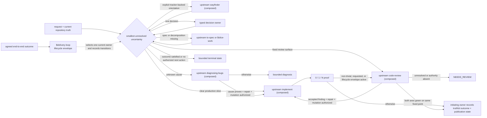
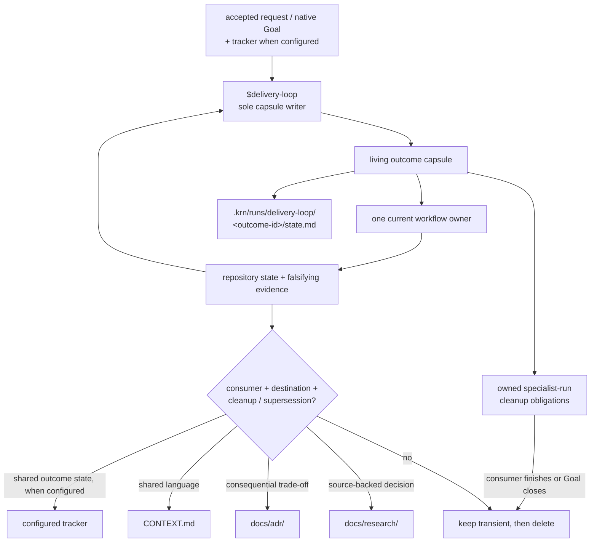

# KRN Skills

Production-first Codex workflows with one owner per repeated process. Global
policy stays small; product language stays with the product; working context is
compiled into a few semantic artifacts instead of accumulated as reports.

## Workflow



The diamond is a routing rule, not a router skill. Settled work skips every
resolved phase: a clear slice enters the composed upstream `implement`, and a
fixed diff, PR, or fingerprinted working tree enters the composed upstream
`code-review`. The typed decision owner is `$source-to-decision` when
external evidence must change a named local decision, and composed upstream
for the rest: `domain-modeling` for a user-owned choice or contested concept,
`prototype` for a disposable runnable experiment, or `codebase-design` for a
seam or ownership decision. Each returns a bounded
result to the current owner; none becomes a mandatory pipeline stage.

`target-repo-work` wraps another checkout. `typescript-engineering` is a
language companion. `opencode-second-opinion` is an explicit advisory side path.
Setup, capability management, and skill authoring remain separate owners. The
evidence, admission matrix, and lifecycle invariants live in
[the orchestration synthesis](docs/research/orchestration.md).

## Compact context spine



`$delivery-loop`'s named sole writer rewrites the capsule at owner and context
boundaries. Other workflows return evidence to that writer or continue through
the native Goal/tracker; they do not create another capsule. Git history is the
chronological log; raw transcripts, prompts, and reviewer packets do not become
documentation by default. When no tracker is configured, the accepted request or
native Goal plus capsule, repository, and host readback carry current truth; no
tracker capability is emulated.

## Skills

| Skill | Invocation | Owns |
|---|---|---|
| [`source-to-decision`](skills/engineering/source-to-decision/SKILL.md) | model or user | one source-backed disposition for a named local consumer |
| [`slice-work`](skills/engineering/slice-work/SKILL.md) | model or user | vertical implementation slices or expand-contract migration stages |
| [`delivery-loop`](skills/engineering/delivery-loop/SKILL.md) | model or user | lifecycle truth and handoffs for one agreed end-to-end outcome |
| [`target-repo-work`](skills/engineering/target-repo-work/SKILL.md) | model or user | identity and authority when work crosses into another checkout |
| [`setup-repository-workflow`](skills/engineering/setup-repository-workflow/SKILL.md) | explicit only | one-time adoption or repair of a thin local contract |
| [`typescript-engineering`](skills/engineering/typescript-engineering/SKILL.md) | model or user | TypeScript inference, public APIs, compiler mechanics, and proof |
| [`opencode-second-opinion`](skills/advisory/opencode-second-opinion/SKILL.md) | explicit only | bounded independent-model opinion on one explicit path, without diffs |
| [`managing-codex-capabilities`](skills/meta/managing-codex-capabilities/SKILL.md) | model or user | global skill, plugin, MCP, and profile control |
| [`unlazy`](skills/meta/unlazy/SKILL.md) | explicit only | machine-checked completion gates for long or multi-phase work |
| [`unslop`](skills/meta/unslop/SKILL.md) | explicit only | audit or rewrite robotic prose without semantic drift |

### Source-only packs

The frontend package is not installed before fresh behavioral proof. Its
validated source-only packs are
[`frontend-discovery`](skills/frontend/frontend-discovery/SKILL.md),
[`frontend-authoring`](skills/frontend/frontend-authoring/SKILL.md),
[`frontend-cube-css`](skills/frontend/frontend-cube-css/SKILL.md), and
[`frontend-visual-review`](skills/frontend/frontend-visual-review/SKILL.md).
Promotion moves an accepted pack into the installable catalog in a later fixed
point. `frontend-cube-css` additionally requires an authorized migration of the
incumbent global `cube-css`; this source state neither retires nor replaces it.

The shared engineering and productivity flow (`ask-matt`, `wayfinder`,
`to-spec`, `to-tickets`, `implement`, `diagnosing-bugs`, `research`,
`prototype`, `codebase-design`, `improve-codebase-architecture`,
`resolving-merge-conflicts`, `code-review`, `domain-modeling`, `tdd`, `triage`,
`wizard`, `grill-with-docs`, `grill-me`, `grilling`, `handoff`, `teach`,
`to-questionnaire`, `wait-what`, `writing-for-agents`, and
`setup-matt-pocock-skills`) is **composed from a clean checkout of the
upstream [`mattpocock/skills`](https://github.com/mattpocock/skills) set at the
commit pinned by `config/upstream-sources.json`, not owned here** — do not use a
moving `npx skills add` result as the KRN source. This repo owns only the decisions
and lifecycle envelopes listed above; lab measurement found no advantage of a
hand-forked copy over upstream or over no skill
([`skills-3arm-lab`](docs/research/skills-3arm-lab.md), results in
`skills-lab-3arm/results/`).

Descriptions and `agents/openai.yaml` are the routing authority. README is the
only human skill catalog; there are no hand-maintained per-skill mirror pages.

## Install

```bash
npm run validate
scripts/install.sh check
scripts/install.sh install
```

The installer links only manifest-owned skills into `~/.agents/skills`, the
catalog executable into `~/.local/bin`, the global contract into Codex, the
same semantic core into Claude, and one deterministic `PreToolUse` guard. It
applies path-aware policy to recognized direct `rm`, denies recognized literal
non-dry-run `git clean`, blocks exact literal quarantine references and patch
targets, and denies unsupported shell composition only when it contains the
same literal risk. It does not interpret shell execution; runtime-built,
sourced, or obfuscated behavior remains governed by the global contract. Only
bare, uncomposed `echo` and `printf` are treated as inert risk text. The
installer refuses foreign collisions. Named legacy and retired entries are
archived only with explicit authority:

```bash
# Set this only to the verified root containing active upstream skill sources.
UPSTREAM_SKILLS_ROOTS="/absolute/path/to/verified-upstream-skills"
test -d "$UPSTREAM_SKILLS_ROOTS"
test -e "$UPSTREAM_SKILLS_ROOTS/skills/engineering/code-review/SKILL.md"

env KRN_UPSTREAM_SKILLS_ROOTS="$UPSTREAM_SKILLS_ROOTS" \
  KRN_REPLACE_GLOBAL_SKILLS=1 \
  KRN_ARCHIVE_LEGACY=1 KRN_REPLACE_GLOBAL_AGENTS=1 \
  KRN_REPLACE_GLOBAL_CLAUDE=1 KRN_REPLACE_GLOBAL_HOOKS=1 \
  scripts/install.sh install
```

The repository lock in `config/upstream-sources.json` requires every supplied
upstream root to be at the recorded commit, clean, and complete before the
installer preserves an upstream-owned symlink. If an upstream-owned retired
link exists, omitting the root fails closed. Do not set
`KRN_ARCHIVE_LEGACY=1` until the upstream root is verified; stale or foreign
targets still require archive authority.

`KRN_REPLACE_GLOBAL_SKILLS=1` is required only when the installed KRN links
come from another clean worktree of this same Git repository. The installer
archives those links before replacing them and still refuses foreign files.

Run `check` again and start a fresh Codex session after installation. Discovery
is session-scoped. `setup-repository-workflow` and `opencode-second-opinion`
require an explicit `$skill-name` attachment; the composed upstream
`wayfinder` is explicit-only in that set.

See [migration](docs/migration.md) for ownership, retirement, backup, and
rollback guarantees.

## Repository setup and working state

`$setup-repository-workflow` writes one managed block into an existing root
instruction owner plus `.krn/runs/.gitignore`. In an empty repository it first
bootstraps thin `AGENTS.md` and a `CLAUDE.md` symlink to that same owner, and
reports all three changed paths. It names tracker state — including `none` — and
the context layout directly; `CONTEXT.md`, ADRs, and research pages appear later
only when a real decision earns them.

`$opencode-second-opinion` stores its transient brief and response at
`.krn/runs/opencode-second-opinion/<run-id>/`. It always receives the target
directory as an absolute path; there is no implicit home fallback.

## Capability catalog

```bash
krn-codex-catalog inventory
krn-codex-catalog usage --days 30
krn-codex-catalog plan lean
krn-codex-catalog apply lean
```

Named profiles keep optional integrations intentional. Usage evidence never
disables a capability automatically. See [capabilities](docs/capabilities.md).

## Proof budget

| Budget | Use |
|---|---|
| `0` | mechanical, documentation, topology, type-only, or already-covered work |
| `1` | one changed runtime contract, validator, migration, authority rule, or reproduced bug |
| `N` | distinct acceptance requirements with distinct failure modes |

Broad suites are completion evidence, not the inner loop.
Every pull request runs this full repository proof once on its fixed revision.

## Repository map

```text
AGENTS.md       source-repository editing contract
config/         installed global contract and hook configuration
skills/         canonical workflow owners and direct resources
evals/          routing cases
scripts/        deterministic validation, installation, hooks, and catalog
CONTEXT.md      compact current vocabulary and knowledge index
docs/research/  living source-backed synthesis
docs/adr/       earned durable decisions
.krn/runs/      ignored resumable working state
```
