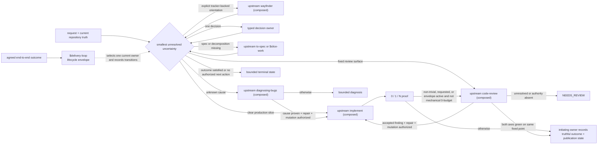
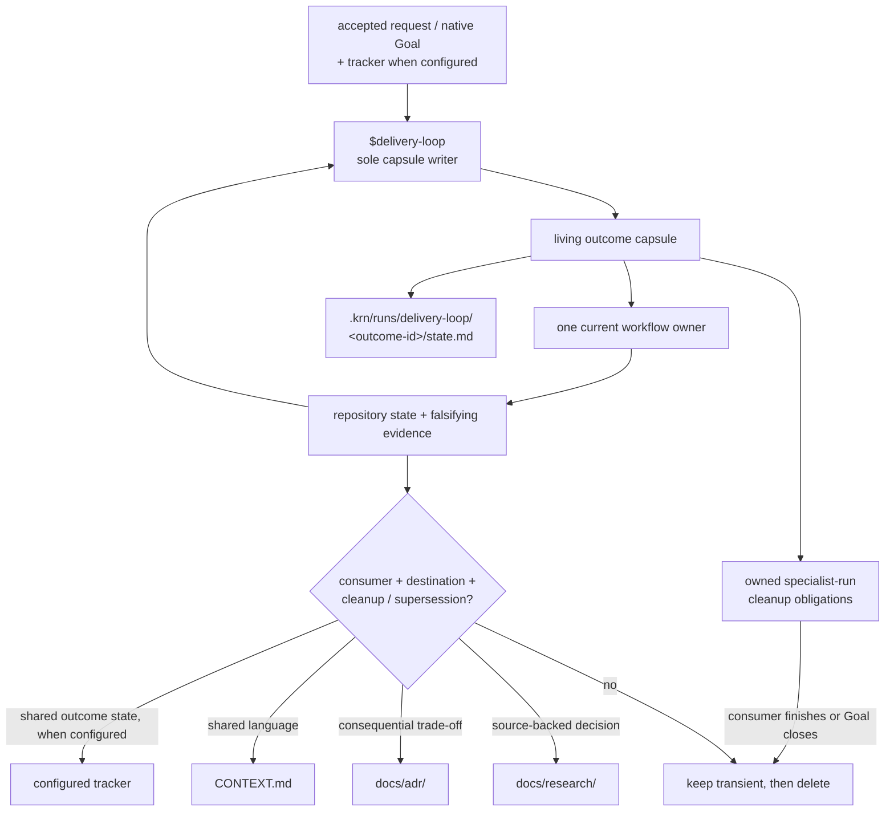

# KRN Skills

Production-first Codex workflows with one owner per repeated process. Global
policy stays small; product language stays with the product; working context is
compiled into a few semantic artifacts instead of accumulated as reports.

## Workflow



The diamond is a routing rule, not a router skill. Settled work skips every
resolved phase: a clear slice enters the composed upstream `implement`, and a
fixed diff, PR, or fingerprinted working tree enters the composed upstream
`code-review`. The typed decision owner is `$source-to-decision` when
external evidence must change a named local decision, and composed upstream
for the rest: `domain-modeling` for a user-owned choice or contested concept,
`prototype` for a disposable runnable experiment, or `codebase-design` for a
seam or ownership decision. Each returns a bounded
result to the current owner; none becomes a mandatory pipeline stage. The canonical condition → handler
table, and with it the repository-scoped harness baseline, is owned by
[`delivery-loop/references/transitions.md`](skills/engineering/delivery-loop/references/transitions.md);
this README keeps only the operator graph.

`target-repo-work` wraps another checkout. `typescript-engineering` is a
language companion. `opencode-second-opinion` is an explicit advisory side path.
Setup, capability management, and skill authoring remain separate owners. The
evidence, admission map, and lifecycle invariants live in
[the orchestration synthesis](docs/research/orchestration.md).

## Compact context spine



`$delivery-loop`'s named sole writer rewrites the capsule at owner and context
boundaries. Other workflows return evidence to that writer or continue through
the native Goal/tracker; they do not create another capsule. Git history is the
chronological log; raw transcripts, prompts, and reviewer packets do not become
documentation by default. When no tracker is configured, the accepted request or
native Goal plus capsule, repository, and host readback carry current truth; no
tracker capability is emulated.

When sources disagree, the accepted user request or native Goal supplies intent
and authority, repository and host state supply observed execution truth, and a
configured tracker supplies shared remote acceptance and publication truth. The
capsule is a compiled cache, never the winning source; an irreconcilable
disagreement blocks the next transition until the owner records the resolution.

## Skills

| Skill | Invocation | Owns |
|---|---|---|
| [`source-to-decision`](skills/engineering/source-to-decision/SKILL.md) | model or user | one source-backed disposition for a named local consumer |
| [`slice-work`](skills/engineering/slice-work/SKILL.md) | model or user | vertical implementation slices or expand-contract migration stages |
| [`delivery-loop`](skills/engineering/delivery-loop/SKILL.md) | model or user | lifecycle truth and handoffs for one agreed end-to-end outcome |
| [`target-repo-work`](skills/engineering/target-repo-work/SKILL.md) | model or user | identity and authority when work crosses into another checkout |
| [`setup-repository-workflow`](skills/engineering/setup-repository-workflow/SKILL.md) | explicit only | one-time adoption or repair of a thin local contract |
| [`typescript-engineering`](skills/engineering/typescript-engineering/SKILL.md) | model or user | TypeScript inference, public APIs, compiler mechanics, and proof |
| [`opencode-second-opinion`](skills/advisory/opencode-second-opinion/SKILL.md) | explicit only | bounded independent-model opinion on one explicit path, without diffs |
| [`managing-codex-capabilities`](skills/meta/managing-codex-capabilities/SKILL.md) | model or user | global skill, plugin, MCP, and profile control |
| [`unlazy`](skills/meta/unlazy/SKILL.md) | explicit only | machine-checked completion gates for long or multi-phase work |
| [`unslop`](skills/meta/unslop/SKILL.md) | explicit only | audit or rewrite robotic prose without semantic drift |

The shared engineering and productivity flow is **composed from a clean
checkout of the upstream [`mattpocock/skills`](https://github.com/mattpocock/skills)
set at the commit pinned by `config/upstream-sources.json`, not owned here**.
The lock file is the machine-readable source of the set; `config/AGENTS.md`
contains the stable ownership boundary. Do not use a moving `npx skills add`
result as the KRN source, and do not create a local fork without a named
consumer and falsifier. The curated harness subset named by `harness_skills` in
`skills/manifest.json` is materialized into the
generated, provenance-marked `.agents/skills/` by `krn-codex skills export`
(the full pin stays in `config/upstream-sources.json`); regenerate instead of
editing, and `npm run skills:check` fails on a foreign destination, a stale upstream pin (against `config/upstream-sources.json`), or an exported skill whose bytes differ from its source. `krn.commit` records the source HEAD when the export ran, so re-export on a clean tree to keep it reproducible.

### Source-only packs

There are no source-only packs on this core branch. Domain-specific packs stay
on their own branch until a separate promotion decision is made.

Skill frontmatter descriptions route admission; `agents/openai.yaml` owns the
interface and invocation policy. README is the only human skill catalog; there
are no hand-maintained per-skill mirror pages.

## Install

```bash
npm run validate
krn-codex install plan --source /absolute/path/to/clean/krn-codex-skills
krn-codex install apply --source /absolute/path/to/clean/krn-codex-skills --yes
krn-codex doctor
```

`krn-codex state check` structurally validates a repository's file-backed
outcome capsule, restart path, and run cleanup obligations; `$delivery-loop`
runs it at every boundary. `krn-codex state compile` prints a capsule skeleton
with the mechanical fields (HEAD, dirty scope, active runs) already filled, and
`krn-codex state resume` prints a deterministic restart brief that diffs the
recorded capsule against live repository state. Both are read-only and never
write the capsule.
`krn-codex install plan` is read-only. `install apply` accepts only a clean
Git checkout at its checked-out commit, validates that exact tree, copies an
explicit manifest-owned runtime closure to
`$CODEX_HOME/krn/releases/<commit>/`, hashes it, then atomically switches
`$CODEX_HOME/krn/current`. Stable skill, bin, global-contract, and hook links
lead through `current`, never to the source checkout. Existing matching
releases are idempotent; a mismatched or tampered release fails closed. The
installer links only manifest-owned skills into `~/.agents/skills`, the CLI, and
catalog compatibility shim into `~/.local/bin`, the global contract into Codex,
and one deterministic `PreToolUse` guard. It
applies path-aware policy to recognized direct `rm`, denies recognized literal
non-dry-run `git clean`, blocks exact literal quarantine references and patch
targets, and denies unsupported shell composition only when it contains the
same literal risk. It does not interpret shell execution; runtime-built,
sourced, or obfuscated behavior remains governed by the global contract. Only
bare, uncomposed `echo` and `printf` are treated as inert risk text. The
installer refuses foreign collisions and archives only its previous managed
links while it reconciles them through `current`. `scripts/install.sh` remains
a one-release `check`/`install` compatibility shim; it invokes the same CLI.

Use `krn-codex install check` for filesystem state and `krn-codex doctor` when
you need the distinction between an installed filesystem snapshot, a broken or
foreign link, a legacy mutable source link, and unknown/stale session loading.
Start a fresh Codex session after installation. Discovery is session-scoped.
`setup-repository-workflow`, `opencode-second-opinion`, `unlazy`, and `unslop`
require an explicit `$skill-name` attachment. Descriptions route the task;
manifest invocation mode decides auto-attachment, and many composed upstream
owners are explicit-only — including `ask-matt`, `implement`,
`improve-codebase-architecture`, `to-spec`, `to-tickets`, `triage`, `handoff`,
and `wayfinder`.

For a disposable end-to-end proof, run `npm run test:bootstrap`; it installs a
temporary release and drives the linked CLI against
[`test/bootstrap-fixture`](test/bootstrap-fixture/). The installer
validates the exact clean source checkout before a release is created; refreshes
should still run `npm run validate` first.

See [migration](docs/migration.md) for ownership, retirement, backup, and
rollback guarantees.

## Repository setup and working state

`$setup-repository-workflow` writes one managed block into an existing root
instruction owner plus `.krn/runs/.gitignore`. In an empty repository it first
bootstraps a thin `AGENTS.md`, and reports the two managed paths. It names tracker state — including `none` — and
the context layout directly; `CONTEXT.md`, ADRs, and research pages appear later
only when a real decision earns them.

`$opencode-second-opinion` stores its transient brief and response at
`.krn/runs/opencode-second-opinion/<run-id>/`. It always receives the target
directory as an absolute path; there is no implicit home fallback.

## Capability catalog

```bash
krn-codex capability inventory
krn-codex capability usage --days 30
krn-codex capability plan lean
krn-codex capability apply lean
```

Named profiles keep optional integrations intentional. Usage evidence never
disables a capability automatically. See [capabilities](docs/capabilities.md).

## Proof

The installed `config/AGENTS.md` owns the `0/1/N` proof budget. README records
the operator entrypoints; it does not duplicate the execution policy.

## Repository map

```text
AGENTS.md             source-repository editing contract
config/               installed global contract and hook configuration
skills/               canonical workflow owners and direct resources
test/                 the retained installed-release bootstrap smoke fixture
scripts/              deterministic validation, installation, hooks, and catalog
CONTEXT.md            compact current vocabulary and knowledge index
docs/research/        living source-backed synthesis
docs/adr/             earned durable decisions
docs/capabilities.md  global capability profiles and evidence states
docs/migration.md     installation ownership, retirement, and rollback
.krn/runs/            ignored resumable working state
```
