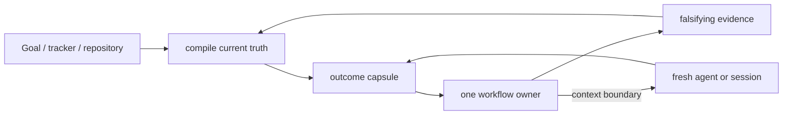

# Orchestration and compact context

Status: `accepted`. Consumer: maintainer, `$delivery-loop`, and
`$source-to-decision`. Owner: maintainer. Verified: 2026-09-10. Rework this page
in place when a falsifier fires; do not append a parallel “v2” report.

## Decision question

How should KRN carry an engineering outcome across long Codex runs, fresh
contexts, specialist workflows, independent review, and publication without
turning the repository into a transcript archive, a generic memory framework,
or an oversized skill catalog?

## Evidence convergence

| Evidence family | What it establishes | KRN implication | Limit |
|---|---|---|---|
| Matt Pocock | small owners, precise leading words, shared language, progressive disclosure, fresh ticket contexts, and explicit router/research/architecture/ticket owners in upstream `6654f6b` | keep a sparse composable catalog; let one indexed map link full decision sources while each ticket names its exact KRN owner; refresh the composed set from upstream instead of maintaining a fork | his exact catalog, tracker, and spec-retention policy are not KRN policy |
| Karpathy compact knowledge | raw sources can feed one indexed synthesis that improves by integration, contradiction handling, and rewriting | continuously compile a few living topic pages; Git supplies chronology | a personal knowledge workflow does not prove a production agent runtime |
| Rohit Goyal memory extension | useful memory needs provenance, recency, confidence, supersession, and forgetting | put those fields into source decisions; add search/graphs only after scale demands them | automated confidence and crystallization can become ungrounded ceremony |
| Official Codex guidance | Goal carries one outcome in one chat; skills carry repeatable methods; subagents isolate bounded work; required team rules stay in checked-in authority | Goal/tracker is live state, not a replacement for the selected workflow or repository memory | runtime Goal state is not portable repository knowledge |
| OpenAI harness engineering | agents need a maintained map into structured repository knowledge, with mechanical checks and gardening | `CONTEXT.md` is the small map; research and ADRs are the system of record; freshness is part of the maintenance loop | a large product harness would be overbuilt here |
| Anthropic long-running harnesses | restartable state and independent evaluation reduce drift; harness assumptions go stale as models improve; parallel agents cost tokens and coordination | checkpoint a compact capsule, use independent fixed-point review for substantial changes, and periodically delete or re-test scaffolding | older harness findings do not mandate initializer/evaluator fleets on newer models |
| Long-horizon agent benchmarks | SWE-EVO reports a large gap between isolated issue fixing and software evolution; SlopCodeBench measures verbosity and structural erosion; DeepSWE finds inherited tests can disagree materially with independent review | proof must include maintainability and trajectory-level checks where repeated agent edits are in scope, not only current test pass/fail | benchmark tasks and metrics are not a substitute for a product-specific acceptance test |
| `unlazy` harness | its current source puts gates, explicit evidence, re-verification, a task tree, and cooperative leases before or around work; its own boundary notes distinguish coordination from isolation | installed as an explicit companion; keep its production benefit at `lab-test`; it does not own lifecycle, sandboxing, leases, or dispatch | source design and historical self-reports do not prove lower cost, better outcomes, or hostile-process isolation |
| `ponytail` scope ladder | the current source asks whether work is needed, then prefers reuse, standard library, native capability, installed dependency, or the smallest implementation while preserving trust-boundary and accessibility checks | `lab-test` the question inside one real `to-spec` or `codebase-design` outcome; do not add a duplicate global skill | its small self-reported benchmark does not establish transfer to KRN or a universal implementation rule |
| Local deletion probe | five of six artifact roles had no runtime consumer; 18 operator pages mirrored the skills; reviewer-handoff had no external caller | delete generic report roles, doc mirrors, and the unconsumed packet workflow | future measured consumers may justify reintroduction |
| Local register micro-lab | the observed stale capsule sentence was repairable by fresh Goal/repository/PR readback; SQLite and Git-ref candidates could mechanically fence cooperative writers | retain the compact spine; keep both mechanisms at `lab-test` until a recurring writer-admission failure survives bounded repair | synthetic conformance is not product need, restore recovery, hostile-process exclusion, or power-loss proof |
| Local retrieval probe | 17 opportunistically chosen questions (facts, structure, metadata, links, supersession, negatives) were answerable by fresh same-model agents from the live map, lexical/git, metadata, and link rungs, and every cited line was checked locally | keep the retrieval ladder unchanged at this scale | the question set was self-authored with no sampling frame or retained pass record, so it neither tests whether a lower rung fails nor proves scale, cross-family parity, or hostile-input behavior |
| Local spine divergence probe | `repo inspect` reported `managedRuns: true` while a capsule with a bad enum, a missing restart path, a ghost cleanup entry, and an invalid fixed point passed silently | adopt the deterministic `krn-codex state check` boundary gate in `$delivery-loop` | it checks structure, not whether the recorded state is semantically current |

Primary-source refresh (2026-09-10): [OpenAI's harness-engineering guidance](https://openai.com/index/harness-engineering/) treats `AGENTS.md` as a short table of contents and the repository knowledge base as the system of record, with mechanical boundary checks. [Anthropic's long-running harness work](https://www.anthropic.com/engineering/effective-harnesses-for-long-running-agents) supports restartable artifacts and tractable work units while warning that harness assumptions age. [Anthropic's application harness work](https://www.anthropic.com/engineering/harness-design-long-running-apps) shows that a skeptical generator/evaluator loop can lift subjective frontend quality, but only when the task is beyond the model's solo reliability and at substantial cost. [Context as a Tool](https://arxiv.org/abs/2512.22087) and [ACON](https://arxiv.org/abs/2510.00615) support structured or learned context compression; they justify only a bounded capsule lab-test here, not a generic memory service. [SWE-EVO](https://arxiv.org/abs/2512.18470) shows a large gap between isolated fixes and multi-file evolution, while [SecureVibeBench](https://arxiv.org/abs/2509.22097) shows that functional success and explicit security instructions do not guarantee secure code. The [LIMIT study](https://arxiv.org/abs/2508.21038v2) proves a dimension bound on single-vector top-k expressivity and calls for techniques beyond the single-vector paradigm; the theorem is established, while its application to KRN is untested. The remaining sources here are hypotheses and risk signals, not KRN proof.

## 2026 research refresh: complexity must earn its owner

The current evidence converges on a deliberately small production spine. A
mechanism enters KRN only when it has a named consumer, one canonical owner,
and a falsifier; otherwise it remains a bounded experiment or is rejected.

| Mechanism | Decision | Local consumer and falsifier | Slop boundary |
|---|---|---|---|
| Skill descriptions as admission router; progressive disclosure; thin `AGENTS.md` map | adopt | `config/AGENTS.md`, README, and the pinned composed set; routing collisions or repeated misroutes despite improved descriptions reopen the decision | no central router, per-skill mirrors, or duplicated procedure |
| Compiled outcome capsule with pointers, explicit non-proofs, and one writer | adopt | `$delivery-loop`; a fresh agent must resume three representative long outcomes without transcript reconstruction | no transcript archive, vector store, or durable reflection log |
| Plan–act–observe, staged diagnosis before repair, provenance, and fixed-point review | adopt | current specialist owner plus `$source-to-decision` / `code-review`; a public-seam acceptance failure or stale fixed point falsifies the gate | no mandatory full pipeline or benchmark-as-proof |
| Retrieval as a composed process over the live map, lexical/git, metadata, links, and a conditional local full-text index; embeddings as one optional tool | adopt | maintainer owns the map, links, and rung decisions; a workflow that builds a derived index owns that index only; `$source-to-decision` loads and `research` passes consume it; a measured failure authorizes current-rung repair before the next rung | no central vector store, graph database, or similarity-first memory service |
| Deterministic spine state check for the outcome capsule and run cleanup | adopt | `$delivery-loop` and the next session; injected bad enum, ghost cleanup, missing restart path, or invalid fixed point must fail and a clean capsule must pass (`npm run test:state`) | structural facts only, and 40-hex tokens must be git objects; no freshness inference, semantic judgment, or second store |
| Lossy compaction or proactive memory actions | lab-test | one bounded capsule rewrite/readback experiment; a dropped field causing a wrong action that readback cannot repair fails it | no generic summarizer, embeddings, graph, or episodic memory service |
| Generator/evaluator loop for frontend taste and browser behavior | lab-test, separate branch | one real frontend outcome with a solo baseline, evaluator run, cost, and human acceptance; no material lift at acceptable cost rejects it | never globalize a multi-hour evaluator loop or turn taste into a universal score |
| Issue tracker as orchestration control plane or Beads-like backend | defer | only a measured queue/concurrency bottleneck with explicit remote-write authority can reopen it | native Goal, tracker, and capsule stay distinct; no new task database now |
| Mechanical checks for already-declared durable-page fields | adopt | maintainer and `$source-to-decision` promotion; removing a required header field or index row must fail `npm run validate` | no freshness scoring, prose-style linting, or checks beyond fields that already have a reader |

The durable-page field check was promoted to `adopt` on 2026-09-10 after two
independent audits recorded six header shapes across the four topic pages and a
dangling, unlabeled `lab-test` disposition; the check asserts only fields a
named reader already consumes.

The frontend result is especially important: Anthropic reports that skeptical
evaluation improved originality and last-mile behavior, but also reports rising
complexity, multi-hour runs, and diminishing value as the model improves. KRN
therefore keeps frontend taste as a separate branch experiment, not a global
skill or permanent evaluator harness. The same conditional rule applies to
cross-model review and parallel writers: measure detection or integration lift
against cost before promoting either mechanism.

## Retrieval escalation ladder

KRN keeps retrieval as a composed process, not one similarity search. The
[LIMIT study](https://arxiv.org/abs/2508.21038v2) shows that a single vector can
express only a dimension-bounded number of top-k relevance sets, even when
embeddings are optimized directly on the test set; the result bounds the
single-vector paradigm, not KRN's current corpus. The local response is a
ladder: climb one rung only after the current rung repeatedly fails on a
measured durable corpus.

1. **Live map** — `CONTEXT.md`, `README.md`, and the installed contract; the
   smallest current index, always loaded.
2. **Exact and lexical** — path and glob search, `ripgrep` over canonical files,
   and `git log` or `blame` for chronology and supersession. Deterministic and
   cheap.
3. **Structured metadata** — source identities, statuses, owners, verification
   dates, decision vocabulary, and configured tracker fields.
4. **Explicit links** — map → topic → primary-source row → owning skill,
   including supersession edges. This link graph is the graph; no graph database
   is earned at this scale.
5. **Local full-text index** — for example SQLite FTS5, only when a measured
   durable corpus outgrows exact search.
6. **Embeddings as one optional tool** — never the authority, never the central
   store, and only after the earlier rungs demonstrably fail.

Owner: maintainer, who keeps the map, links, and rung decisions current.
Consumers: `$source-to-decision` source loads and `research` passes. A derived
rung-5 or rung-6 index is owned only by the workflow that builds it. Falsifier: a
durable corpus and query class that repeatedly fails the current rung; repair the
current rung first (index, links, vocabulary), then let that failure authorize
the next rung, and reopen the topic decision only if the failure survives the
bounded repair and the climb it authorizes. Non-proof: the LIMIT result bounds
single-vector expressivity; it does not measure KRN, nor prove that lexical
retrieval suffices at any future scale. Supersession: replace a rung when a
mature local mechanism makes it obsolete. Any rung-5 or rung-6 index is derived
and disposable: built by a workflow inside its own ignored run, deleted when that
run's consumer finishes like any other run state, and never promoted to durable
knowledge.

## Breakthrough: compile context at boundaries

The continuity unit is not a chat transcript, report directory, or autonomous
memory service. It is a compact **outcome capsule** that is rewritten whenever
ownership or context changes. The next owner reconstructs the task from that
capsule plus current repository/tracker state.



`$delivery-loop` owns the exact capsule ABI; that skill is the only
authoritative field list. This page records only how the capsule is compiled,
where it may live, and who may write it.

For a multi-session outcome, the accepted request or native Goal owns current
thread intent and authority. A configured tracker, when present, owns durable
shared acceptance, queue, blocker, and active-Spec state. Repository and host
state own observed execution truth. The capsule is a compiled cache, never the
winning source. Its absence is explicit; an irreconcilable disagreement blocks
the next transition until the owner records the resolution. When a fresh process
must resume without the current chat,
`$delivery-loop`'s named sole writer may mirror the capsule only at
`.krn/runs/delivery-loop/<outcome-id>/state.md`. Other workflows keep
continuation in the native Goal or configured tracker, or hand lifecycle
ownership to `$delivery-loop`; they never create a workflow-local outcome
capsule. The delivery-loop writer rewrites that file in place and deletes its
run at the lifecycle cleanup trigger. It also carries each specialist run's
creating owner, semantic pointer, sole consumer, trigger, and state until that
owner's cleanup is verified. The capsule never becomes a generic durable
report. A superseded or abandoned run remains while its original Goal is active;
transfer into a successor does not delete it before the original Goal's
non-active transition is read back.

## One spine, typed entries

The canonical operator graph is in [README.md](../../README.md#workflow). Its
diamond is a decision rule, not a central router skill. Every resolved phase is
skipped. Once one production slice is clear, the ordinary spine is
`implement` → `0/1/N proof` → fixed-point `code-review` when the slice is
non-trivial, review is requested, or a `$delivery-loop` lifecycle envelope is
active and the slice is not mechanical 0-budget → truthful outcome and
publication state. A mechanical low-risk 0-budget slice may skip review when it
changes no behavior, authority, security, or spec/acceptance surface. An
accepted, authorized review repair returns to a fresh `implement` task.

Everything before that spine is a typed admission or return, not a mandatory
stage. When a specialist return satisfies the requested outcome or has no
authorized next action, it is terminal instead of being routed merely to keep
the graph moving:

| Observable unresolved condition | Smallest owner | Exact return boundary |
|---|---|---|
| The user explicitly requests a tracker-backed route map for an unclear effort spanning sessions | `wayfinder` | one open map with a named frontier/blocker, or one closed map with an exact terminal owner |
| A user-owned choice or contested concept blocks progress | `domain-modeling` | an executable decision or bounded handoff to its named consumer |
| External evidence must change a named local decision | `source-to-decision` | `adopt`, `reject`, `lab-test`, or `defer` for that consumer and falsifier |
| A disposable runnable experiment can answer one design question | `prototype` | a verdict in the current owner and no unapproved production residue |
| A seam, interface, or ownership decision is unresolved | `codebase-design` | one chosen boundary, bounded first slice, or decision-only handoff |
| Success is agreed, every implementation gate is settled, but the first written spec does not exist | `to-spec` | one destination-first spec with source links and no gating unknowns, routed to `implement` or `slice-work` |
| A settled written spec needs several demonstrable units or migration stages | `slice-work` | an implementation-ready list routed one unit at a time to `implement` |
| A failure's cause is unknown | `diagnosing-bugs` | a proven cause routed to `implement` only with repair and mutation authority, otherwise a bounded diagnosis |
| One scoped change or proven repair is clear | `implement` | production behavior plus proportional proof |
| A diff, PR, or fingerprinted working tree needs read-only judgment | `code-review` | Standards and Spec disposition on one fixed point |
| The user requests ownership of an already-agreed outcome through all authorized transitions | `delivery-loop` | lifecycle truth, one current owner, and the actual outcome/publication state |

This removes the graph's former generic `CHOSEN`, `DISP`, and `VERDICT` nodes.
Those were not shared runtime states; each specialist already has a more
precise return contract. Authority is a precondition and reported state, not a
workflow stage. The change owner produces proof; an active lifecycle envelope
commissions fixed-point review for every non-mechanical slice without taking
over either procedure. `$delivery-loop` is the optional lifecycle envelope around the
selected owners; it never executes their procedures and is not a downstream
decision consumer merely because a decision completed.

A Wayfinder map persists one active integrator identity, one exact worker-result
return channel, observed tracker-write authority, and a writer generation with
matching activation readback. Fresh ticket workers treat the map and child as
read-only and return complete results through that channel; only the recorded
integrator writes, and a pending or mismatched generation blocks the frontier.
Repository-dependent children also carry canonical repository and `cwd`, fixed
point, allowed paths, separate mutation authority, result shape, consumer, and
non-proof; their canonical **Result return** block alone holds the mutable return
destination. Every write-capable child uses an isolated worktree and one
integration owner. Concurrent file writers additionally use disjoint allowed
paths; otherwise the child remains read-only.
These writer, worktree, and allowed-path rules coordinate cooperating clients;
they are not a process-isolation or security boundary.

Wrappers and companions:

- `target-repo-work` establishes identity and authority before the selected
  owner crosses into another checkout.
- `typescript-engineering` sharpens TypeScript work beside implementation,
  diagnosis, design, or review.
- `opencode-second-opinion` is an explicit, non-interactive DeepSeek advisory
  pass over one named path or artifact. It returns prose, never a patch or
  approval; the initiating owner verifies and disposes its output.
- `setup-repository-workflow` performs one explicit adoption/repair pass and
  then disappears from ordinary work.
- `managing-codex-capabilities` remains the KRN capability owner; the system
  `skill-creator` remains a separate authoring owner.

## OpenCode advisory transport disposition

**Decision:** treat the transport as advisory-only, not bounded beyond its
prompt. Code inspection resolves the path scope: the runner passes the whole
target directory and enforces only output-citation scope, so the allowed-path
brief is convention, not a boundary. The terminal time-limit and
failure-retention contract is verified on substituted processes. A mechanical
scope boundary stays unbuilt until a named consumer needs to send sensitive
state or the runner crosses a trust boundary. The named consumer is the next
`$opencode-second-opinion` transport change.

The current runner accepts either a prose or strict-JSON opinion, does not
request interactive or automatic permissions, enforces a terminal timeout, and
retains `raw.failed.jsonl` plus `failure.txt` for failed or interrupted runs.
That proves a completed response is well-formed and a failure is attributable;
it does not prove filesystem scope isolation: OpenCode receives the target
repository directly while allowed paths remain prompt prose. Nor does the
timeout establish complete process or resource isolation.

| Mechanism | Bounded test | State and decision limit |
|---|---|---|
| A path allowlist is a security boundary only when enforced outside the model prompt. | Give a run one permitted file and ask it to read a sibling ignored run; any returned sibling content rejects the prompt-only boundary. | Resolved by inspection: the runner enforces only output-citation scope and contains no allowlist code, so the brief is convention. Do not label the transport sandboxed or send sensitive repository state until a mechanical scope boundary exists. |
| A bounded external opinion needs a terminal time limit and attributable failure evidence. | Substitute an `opencode` process that never exits, then one that emits an incomplete JSON stream; the runner must terminate and retain the exact partial stream plus failure cause. | Verified on substituted processes: the runner terminates and retains attributable failure evidence. Do not adopt a specific timeout value or treat the retained artifacts as security evidence. |

Transport lab result (2026-09-10, substituted processes): the runner terminated a
never-exiting process at the configured timeout (exit `124`) and retained
`failure.txt` with reason and exit code; it rejected an incomplete JSON stream
during extraction (exit `78`) and retained the partial stream as
`raw.failed.jsonl` plus `failure.txt`; a nonzero process exit retained the same
failure evidence (exit `7`). `check-opinion.sh` returned `failed` for all three
and no `opinion.md` was produced. This establishes the terminal time-limit and
attributable-failure contract of the current runner. It does not adopt a timeout
value, prove filesystem scope isolation, or show model behavior toward the path
brief; the path allowlist remains a prompt convention, not an enforced boundary.

This decision does not prove that OpenCode will violate a path brief, that a
particular timeout is correct, or that DeepSeek output is approval. If a future
consumer needs a mechanical scope boundary, the next owner returns only a
focused transport proof to `$source-to-decision`; until then the initiating
workflow still verifies any substantive finding locally.

## Claude memory comparison: reuse the mechanism, not the plugin

The old project-local `.remember` material is not Claude Code's native memory.
The public Remember project is a third-party, source-available plugin. Its
useful mechanism is a lifecycle pipeline: session start recovery, filtered
transcript extraction, bounded summarisation, a current handoff, and later
consolidation into recent/archive files. It also documents locks, atomic
same-directory replacement, cooldowns, and worktree-aware external storage.
Those are observations about that project, not permission to vendor it; its
license prohibits modification and redistribution, and KRN forbids vendoring
external code or raw corpora.

Claude's native feature is smaller: project-scoped Markdown memory is loaded at
session start, is bounded, editable, and acts as context rather than an
enforcement boundary. KRN therefore ports the semantic boundary, not the
implementation:

| Remember mechanism | KRN decision | Local boundary |
|---|---|---|
| Automatic transcript capture and tiered daily/archive summaries | reject for now | duplicates the research ledger, hides stale model-written context, and adds privacy/token cost; reopen only after a named restart failure and retention rule |
| Explicit `/remember` handoff | adopt as a semantic pattern | `$delivery-loop` rewrites one compact outcome capsule with evidence, non-proofs, authority, and next action; no second memory store |
| Per-project/worktree external storage | adopt existing boundary | ignored `.krn/runs` and canonical repository identity already isolate transient state; durable shared facts belong in `CONTEXT.md`, research, or ADRs |
| SessionStart/PostToolUse lifecycle hooks | defer | the KRN hook stays narrow and deterministic; add lifecycle hooks only after a reproducible missed-restart case has a consumer, cleanup trigger, and falsifier |
| Locks, cooldowns, atomic replacement, and recovery | lab-test only | use if concurrent capsule writers or power-loss recovery fails in a real run; do not add a generic memory daemon |
| Personal preferences or identity memory | reject in the repository | keep operator preferences outside product knowledge; only shared vocabulary and accepted decisions are durable |

The resulting invariant is simple: a fresh owner reads the accepted request or
Goal, current repository/tracker state, and one compact capsule. If that is not
enough, the owner records the missing fact in the canonical decision topic or
asks for authority; it does not silently grow a transcript archive. The
canonical topic records the source identity and decision residue so later work
can reuse the decision without rereading the same material.

## Third-party harness disposition

The named consumer is `$delivery-loop`, with the next suitable multi-session
engineering outcome as its lab surface. The current KRN core already owns one
outcome writer, restart capsules, authority states, scope-aware repository
work, and proportional proof. Installing another lifecycle framework globally
would create an ownership collision before it had a measured consumer.

| Candidate | Decision | Local action | Falsifier / next gate |
|---|---|---|---|
| `unlazy` | `adopt` as an explicit companion | keep the machine-checked gate ledger and re-verification; it does not own lifecycle, sandboxing, leases, or dispatch | a second long-running pilot shows duplicate state, extra ceremony, or no earlier detection; then revisit the explicit companion |
| `ponytail` | `adopt` as a heuristic, no new skill | make “needed → reuse → standard/native → installed dependency → smallest implementation” an explicit question for existing `to-spec` / `codebase-design` owners | a recurring overbuilt slice, missed reuse opportunity, or security/accessibility regression despite the question reopens whether the heuristic belongs in a stronger seam |

Neither candidate is installed as a new global lifecycle owner by this
decision. The source claims are not a benchmark of KRN, and the lab-test setup
is not adoption or proof of production isolation.

## Artifact taxonomy

| Information | Canonical owner and destination | Lifecycle |
|---|---|---|
| Current thread objective and continuation | accepted request or native Goal when present | reconciled at every transition; native Goal closed with the outcome when present |
| Durable shared acceptance, queue, blockers, and active Spec | configured tracker, when present | updated at every shared transition; its absence is explicit; frontier tickets remain linked primary sources and the Spec closes with the outcome |
| Shared vocabulary and current system map | `CONTEXT.md` | rewritten when a term or relationship changes |
| Consequential hard-to-reverse trade-off | `docs/adr/<id>-<slug>.md` | created rarely; superseded explicitly |
| Source-backed engineering decision | `docs/research/<topic>.md` | created only for a named consumer, then merged in place; claim stays near provenance and falsifier |
| Outcome capsule | `.krn/runs/delivery-loop/<outcome-id>/state.md` | owned and rewritten only by delivery-loop's sole writer; delete at its lifecycle cleanup trigger; transfer condensed truth before cross-Goal continuation |
| Transient spec, slice list, prompt, job, packet, or shard | `.krn/runs/<workflow>/<run-id>/` | owned by the creating workflow, ignored and private; delete when its in-goal consumer finishes or owning Goal closes |
| Review result | initiating outcome, PR, or issue thread tied to one fixed point | condensed into the capsule when continuation needs it; invalid when base/head/Spec/Standards changes |

Every artifact has a semantic owner and lifecycle. Physical mount prefixes are
runtime details, not reusable contracts.

## Portfolio boundary

The KRN repository promotes ten local owners and composes the pinned
upstream set separately. `reviewer-handoff` was retired because no workflow
called its compiler: routine review already has repository access and the
external checker owns its own packet/schema/transport. A deterministic helper
without a demonstrated consumer is not a promoted workflow.

Four local skills remain explicit-only:

- `setup-repository-workflow` because it mutates repository instructions;
- `opencode-second-opinion` because it starts an external advisory run;
- `unlazy` because it starts a completion ledger and gate re-verification;
- `unslop` because it performs a deliberate prose audit or rewrite.

`slice-work` is model-invocable because `delivery-loop` composes it. Ticket
publication remains a separate authority branch; invocation does not grant
remote mutation.

No central router is added. Skill descriptions are the admission router; add a
router only after repeated human recall failures across the four explicit-only
local skills.

## Complete owner map

The harness map is a routing boundary, not a second skill catalog. This compact
map records the owner groups and their stopping boundaries so `README.md` can
remain the human catalog.

| Owner group | Owners | Boundary |
|---|---|---|
| Admission | `ask-matt`, `wayfinder`, `triage`, `grill-with-docs`, `grilling`, `wait-what` | select one unresolved owner or restore shared understanding; no production mutation |
| Evidence and design | `research`, `source-to-decision`, `prototype`, `domain-modeling`, `codebase-design`, `improve-codebase-architecture`, `target-repo-work`, `typescript-engineering` | produce cited facts, a decision, a disposable artifact, or a selected seam |
| Planning and execution | `to-spec`, `slice-work`, `to-tickets`, `implement`, `tdd`, `diagnosing-bugs`, `setup-repository-workflow`, `setup-matt-pocock-skills`, `resolving-merge-conflicts`, `wizard` | produce one authorized slice, setup operation, or resolved repository operation |
| Proof and continuity | `code-review`, `opencode-second-opinion`, `unlazy`, `handoff`, `delivery-loop`, `writing-for-agents`, `managing-codex-capabilities`, `unslop` | interpret evidence, preserve restart state, or reconcile explicitly owned capability/prose state |

Other pinned upstream owners, including `grill-me`, `teach`, and
`to-questionnaire`, remain upstream-only and are selected from their installed
descriptions rather than duplicated in this local map.

Every owner has one stop condition. A test pass, issue status, advisory answer,
or successful install proves only its own boundary; it never grants authority
for another workflow. `delivery-loop` owns lifecycle state and the single
outcome capsule writer, while specialist skills retain their procedures.

`to-tickets` shapes an authorized publication item; `$slice-work` shapes the
implementation units. Resolve the implementation shape first, then return to
ticket publication only when that remote mutation is separately authorized.

## Condensing expert material into skills

The reusable unit is a mechanism, not a lesson, slogan, transcript, or copied
course chapter:

```text
source material → candidate mechanisms → boundary and hard negative
→ representative example → named owner and trigger → falsifier → promotion
```

Each promoted reference must state its mechanism, use condition, desired choice,
tempting counter-choice, one representative example, one counterexample, owner,
and falsifier. `SKILL.md` remains the routing/procedure boundary, references
hold mechanisms and examples, and scripts perform only deterministic work.
Promotion requires a new task to beat a baseline without a trigger collision,
owner collision, or evidence gap.

## Review and re-review

A review result is keyed to:

```text
base revision + head/fingerprint + Spec revision + Standards revision
```

Standards and Spec are independent read-only passes for substantial work. The
main owner verifies candidate findings against current code. Any accepted
repair changes the head and invalidates the previous result; a fresh re-review
must inspect the new fixed point. Reviewer prose never grants edit, merge, or
deployment authority.

Parallelism is contextual:

- one writer per outcome/worktree;
- parallel read-only mapping, research, tests, and independent review;
- parallel writers only in disjoint worktrees with one integration owner.

This replaces the old universal “WIP exactly one” rule with the invariant the
evidence actually supports: no concurrent mutation of the same outcome state.

## Rejected alternatives

| Alternative | Disposition | Reason |
|---|---|---|
| Generic memory skill | reject | duplicates domain, source, tracker, and lifecycle owners |
| Vector database, embeddings, or knowledge graph now | defer | this repository has tens, not thousands, of durable pages, so links and content index suffice now; the deferral is independent of [the dimension bound on single-vector top-k expressivity](https://arxiv.org/abs/2508.21038v2), which means single-vector embeddings cannot be the central or sole mechanism even at scale |
| Append-only research log | reject | Git already records chronology; a second log would preserve superseded prose as active context |
| Global “sacrifice grammar” instruction | reject | Matt later moved it out of global context; terse output can hide proof and uncertainty |
| Per-skill operator page | reject | mirrors `SKILL.md` and creates a second manual catalog |
| Artifact-role JSON registry | reject | configurable names without consumers or semantic lifecycle |
| `ask-krn` router | defer | only four explicit-only local skills remain and no measured recall failure exists |
| Mandatory full pipeline | reject | clear single changes should route directly to the smallest owner |
| Reviewer-handoff skill | retire | no independent caller; packet generation alone is not a workflow outcome |

## Local register lab disposition

The disposable adapter-neutral lab exercised one bounded no-tracker control and
two deliberately smaller mechanical candidates. Its sole consumer was ADR
0001's supersession rule; the runners and backend state were removed after
independent re-review.

| Candidate | Result | Disposition and limit |
|---|---|---|
| Current Goal/capsule/repository/PR readback | 3 pass, 1 observed stale-sentence failure, 1 missing-evidence case | bounded repair and the real restart consumer passed, so the ADR supersession premise was not met |
| SQLite A1-micro (`DELETE` + `EXTRA`) | 22 pass, 0 fail, 3 missing-evidence cases | `lab-test`; restore response loss, ambiguous generic commit I/O, and actual power loss remain unproved |
| One-root Git B1-micro | 25 pass, 0 fail, 2 missing-evidence cases | `lab-test`; restore response loss and actual power loss remain unproved, and one root adds false contention between unrelated outcomes |

No register, tracker, skill, report tree, or permanent runner is earned. Reopen
the mechanical candidates only after an observed recurring writer-admission
failure survives bounded repair in the accepted request or Goal, capsule,
repository/host readback, and any configured tracker. Conformance demonstrates
mechanism feasibility among cooperating clients; it does not establish a
production authority boundary.

## Falsifiers and maintenance triggers

1. **Restart test — `$delivery-loop`:** a fresh agent must resume three
   representative long outcomes from capsule plus repository/tracker state
   without transcript reconstruction.
2. **Routing ABI test — maintainer / `$managing-codex-capabilities`:** for
   `foggy route`, `contested concept`, `external evidence`, `fixed diff`, and
   `clear change`, compare canonical words, natural synonyms, and nearest
   negatives across supported models.
3. **Artifact test — `$source-to-decision`:** every durable file must name its
   consumer and supersession/cleanup rule; every run must disappear when its
   in-goal consumer finishes or its owning Goal closes.
4. **Path test — `$opencode-second-opinion`:** create, list, and resume a
   second-opinion pass through a symlinked or moved checkout without a JSON
   resolver or exposed unignored data.
5. **Review test — `$code-review` / `$delivery-loop`:** changing any member of
   the fixed-point identity must invalidate the previous Standards/Spec
   disposition.
6. **Pruning test — maintainer:** a fresh operator must recover invocation,
   boundary, and composition from README plus the linked `SKILL.md` without
   operator mirrors.
7. **Router test — maintainer:** add a router only if repeated observed
   explicit-skill recall failures survive naming and README improvements.
8. **Search-scale test — maintainer, with `$source-to-decision` evidence:** climb
   the retrieval ladder one rung at a time — live map, lexical/git, metadata,
   explicit links, local full-text index, embeddings as one tool — only after the
   current rung repeatedly fails on a measured durable corpus.

The architecture is deliberately falsifiable. A mechanism that does not change
routing, restart accuracy, proof quality, or maintenance cost does not earn
permanent prompt or documentation space.
