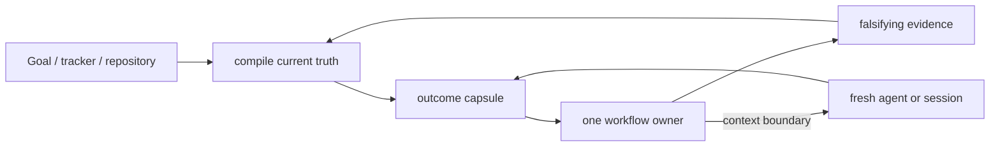

# Orchestration and compact context

Status: `accepted`. Consumer: maintainer, `$delivery-loop`, and
`$source-to-decision`. Owner: maintainer. Verified: 2026-09-10. Rework this page
in place when a falsifier fires; do not append a parallel “v2” report.

## Decision question

How should KRN carry an engineering outcome across long Codex runs, fresh
contexts, specialist workflows, independent review, and publication without
turning the repository into a transcript archive, a generic memory framework,
or an oversized skill catalog?

## Evidence convergence

| Evidence family | What it establishes | KRN implication | Limit |
|---|---|---|---|
| Matt Pocock | small owners, precise leading words, shared language, progressive disclosure, fresh ticket contexts, and explicit router/research/architecture/ticket owners in upstream `6654f6b` | keep a sparse composable catalog; let one indexed map link full decision sources while each ticket names its exact KRN owner; refresh the composed set from upstream instead of maintaining a fork | his exact catalog, tracker, and spec-retention policy are not KRN policy |
| Karpathy compact knowledge | raw sources can feed one indexed synthesis that improves by integration, contradiction handling, and rewriting | continuously compile a few living topic pages; Git supplies chronology | a personal knowledge workflow does not prove a production agent runtime |
| Rohit Goyal memory extension | useful memory needs provenance, recency, confidence, supersession, and forgetting | put those fields into source decisions; add search/graphs only after scale demands them | automated confidence and crystallization can become ungrounded ceremony |
| Official Codex guidance | Goal carries one outcome in one chat; skills carry repeatable methods; subagents isolate bounded work; required team rules stay in checked-in authority | Goal/tracker is live state, not a replacement for the selected workflow or repository memory | runtime Goal state is not portable repository knowledge |
| OpenAI harness engineering | agents need a maintained map into structured repository knowledge, with mechanical checks and gardening | `CONTEXT.md` is the small map; research and ADRs are the system of record; freshness is part of the maintenance loop | a large product harness would be overbuilt here |
| Anthropic long-running harnesses | restartable state and independent evaluation reduce drift; harness assumptions go stale as models improve; parallel agents cost tokens and coordination | checkpoint a compact capsule, use independent fixed-point review for substantial changes, and periodically delete or re-test scaffolding | older harness findings do not mandate initializer/evaluator fleets on newer models |
| Long-horizon agent benchmarks | SWE-EVO reports a large gap between isolated issue fixing and software evolution; SlopCodeBench measures verbosity and structural erosion; DeepSWE finds inherited tests can disagree materially with independent review | proof must include maintainability and trajectory-level checks where repeated agent edits are in scope, not only current test pass/fail | benchmark tasks and metrics are not a substitute for a product-specific acceptance test |
| `unlazy` harness | its current source puts gates, explicit evidence, re-verification, a task tree, and cooperative leases before or around work; its own boundary notes distinguish coordination from isolation | installed as an explicit companion; keep its production benefit at `lab-test`; it does not own lifecycle, sandboxing, leases, or dispatch | source design and historical self-reports do not prove lower cost, better outcomes, or hostile-process isolation |
| `ponytail` scope ladder | the current source asks whether work is needed, then prefers reuse, standard library, native capability, installed dependency, or the smallest implementation while preserving trust-boundary and accessibility checks | `lab-test` the question inside one real `to-spec` or `codebase-design` outcome; do not add a duplicate global skill | its small self-reported benchmark does not establish transfer to KRN or a universal implementation rule |
| Local deletion probe | five of six artifact roles had no runtime consumer; 18 operator pages mirrored the skills; reviewer-handoff had no external caller | delete generic report roles, doc mirrors, and the unconsumed packet workflow | future measured consumers may justify reintroduction |
| Local register micro-lab | the observed stale capsule sentence was repairable by fresh Goal/repository/PR readback; SQLite and Git-ref candidates could mechanically fence cooperative writers | retain the compact spine; keep both mechanisms at `lab-test` until a recurring writer-admission failure survives bounded repair | synthetic conformance is not product need, restore recovery, hostile-process exclusion, or power-loss proof |
| Local retrieval probe | 17 opportunistically chosen questions (facts, structure, metadata, links, supersession, negatives) were answerable by fresh same-model agents from the live map, lexical/git, metadata, and link rungs, and every cited line was checked locally | keep the retrieval ladder unchanged at this scale | the question set was self-authored with no sampling frame or retained pass record, so it neither tests whether a lower rung fails nor proves scale, cross-family parity, or hostile-input behavior |
| Local spine divergence probe | `repo inspect` reported `managedRuns: true` while a capsule with a bad enum, a missing restart path, a ghost cleanup entry, and an invalid fixed point passed silently | adopt the deterministic `krn-codex state check` boundary gate in `$delivery-loop` | it checks structure, not whether the recorded state is semantically current; the probe was synthetic and self-authored with no retained pass record, the gate covers only file-backed capsules and is cooperative, and the host exposes only `PreToolUse` |
| Local restart probe | two fresh no-context agents resumed a synthetic delivered outcome from the capsule plus the generated repository contract, reported the correct owner, next action, cleanup trigger, and fixed point, refused `COMPLETE`, and ran `krn-codex state check` once the contract named it | keep the capsule plus generated-contract restart path and record the state-check pointer there | one synthetic outcome with same-model agents; it does not prove three real long outcomes, cross-model recovery, or tracker-backed resume |
| Local routing probe | 15/15 mappings correct: five conditions (foggy route, contested concept, external evidence, fixed diff, clear change) expressed as canonical words, natural synonyms, and nearest negatives each routed to the canonical owner with a resolving citation | keep skill descriptions as the admission router; no central router is earned at this scale | same-model fresh agents, self-authored scenarios, and one repository surface; it does not prove cross-model recall or natural phrasing at scale |
| Local harness audit | three fresh same-model agents audited routing descriptions, durable-knowledge consistency, and falsifier coverage; 9/12 natural routing requests were ambiguous between descriptions, and concrete gaps (CI gate parity, disposition drift, an unexported recovery helper, index-row coverage) were fixed | fix verified inconsistencies and correct the explicit-only documentation; do not churn descriptions without an observed misroute | same-model agents, self-authored scenarios, and no retained per-question pass record; it does not prove cross-model routing or that fixed items stay fixed |
| Low-effort cross-model probe | `gpt-5.6-luna` at low reasoning completed one clear scoped edit through the installed harness in the onboarding repository: it skipped the lifecycle correctly, kept one focused falsifier, stopped before commit, and recovered from a sandbox-caused test failure; it named only a "direct implementation workflow" and never attached the explicit-only `implement` handler | keep the proof and authority steering; state the explicit-only attachment rule in the always-loaded protocol and plan a compiled capsule so restart does not depend on prose | one synthetic task in one repository with one model; it does not prove lifecycle resume, capsule validity, multi-session continuity, or routing beyond this observation |
| Agent memory research (2025–2026) | ACE shows structured incremental updates beat monolithic rewriting; Letta shows offline precomputation pays when the next query is predictable from context; the March 2026 surveys place the episodic-to-semantic transition and procedural experience extraction as the fragile, underserved stages; RLM shows code-mediated context access beats compaction for dense inputs | adopt the anti-collapse update rule for durable pages; lab-test a precompiled restart brief and a procedural-friction loop; keep episodic stores, graph activation, and REPL sub-calling deferred or rejected at this scale | benchmark gains and survey taxonomies are not KRN proof; the surveys themselves call consolidation and experience extraction fragile and hard to validate |
| Verification and judge research (2023–2026) | intrinsic self-correction degrades reasoning without external feedback (Huang 2023; Stechly ICLR 2025), models find logical errors poorly but correct them once the location is given (Tyen ACL 2024), LLM judges show self-preference and position bias and can be reproducible yet invalid (EMNLP 2025; Reliability without Validity 2026), and multi-agent failures cluster in specification, inter-agent misalignment, and task verification (MAST, NeurIPS 2025) | state the external-reference rule in the always-loaded proof budget; keep cross-model fixed-point disposition; reject the MAST-derived checklist after no lift in the local seeded-defect lab; reject intrinsic self-critique loops; defer judge ensembles and pairwise debiasing | benchmark findings are not KRN proof; the taxonomy is descriptive and its populations are multi-agent systems unlike KRN's single-writer lifecycle |
| Local seeded-defect review lab | low-effort `gpt-5.6-luna` reviewed one three-defect change with and without a MAST-derived checklist; both reviews found all three defects (exclusive-range off-by-one, missing `RangeError` validation, and a test encoding the bug), and the control already separated Standards from Spec; the treatment additionally misquoted the base commit SHA before self-correcting | delete the checklist candidate; keep external-reference review and deterministic proof; treat model-stated references as unverified | one synthetic seed, one model, and a difficulty ceiling where the control scored 3/3; it does not prove checklist value on harder artifacts or weaker reviewers, and it did not measure false positives |
| Context compaction and context rot (2025–2026) | length alone degrades performance even with perfect retrieval and drives premature termination (EMNLP 2025; Chroma; 2606.29718), so official harness guidance recommends proactive compaction with a steering hint, structured note-taking, tool-result clearing, and subagent context isolation (Anthropic; Microsoft; LangChain); ARC shows addressable citations preserve recall where summaries lose it, and TRACE evaluates a compaction boundary by paired continuations from the same state | keep the small always-loaded map, proactive boundary rewrite, and addressable capsule pointers; run no autocompact; defer subagent isolation and boundary-local evaluation until a measured long session loses context or repeats exploration | the studies measure benchmark agents, not KRN; premature termination and context rot are length-driven and their KRN magnitude is unmeasured |
| Official harness primitives (2026) | Codex documents an AGENTS.md precedence chain, per-CWD `.agents/skills`, and explicit-only subagents; Anthropic's long-running harness ships a default-FAIL contract, a fresh-context evaluator with no write tools, and an agent-maintained handoff, and its app harness negotiates a sprint contract before building | adopt the fresh-context, no-write evaluator refinement in `$delivery-loop` step 4; the default-FAIL contract is already covered by observed-evidence completion and the N-proof budget; subagent isolation stays deferred | vendor examples and demo harnesses are not KRN proof; the sprint-contract and browser-evaluator loops are cost-heavy and out of KRN's current scope |
| Cookbook reliability primitives (2026) | OpenAI's Agents SDK `Memory()` stores reusable workflow lessons across runs, not case facts, and is steered away from becoming a shadow record; compaction carries the current run while memory improves future ones | port `Memory()` to a bounded, file-backed workflow-lessons page loaded at bind and promoted at cleanup; no API dependency and no second record | the cookbook runs API sandboxes over synthetic evidence; the port changes storage and loading, not proven behavioral value |
| Local lesson-gate probe | a synthetic ACTIVE capsule with one friction candidate surfaced the candidate in `krn-codex state resume`; flipping it to `COMPLETE` made `krn-codex state check` fail with `complete-with-friction` (exit 1); a second probe showed `state resume` printing a repository workflow-lessons page; a third showed `krn-codex state check` diverging on a 25-row lessons page without any capsule; a fourth showed a lesson row without a gate failing as `malformed-lesson`; all probe artifacts were removed | keep the capsule field, the completion block, resume-time lesson loading, and the portable budget plus gate invariants | synthetic probes only; they do not prove lessons are promoted well after a real outcome, nor that the lessons page improves future behavior |
| Local lesson promotion | the budgeted-surface friction observed in this session (`delivery-loop/SKILL.md` reached 181 lines until condensed to 179) was promoted to `workflow-lessons.md` with its evidence and enforcing gate | keep the require-a-gate invariant and the promotion path from a real observed outcome | one self-observed session; it does not prove promotion from third-party outcomes or that the lesson changed future behavior |
| Local cross-model restart lab | in a fresh repository, a low-effort `gpt-5.6-luna` session A implemented a scoped feature and hand-wrote a structurally valid capsule (`state check` clean); a fresh session B loaded it, reran the test, ran `git diff --check` and `state check`, updated the capsule to `NEEDS_REVIEW` with evidence and a next action, and correctly kept restart state for the non-terminal outcome | keep the capsule ABI, the restart-state keep/remove rule, and the state-check pointer; prefer `state compile` for the mechanical skeleton because hand-written fixed points stay vague | two short sessions on one small feature in one model family; it does not prove long multi-session delivery, cross-family recovery, or lesson-promotion quality |
| Local mutation probe | mutating `state-brief.mjs` (`count: items.length` to `+ 1`) turned the workflow-lessons test red (24 pass / 1 fail), and restoring it returned 25/25, demonstrating that the new falsifier can fail | keep the show-it-fail proof rule; it needs no mutation framework | one hand-made mutation in one function; it does not prove suite-level mutation adequacy or low-effort authoring behavior |
| Harness observability research (2026) | AHE runs an observability-driven evolution loop over component, experience, and decision surfaces, pairs every edit with a self-declared prediction, and its ablations localize gains to tools, middleware, and long-term memory rather than the system prompt; production guidance adds structured traces, an audit log, and a doctor-style diagnostic; Agents SDK tracing is span-structured and disabled under ZDR | keep file-level harness components, distilled durable evidence, and prediction-bearing changes; never add a raw trace store; treat structural mechanisms as the transferable part and prose as the fragile part | the evolution loop needs large rollout corpora and benchmark harnesses far beyond KRN; no KRN measurement supports its transfer, and raw traces carry privacy and cost limits |
| Local silent-failure probe | a composition probe (a valid capsule plus a 25-row lessons page) made `state resume` exit 1 without naming `lessons-over-budget`; the brief and CLI now print the blocking error, and a regression test asserts it | keep blocking errors visible in human output; add no logging store | one synthetic composition; it does not prove other silent-failure classes are covered |
| Local explicit-only re-probe | a fresh low-effort `gpt-5.6-luna` session implemented a clear scoped change directly without attaching `implement` or asking, despite the always-loaded attachment rule, while still keeping the proof and no-commit rules | scope the rule: direct execution under proportional proof for mechanical or single-seam scoped changes, `$implement` attachment for non-mechanical or multi-file work | one short task and one model; it does not prove the rule holds for larger handlers or stronger models |
| Local compile-path probe | `state compile` output pasted verbatim as a run capsule passed `state check` with status `clean`, raising only the expected `vague-acceptance` warning on its placeholder, and `state resume` read it back | keep the compiled skeleton valid out of the box | one repository and one skeleton; it does not prove a model fills the semantic fields well |
| Local diagnostics sweep | a divergent capsule (hidden field plus unignored runs) and an empty skill index surfaced every error in human output and JSON with non-zero exits: `state check` and `state resume` printed `runs-not-ignored` and `missing-field`, resume carried them in the brief and JSON, and `skills check` exited 1 | keep blocking diagnostics visible across the CLI surface | one synthetic divergent repository; it does not prove semantic correctness or coverage of every error class |
| Local release provenance check | a fresh clone at `4b8e41c` passed `validate`, `test:state` (26/26), and `test:skills` (6/6); `install apply` into a temporary `CODEX_HOME` produced a release at the clone's exact commit, switched `current` to it, and the linked CLI ran `state compile` | keep the release pipeline verifiable from the published artifact alone | one clone, one host, and a temporary home; it does not prove cross-host behavior or fresh-session discovery |
| Local composition test probe | `test/composition.test.mjs` composes compile, check, and resume on a real temporary repository; it failed when `renderLessons` was mutated to hide lessons (25/27) and passed again after restore (27/27) | keep the composition test in `test:state` and the held-out rule in step 4 | one composed path on the state surface; it does not prove composition across other surfaces |
| Local dogfood outcome | the two open proof lab-tests closed: per-slice checks are named in the transition table and step 2, and the held-out/composition rule ships with `test/composition.test.mjs` (failed 25/27 under a `renderLessons` mutation, 27/27 restored); a low-effort `gpt-5.6-luna` slice added one valid workflow-lessons row, and an independent read-only luna review returned no finding on Standards and Spec at the fixed point while reporting it could not execute tests in its read-only sandbox | keep the named per-slice check and the composition test in `test:state`; treat review-lane execution gaps as stated non-proofs | one self-authored outcome and one reviewer model; the review lane could not execute the suite, so its Standards check is inspection-only |
| Verification execution and regression research (2025–2026) | execution evidence beats static hypotheses: AnyPoC shows naive verifiers are biased toward success and need independent re-execution; test and static feedback lift repair solve rates (28.5% to 43.9%); layer-isolated no-LLM suites catch single-layer regressions that aggregate metrics mask; AgentAssay gives token-efficient stochastic verdicts; the progress-mirage study shows self-graded loops accept stagnation without out-of-band grounding; QGP makes the stopping condition externally checkable | adopt executable lessons and executed disposition evidence; keep the deterministic no-LLM suite as the gate and model lanes as advisory; lab-test a stall signal from an externally checkable progress state | benchmark and production results are not KRN proof; KRN has no live evaluator and its suites are small |
| Planning and reliability research (2026) | long-horizon failure shifts from raw errors to subplanning drift and catastrophic forgetting as horizons grow (2604.11978), planner-defined passing criteria per subtask improve execution (VERIMAP, EACL 2026), decomposition quality is the routing bottleneck (2606.18051), and most production uplift comes from scaffolding and routing rather than the verifier, whose catch rate is low but concentrated on otherwise-failing tasks (2607.17044) | keep the compiled capsule as the long-horizon constraint carrier and the independent evaluator; record a per-slice passing criterion as a lab-test; add no planning model or DAG engine | benchmark and production results are not KRN proof; KRN is a single-writer lifecycle without DAG scheduling |

Primary-source refresh (2026-09-10): [OpenAI's harness-engineering guidance](https://openai.com/index/harness-engineering/) treats `AGENTS.md` as a short table of contents and the repository knowledge base as the system of record, with mechanical boundary checks. [Anthropic's long-running harness work](https://www.anthropic.com/engineering/effective-harnesses-for-long-running-agents) supports restartable artifacts and tractable work units while warning that harness assumptions age. [Anthropic's application harness work](https://www.anthropic.com/engineering/harness-design-long-running-apps) shows that a skeptical generator/evaluator loop can lift subjective frontend quality, but only when the task is beyond the model's solo reliability and at substantial cost. [Context as a Tool](https://arxiv.org/abs/2512.22087) and [ACON](https://arxiv.org/abs/2510.00615) support structured or learned context compression; they justify only a bounded capsule lab-test here, not a generic memory service. [SWE-EVO](https://arxiv.org/abs/2512.18470) shows a large gap between isolated fixes and multi-file evolution, while [SecureVibeBench](https://arxiv.org/abs/2509.22097) shows that functional success and explicit security instructions do not guarantee secure code. The [LIMIT study](https://arxiv.org/abs/2508.21038v2) proves a dimension bound on single-vector top-k expressivity and calls for techniques beyond the single-vector paradigm; the theorem is established, while its application to KRN is untested. The remaining sources here are hypotheses and risk signals, not KRN proof.

## 2026 research refresh: complexity must earn its owner

The current evidence converges on a deliberately small production spine. A
mechanism enters KRN only when it has a named consumer, one canonical owner,
and a falsifier; otherwise it remains a bounded experiment or is rejected.

| Mechanism | Decision | Local consumer and falsifier | Slop boundary |
|---|---|---|---|
| Skill descriptions as admission router; progressive disclosure; thin `AGENTS.md` map | adopt | `config/AGENTS.md`, README, and the pinned composed set; routing collisions or repeated misroutes despite improved descriptions reopen the decision | no central router, per-skill mirrors, or duplicated procedure |
| Compiled outcome capsule with pointers, explicit non-proofs, and one writer | adopt | `$delivery-loop`; a fresh agent must resume three representative long outcomes without transcript reconstruction | no transcript archive, vector store, or durable reflection log |
| Plan–act–observe, staged diagnosis before repair, provenance, and fixed-point review | adopt | current specialist owner plus `$source-to-decision` / `code-review`; a public-seam acceptance failure or stale fixed point falsifies the gate | no mandatory full pipeline or benchmark-as-proof |
| Retrieval as a composed process over the live map, lexical/git, metadata, links, and a conditional local full-text index; embeddings as one optional tool | adopt | maintainer owns the map, links, and rung decisions; a workflow that builds a derived index owns that index only; `$source-to-decision` loads and `research` passes consume it; a measured failure authorizes current-rung repair before the next rung | no central vector store, graph database, or similarity-first memory service |
| Deterministic spine state check for the outcome capsule and run cleanup | adopt | `$delivery-loop` and the next session; injected bad enum, ghost cleanup, missing restart path, or invalid fixed point must fail and a clean capsule must pass (`npm run test:state`); the installed bootstrap smoke drives ACTIVE → premature-COMPLETE blocked → completed (`npm run test:bootstrap`); superseded when the capsule ABI moves or the gate is enforced directly, then the maintainer deletes the checker, test, and gate | structural facts only, and 40-hex tokens must be git commit objects; `divergent` blocks, `not-applicable` means no file-backed capsule was checked, and the gate is cooperative, not enforcement; one non-blocking recorded-HEAD-vs-live-HEAD warning only; no second store |
| Lossy compaction or proactive memory actions | lab-test | one bounded capsule rewrite/readback experiment; a dropped field causing a wrong action that readback cannot repair fails it | no generic summarizer, embeddings, graph, or episodic memory service |
| Generator/evaluator loop for frontend taste and browser behavior | lab-test, separate branch | one real frontend outcome with a solo baseline, evaluator run, cost, and human acceptance; no material lift at acceptable cost rejects it | never globalize a multi-hour evaluator loop or turn taste into a universal score |
| Issue tracker as orchestration control plane or Beads-like backend | defer | only a measured queue/concurrency bottleneck with explicit remote-write authority can reopen it | native Goal, tracker, and capsule stay distinct; no new task database now |
| Mechanical checks for already-declared durable-page fields | adopt | maintainer and `$source-to-decision` promotion; removing a required header field or index row must fail `npm run validate` | no freshness scoring, prose-style linting, or checks beyond fields that already have a reader |
| Cross-repo history hygiene in the always-loaded contract | adopt | every installed session and future repository contract; a conflicting repository convention or an observed non-conventional authored commit that survives review reopens ownership, and a machine-parsing consumer reopens enforcement | Conventional Commits on authored commits, PR titles, and squash subjects plus the no-machinery rule naming status and progress artifacts; squash merges keep the PR title as the maintained subject; no per-repo duplicate rule, no commit recipe book, no hook without a named consumer |
| Itemized durable-page updates that preserve mechanisms, conditions, counters, and provenance | adopt | maintainer and `$source-to-decision` promotion; a review that finds a rewrite dropped a retained mechanism, falsifier, or provenance link reopens the rule | no append-only log and no per-claim database; item IDs only if a named reader needs them |
| Precompiled restart brief over the outcome capsule | lab-test; implemented as read-only `state compile` / `state resume` with focused tests in `npm run test:state`; a 2026-09-10 low-effort `gpt-5.6-luna` probe resumed a synthetic ACTIVE capsule correctly through `state check` and `state resume`, and a cross-model lab resumed a real small outcome with a hand-written capsule | `$delivery-loop` restart path; a fresh low-effort session must resume from one compiled brief with no transcript reconstruction and no missing mechanical field, or the mechanism is deleted with its command | deterministic fields only; no background daemon, no always-on summarizer, no second memory store; the probes used one hand-authored or hand-written synthetic capsule and one small feature, so they do not prove recovery after a long outcome, cross-family generality, or that the recorded state is semantically current |
| Workflow-lesson memory (`Memory()` port) | store/load/gate adopt; production benefit lab-test | `$delivery-loop` reads `docs/research/workflow-lessons.md` at bind, `krn-codex state resume` prints it, every row carries evidence and an enforcing gate, and a capsule lesson candidate blocks `COMPLETE` until dispositioned; the next long outcome must turn repeated friction into a skill or reference edit or the mechanism is deleted | no API dependency, no shadow record, no second store, no automatic skill rewriting; `npm run validate` and `krn-codex state check` enforce the 24-row budget and require a non-empty gate on every lesson; a lesson without a gate is deleted |
| Treat the durable corpus as an external code-manipulated variable | defer | maintainer; reopen only when the live-map and lexical rungs repeatedly fail on a measured corpus | no REPL, sub-call, or graph infrastructure at this scale |
| External-reference verification; intrinsic self-critique is not proof | adopt | every installed session; the proof budget states that a deterministic falsifier outranks a model review and same-model self-assessment is never proof, while `$delivery-loop` requires a reviewer identity, model, and context different from the implementer for an admissible disposition | no self-critique loop, no always-on judge, no second verification owner |
| Context compaction, rot, and isolation (2025–2026) | proactive boundary rewrite and addressable pointers adopt (already present); subagent context isolation and boundary-local evaluation defer | keep the small map, boundary capsule rewrite, `Next bounded owner and action`, and addressable pointers with no autocompact; defer isolation and paired-continuation evaluation until a measured long outcome loses context or repeats exploration | no autocompact, transcript archive, subagent fleet, instrumentation, or always-on evaluator |
| Official harness primitives: fresh-context evaluator | adopt | Codex documents the AGENTS.md precedence chain, per-cwd `.agents/skills`, and explicit-only subagents as host behavior; Anthropic's primitive is a fresh-context evaluator with no write tools, now required in `$delivery-loop` step 4; default-FAIL is covered by observed-evidence completion and the N-proof budget | no evaluator fleet, extra review owner, sprint-contract loop, or browser-evaluator loop; vendor demos are not KRN proof |
| Acceptance as an observable check (test oracle) | adopt | `$delivery-loop` bind requires acceptance to name an observable check the next session can run, `state check` warns `vague-acceptance` when the acceptance field has no command, path, or code marker, and `state compile` prompts for the check | warning-only and no new store; a prose check that produces noise is removed |
| Falsifier must be shown to fail (mutation/red requirement) | adopt | every installed session; the proof budget now requires each new falsifier to fail on the pre-change or mutated behavior before it counts, so a test that cannot fail is proof theater | no mutation framework, no coverage scoring, no test-generation service |
| Held-out or composition acceptance check | adopt (rule in `$delivery-loop` step 4 plus `test/composition.test.mjs` wired into `test:state`, which failed when `renderLessons` was mutated) | for a non-trivial change, one acceptance check the producer did not author is added before the disposition counts | no second test framework; the composition test covers the state surface only |
| Component, experience, and decision observability | adopt (already present) | every editable component is a file with validation, the distilled durable evidence is `docs/research/` plus `workflow-lessons.md`, and each lab-test or lesson carries a falsifier or gate; raw traces stay unretained | no trace store and no automatic harness-evolution service |
| Structural mechanisms outrank prose instructions | adopt as a priority rule | prefer a file, gate, or CLI check over an added instruction line when both can prevent the same failure; the AHE ablation and KRN's own gates both carry behavior this way | a prose rule still earns space when no check can decide it |
| Blocking diagnostics must appear in human output | adopt | a composition probe showed `state resume` exiting 1 on `lessons-over-budget` without naming it; resume text and CLI stderr now carry the error, gated by a `test:state` case | no logging framework; diagnostics stay in the command output |
| Goal budget as a stopping condition | adopt | the native Goal budget bounds authorized work; on exhaustion the owner stops and reports instead of continuing, matching Codex Goal guidance and the per-run spend-controller pattern | no auto-escalation, no hidden spend, and no capsule budget field; the host owns the budget |
| Scoped changes execute directly under proof; larger work attaches `implement` | adopt | a low-effort re-probe ignored the ask-for-attachment rule and executed directly, so the contract now scopes it: mechanical or single-seam scoped changes proceed under the proof budget, and non-mechanical or multi-file work asks for `$implement` | no imitation of the full `implement` procedure and no forced attachment for tiny changes |
| Secrets never enter durable artifacts or diagnostics | adopt | production observability sanitizes tool output before logging and disables tracing under ZDR; the always-loaded contract now forbids committing, logging, or writing credentials or secrets into durable artifacts or diagnostics | no secret-scanning service yet; the hard boundary is review-enforced, and a measured leak would add a mechanical check |
| Per-slice passing criterion before advancing | adopt (implemented in the transition table and step 2) | each `$slice-work` unit names the check that decides it before work starts, and this outcome named per-slice checks for its own slices | no DAG engine or scheduler |
| Compiled capsule as the long-horizon constraint carrier | adopt (already present) | acceptance, non-proofs, unknowns, and next action are rewritten at every boundary, countering catastrophic forgetting and subplanning drift | no constraint-tracking service and no independent plan store |
| Executable lessons resolved by a command | adopt | `krn-codex lessons check` resolves every lesson's gate reference to a repository artifact or an explicit `manual:` marker; a missing or unresolved gate fails the gate list | no arbitrary shell from knowledge files and no lesson without a resolvable gate |
| Proof-carrying review (executed evidence in the disposition) | adopt | a stored Standards/Spec disposition records the executed command, its exit, and the fixed point; `state check` warns `disposition-without-evidence`, and a lane that cannot execute states that gap | no reviewer fleet and no approval upgrade; advisory lanes stay advisory |
| MAST-derived review checklist for specification and verification failures | reject after the 2026-09-10 seeded-defect lab | deleted: low-effort `gpt-5.6-luna` found all three seeded defects with and without the checklist (control 3/3); reopen only with a harder seed or a weaker reviewer that misses a defect without it | no always-loaded checklist and no multi-agent redesign; one seed and one model produced a ceiling effect |
| Judge ensembling and position-swap debiasing | reject for KRN now | pairwise or multi-judge scoring does not match KRN's single read-only artifact review; reopen only if a review-lane disagreement is traced to position or self-preference bias | no judge fleet and no scoring pipeline |

The durable-page field check was promoted to `adopt` on 2026-09-10 after two
independent audits recorded six header shapes across the four topic pages and a
dangling, unlabeled `lab-test` disposition; the check asserts only fields a
named reader already consumes.

History hygiene was promoted to `adopt` on 2026-09-10. Conventional Commits
1.0.0 makes the authored commit header machine-readable, and this source
repository's local rule was not discoverable from a fresh checkout, so it did
not fall under "discoverable facts do not earn permanent prompt space". The
installed contract now owns the format in one line, and the existing
no-machinery bullet explicitly names status and progress artifacts. The
`scripts/validate.mjs` 60-line ceiling for the installed contract stayed
intact, so no other rule was displaced. Mechanical enforcement (`commit-msg`
hook or CI lint) remains deferred: no non-conventional authored commit has been
observed, generated merge commits are outside the rule, and the host exposes
only `PreToolUse`; a local Git hook would first need a repository owner and a
named consumer. The rule also names PR titles and squash subjects, because a
squash subject is the authored PR title; generated merge commits remain outside
it, and strict delivery prefers squash merges so the maintained subject stays
conventional. This does not prove that a prompt-level rule changes commit
behavior; it makes the shared convention explicit and single-owned.

The frontend result is especially important: Anthropic reports that skeptical
evaluation improved originality and last-mile behavior, but also reports rising
complexity, multi-hour runs, and diminishing value as the model improves. KRN
therefore keeps frontend taste as a separate branch experiment, not a global
skill or permanent evaluator harness. The same conditional rule applies to
cross-model review and parallel writers: measure detection or integration lift
against cost before promoting either mechanism.

## Retrieval escalation ladder

KRN keeps retrieval as a composed process, not one similarity search. The
[LIMIT study](https://arxiv.org/abs/2508.21038v2) shows that a single vector can
express only a dimension-bounded number of top-k relevance sets, even when
embeddings are optimized directly on the test set; the result bounds the
single-vector paradigm, not KRN's current corpus. The local response is a
ladder: climb one rung only after the current rung repeatedly fails on a
measured durable corpus.

1. **Live map** — `CONTEXT.md`, `README.md`, and the installed contract; the
   smallest current index, always loaded.
2. **Exact and lexical** — path and glob search, `ripgrep` over canonical files,
   and `git log` or `blame` for chronology and supersession. Deterministic and
   cheap.
3. **Structured metadata** — source identities, statuses, owners, verification
   dates, decision vocabulary, and configured tracker fields.
4. **Explicit links** — map → topic → primary-source row → owning skill,
   including supersession edges. This link graph is the graph; no graph database
   is earned at this scale.
5. **Local full-text index** — for example SQLite FTS5, only when a measured
   durable corpus outgrows exact search.
6. **Embeddings as one optional tool** — never the authority, never the central
   store, and only after the earlier rungs demonstrably fail.

Owner: maintainer, who keeps the map, links, and rung decisions current.
Consumers: `$source-to-decision` source loads and `research` passes. A derived
rung-5 or rung-6 index is owned only by the workflow that builds it. Falsifier: a
durable corpus and query class that repeatedly fails the current rung; repair the
current rung first (index, links, vocabulary), then let that failure authorize
the next rung, and reopen the topic decision only if the failure survives the
bounded repair and the climb it authorizes. Non-proof: the LIMIT result bounds
single-vector expressivity; it does not measure KRN, nor prove that lexical
retrieval suffices at any future scale. Supersession: replace a rung when a
mature local mechanism makes it obsolete. Any rung-5 or rung-6 index is derived
and disposable: built by a workflow inside its own ignored run, deleted when that
run's consumer finishes like any other run state, and never promoted to durable
knowledge.

## Breakthrough: compile context at boundaries

The continuity unit is not a chat transcript, report directory, or autonomous
memory service. It is a compact **outcome capsule** that is rewritten whenever
ownership or context changes. The next owner reconstructs the task from that
capsule plus current repository/tracker state.



`$delivery-loop` owns the exact capsule ABI; that skill is the only
authoritative field list. This page records only how the capsule is compiled,
where it may live, and who may write it.

For a multi-session outcome, the accepted request or native Goal owns current
thread intent and authority. A configured tracker, when present, owns durable
shared acceptance, queue, blocker, and active-Spec state. Repository and host
state own observed execution truth. The capsule is a compiled cache, never the
winning source. Its absence is explicit; an irreconcilable disagreement blocks
the next transition until the owner records the resolution. When a fresh process
must resume without the current chat,
`$delivery-loop`'s named sole writer may mirror the capsule only at
`.krn/runs/delivery-loop/<outcome-id>/state.md`. Other workflows keep
continuation in the native Goal or configured tracker, or hand lifecycle
ownership to `$delivery-loop`; they never create a workflow-local outcome
capsule. The delivery-loop writer rewrites that file in place and deletes its
run at the lifecycle cleanup trigger. It also carries each specialist run's
creating owner, semantic pointer, sole consumer, trigger, and state until that
owner's cleanup is verified. The capsule never becomes a generic durable
report. A superseded or abandoned run remains while its original Goal is active;
transfer into a successor does not delete it before the original Goal's
non-active transition is read back.

## One spine, typed entries

The canonical operator graph is in [README.md](../../README.md#workflow). Its
diamond is a decision rule, not a central router skill. Every resolved phase is
skipped. Once one production slice is clear, the ordinary spine is
`implement` → `0/1/N proof` → fixed-point `code-review` when the slice is
non-trivial, review is requested, or a `$delivery-loop` lifecycle envelope is
active and the slice is not mechanical 0-budget → truthful outcome and
publication state. A mechanical low-risk 0-budget slice may skip review when it
changes no behavior, authority, security, or spec/acceptance surface. An
accepted, authorized review repair returns to a fresh `implement` task.

Everything before that spine is a typed admission or return, not a mandatory
stage. When a specialist return satisfies the requested outcome or has no
authorized next action, it is terminal instead of being routed merely to keep
the graph moving:

The canonical transition table is owned by the lifecycle skill:
[`delivery-loop/references/transitions.md`](../../skills/engineering/delivery-loop/references/transitions.md).
Its handler column defines the repository-scoped baseline, and `npm run
validate` fails when table, manifest, and pin disagree. This page keeps the
admission rationale and must not duplicate the table.

This removes the graph's former generic `CHOSEN`, `DISP`, and `VERDICT` nodes.
Those were not shared runtime states; each specialist already has a more
precise return contract. Authority is a precondition and reported state, not a
workflow stage. The change owner produces proof; an active lifecycle envelope
commissions fixed-point review for every non-mechanical slice without taking
over either procedure. `$delivery-loop` is the optional lifecycle envelope around the
selected owners; it never executes their procedures and is not a downstream
decision consumer merely because a decision completed.

A Wayfinder map persists one active integrator identity, one exact worker-result
return channel, observed tracker-write authority, and a writer generation with
matching activation readback. Fresh ticket workers treat the map and child as
read-only and return complete results through that channel; only the recorded
integrator writes, and a pending or mismatched generation blocks the frontier.
Repository-dependent children also carry canonical repository and `cwd`, fixed
point, allowed paths, separate mutation authority, result shape, consumer, and
non-proof; their canonical **Result return** block alone holds the mutable return
destination. Every write-capable child uses an isolated worktree and one
integration owner. Concurrent file writers additionally use disjoint allowed
paths; otherwise the child remains read-only.
These writer, worktree, and allowed-path rules coordinate cooperating clients;
they are not a process-isolation or security boundary.

Wrappers and companions:

- `target-repo-work` establishes identity and authority before the selected
  owner crosses into another checkout.
- `typescript-engineering` sharpens TypeScript work beside implementation,
  diagnosis, design, or review.
- `opencode-second-opinion` is an explicit, non-interactive DeepSeek advisory
  pass over one named path or artifact. It returns prose, never a patch or
  approval; the initiating owner verifies and disposes its output.
- `setup-repository-workflow` performs one explicit adoption/repair pass and
  then disappears from ordinary work.
- `managing-codex-capabilities` remains the KRN capability owner; the system
  `skill-creator` remains a separate authoring owner.

## OpenCode advisory transport disposition

**Decision:** treat the transport as advisory-only, not bounded beyond its
prompt. Code inspection resolves the path scope: the runner passes the whole
target directory and enforces only output-citation scope, so the allowed-path
brief is convention, not a boundary. The terminal time-limit and
failure-retention contract is verified on substituted processes. A mechanical
scope boundary stays unbuilt until a named consumer needs to send sensitive
state or the runner crosses a trust boundary. The named consumer is the next
`$opencode-second-opinion` transport change.

The current runner accepts either a prose or strict-JSON opinion, does not
request interactive or automatic permissions, enforces a terminal timeout, and
retains `raw.failed.jsonl` plus `failure.txt` for failed or interrupted runs.
That proves a completed response is well-formed and a failure is attributable;
it does not prove filesystem scope isolation: OpenCode receives the target
repository directly while allowed paths remain prompt prose. Nor does the
timeout establish complete process or resource isolation.

| Mechanism | Bounded test | State and decision limit |
|---|---|---|
| A path allowlist is a security boundary only when enforced outside the model prompt. | Give a run one permitted file and ask it to read a sibling ignored run; any returned sibling content rejects the prompt-only boundary. | Resolved by inspection: the runner enforces only output-citation scope and contains no allowlist code, so the brief is convention. Do not label the transport sandboxed or send sensitive repository state until a mechanical scope boundary exists. |
| A bounded external opinion needs a terminal time limit and attributable failure evidence. | Substitute an `opencode` process that never exits, then one that emits an incomplete JSON stream; the runner must terminate and retain the exact partial stream plus failure cause. | Verified on substituted processes: the runner terminates and retains attributable failure evidence. Do not adopt a specific timeout value or treat the retained artifacts as security evidence. |

Transport lab result (2026-09-10, substituted processes): the runner terminated a
never-exiting process at the configured timeout (exit `124`) and retained
`failure.txt` with reason and exit code; it rejected an incomplete JSON stream
during extraction (exit `78`) and retained the partial stream as
`raw.failed.jsonl` plus `failure.txt`; a nonzero process exit retained the same
failure evidence (exit `7`). `check-opinion.sh` returned `failed` for all three
and no `opinion.md` was produced. This establishes the terminal time-limit and
attributable-failure contract of the current runner. It does not adopt a timeout
value, prove filesystem scope isolation, or show model behavior toward the path
brief; the path allowlist remains a prompt convention, not an enforced boundary.

Path lab result (2026-09-10, substituted processes): a pass created through a
symlinked checkout, listed through both the symlink and the resolved path, and
resumed after the checkout moved all returned `completed`; run data stayed
git-ignored, the recorded target was the resolved path, and a stale symlink to
the old location fails closed with exit `64`. This covers the advisory
run-directory path handling; it does not prove model behavior, filesystem
isolation, or cross-machine resumption.

This decision does not prove that OpenCode will violate a path brief, that a
particular timeout is correct, or that DeepSeek output is approval. If a future
consumer needs a mechanical scope boundary, the next owner returns only a
focused transport proof to `$source-to-decision`; until then the initiating
workflow still verifies any substantive finding locally.

## Claude memory comparison: reuse the mechanism, not the plugin

The old project-local `.remember` material is not Claude Code's native memory.
The public Remember project is a third-party, source-available plugin. Its
useful mechanism is a lifecycle pipeline: session start recovery, filtered
transcript extraction, bounded summarisation, a current handoff, and later
consolidation into recent/archive files. It also documents locks, atomic
same-directory replacement, cooldowns, and worktree-aware external storage.
Those are observations about that project, not permission to vendor it; its
license prohibits modification and redistribution, and KRN forbids vendoring
external code or raw corpora.

Claude's native feature is smaller: project-scoped Markdown memory is loaded at
session start, is bounded, editable, and acts as context rather than an
enforcement boundary. KRN therefore ports the semantic boundary, not the
implementation:

| Remember mechanism | KRN decision | Local boundary |
|---|---|---|
| Automatic transcript capture and tiered daily/archive summaries | reject for now | duplicates the research ledger, hides stale model-written context, and adds privacy/token cost; reopen only after a named restart failure and retention rule |
| Explicit `/remember` handoff | adopt as a semantic pattern | `$delivery-loop` rewrites one compact outcome capsule with evidence, non-proofs, authority, and next action; no second memory store |
| Per-project/worktree external storage | adopt existing boundary | ignored `.krn/runs` and canonical repository identity already isolate transient state; durable shared facts belong in `CONTEXT.md`, research, or ADRs |
| SessionStart/PostToolUse lifecycle hooks | defer | the KRN hook stays narrow and deterministic; the reproducible divergence case is now covered by the deterministic CLI gate, while lifecycle events remain unavailable on this host (`PreToolUse` only) and would only wrap the same checker |
| Locks, cooldowns, atomic replacement, and recovery | lab-test only | use if concurrent capsule writers or power-loss recovery fails in a real run; do not add a generic memory daemon |
| Personal preferences or identity memory | reject in the repository | keep operator preferences outside product knowledge; only shared vocabulary and accepted decisions are durable |

The resulting invariant is simple: a fresh owner reads the accepted request or
Goal, current repository/tracker state, and one compact capsule. If that is not
enough, the owner records the missing fact in the canonical decision topic or
asks for authority; it does not silently grow a transcript archive. The
canonical topic records the source identity and decision residue so later work
can reuse the decision without rereading the same material.

## Third-party harness disposition

The named consumer is `$delivery-loop`, with the next suitable multi-session
engineering outcome as its lab surface. The current KRN core already owns one
outcome writer, restart capsules, authority states, scope-aware repository
work, and proportional proof. Installing another lifecycle framework globally
would create an ownership collision before it had a measured consumer.

| Candidate | Decision | Local action | Falsifier / next gate |
|---|---|---|---|
| `unlazy` | `adopt` the explicit companion; `lab-test` its production benefit | keep the machine-checked gate ledger and re-verification; it does not own lifecycle, sandboxing, leases, or dispatch | a second long-running pilot shows duplicate state, extra ceremony, or no earlier detection; then revisit the explicit companion |
| `ponytail` | `adopt` the heuristic in existing owners; `lab-test` its measured effect | make “needed → reuse → standard/native → installed dependency → smallest implementation” an explicit question for existing `to-spec` / `codebase-design` owners | a recurring overbuilt slice, missed reuse opportunity, or security/accessibility regression despite the question reopens whether the heuristic belongs in a stronger seam |

Neither candidate is installed as a new global lifecycle owner by this
decision. The source claims are not a benchmark of KRN, and the lab-test setup
is not adoption or proof of production isolation.

## Artifact taxonomy

| Information | Canonical owner and destination | Lifecycle |
|---|---|---|
| Current thread objective and continuation | accepted request or native Goal when present | reconciled at every transition; native Goal closed with the outcome when present |
| Durable shared acceptance, queue, blockers, and active Spec | configured tracker, when present | updated at every shared transition; its absence is explicit; frontier tickets remain linked primary sources and the Spec closes with the outcome |
| Shared vocabulary and current system map | `CONTEXT.md` | rewritten when a term or relationship changes |
| Consequential hard-to-reverse trade-off | `docs/adr/<id>-<slug>.md` | created rarely; superseded explicitly |
| Source-backed engineering decision | `docs/research/<topic>.md` | created only for a named consumer, then merged in place; claim stays near provenance and falsifier |
| Outcome capsule | `.krn/runs/delivery-loop/<outcome-id>/state.md` | owned and rewritten only by delivery-loop's sole writer; delete at its lifecycle cleanup trigger; transfer condensed truth before cross-Goal continuation |
| Transient spec, slice list, prompt, job, packet, or shard | `.krn/runs/<workflow>/<run-id>/` | owned by the creating workflow, ignored and private; delete when its in-goal consumer finishes or owning Goal closes |
| Review result | initiating outcome, PR, or issue thread tied to one fixed point | condensed into the capsule when continuation needs it; invalid when base/head/Spec/Standards changes |

Every artifact has a semantic owner and lifecycle. Physical mount prefixes are
runtime details, not reusable contracts.

## Portfolio boundary

The KRN repository promotes ten local owners and composes the pinned
upstream set separately. `reviewer-handoff` was retired because no workflow
called its compiler: routine review already has repository access and the
external checker owns its own packet/schema/transport. A deterministic helper
without a demonstrated consumer is not a promoted workflow.

Four local skills remain explicit-only:

- `setup-repository-workflow` because it mutates repository instructions;
- `opencode-second-opinion` because it starts an external advisory run;
- `unlazy` because it starts a completion ledger and gate re-verification;
- `unslop` because it performs a deliberate prose audit or rewrite.

`slice-work` is model-invocable because `delivery-loop` composes it. Ticket
publication remains a separate authority branch; invocation does not grant
remote mutation.

No central router is added. Skill descriptions are the admission router; add a
router only after repeated human recall failures across the four explicit-only
local skills.

## Complete owner map

The harness map is a routing boundary, not a second skill catalog. This compact
map records the owner groups and their stopping boundaries so `README.md` can
remain the human catalog.

| Owner group | Owners | Boundary |
|---|---|---|
| Admission | `ask-matt`, `wayfinder`, `triage`, `grill-with-docs`, `grilling`, `wait-what` | select one unresolved owner or restore shared understanding; no production mutation |
| Evidence and design | `research`, `source-to-decision`, `prototype`, `domain-modeling`, `codebase-design`, `improve-codebase-architecture`, `target-repo-work`, `typescript-engineering` | produce cited facts, a decision, a disposable artifact, or a selected seam |
| Planning and execution | `to-spec`, `slice-work`, `to-tickets`, `implement`, `tdd`, `diagnosing-bugs`, `setup-repository-workflow`, `setup-matt-pocock-skills`, `resolving-merge-conflicts`, `wizard` | produce one authorized slice, setup operation, or resolved repository operation |
| Proof and continuity | `code-review`, `opencode-second-opinion`, `unlazy`, `handoff`, `delivery-loop`, `writing-for-agents`, `managing-codex-capabilities`, `unslop` | interpret evidence, preserve restart state, or reconcile explicitly owned capability/prose state |

Other pinned upstream owners, including `grill-me`, `teach`, and
`to-questionnaire`, remain upstream-only and are selected from their installed
descriptions rather than duplicated in this local map.

Every owner has one stop condition. A test pass, issue status, advisory answer,
or successful install proves only its own boundary; it never grants authority
for another workflow. `delivery-loop` owns lifecycle state and the single
outcome capsule writer, while specialist skills retain their procedures.

`to-tickets` shapes an authorized publication item; `$slice-work` shapes the
implementation units. Resolve the implementation shape first, then return to
ticket publication only when that remote mutation is separately authorized.

## Condensing expert material into skills

The reusable unit is a mechanism, not a lesson, slogan, transcript, or copied
course chapter:

```text
source material → candidate mechanisms → boundary and hard negative
→ representative example → named owner and trigger → falsifier → promotion
```

Each promoted reference must state its mechanism, use condition, desired choice,
tempting counter-choice, one representative example, one counterexample, owner,
and falsifier. `SKILL.md` remains the routing/procedure boundary, references
hold mechanisms and examples, and scripts perform only deterministic work.
Promotion requires a new task to beat a baseline without a trigger collision,
owner collision, or evidence gap.

## Review and re-review

A review result is keyed to:

```text
base revision + head/fingerprint + Spec revision + Standards revision
```

Standards and Spec are independent read-only passes for substantial work. The
main owner verifies candidate findings against current code. Any accepted
repair changes the head and invalidates the previous result; a fresh re-review
must inspect the new fixed point. Reviewer prose never grants edit, merge, or
deployment authority.

Parallelism is contextual:

- one writer per outcome/worktree;
- parallel read-only mapping, research, tests, and independent review;
- parallel writers only in disjoint worktrees with one integration owner.

This replaces the old universal “WIP exactly one” rule with the invariant the
evidence actually supports: no concurrent mutation of the same outcome state.

## Rejected alternatives

| Alternative | Disposition | Reason |
|---|---|---|
| Generic memory skill | reject | duplicates domain, source, tracker, and lifecycle owners |
| Vector database, embeddings, or knowledge graph now | defer | this repository has tens, not thousands, of durable pages, so links and content index suffice now; the deferral is independent of [the dimension bound on single-vector top-k expressivity](https://arxiv.org/abs/2508.21038v2), which means single-vector embeddings cannot be the central or sole mechanism even at scale |
| Append-only research log | reject | Git already records chronology; a second log would preserve superseded prose as active context |
| Global “sacrifice grammar” instruction | reject | Matt later moved it out of global context; terse output can hide proof and uncertainty |
| Per-skill operator page | reject | mirrors `SKILL.md` and creates a second manual catalog |
| Artifact-role JSON registry | reject | configurable names without consumers or semantic lifecycle |
| `ask-krn` router | defer | only four explicit-only local skills remain and no measured recall failure exists |
| Mandatory full pipeline | reject | clear single changes should route directly to the smallest owner |
| Reviewer-handoff skill | retire | no independent caller; packet generation alone is not a workflow outcome |

## Local register lab disposition

The disposable adapter-neutral lab exercised one bounded no-tracker control and
two deliberately smaller mechanical candidates. Its sole consumer was ADR
0001's supersession rule; the runners and backend state were removed after
independent re-review.

| Candidate | Result | Disposition and limit |
|---|---|---|
| Current Goal/capsule/repository/PR readback | 3 pass, 1 observed stale-sentence failure, 1 missing-evidence case | bounded repair and the real restart consumer passed, so the ADR supersession premise was not met |
| SQLite A1-micro (`DELETE` + `EXTRA`) | 22 pass, 0 fail, 3 missing-evidence cases | `lab-test`; restore response loss, ambiguous generic commit I/O, and actual power loss remain unproved |
| One-root Git B1-micro | 25 pass, 0 fail, 2 missing-evidence cases | `lab-test`; restore response loss and actual power loss remain unproved, and one root adds false contention between unrelated outcomes |

No register, tracker, skill, report tree, or permanent runner is earned. Reopen
the mechanical candidates only after an observed recurring writer-admission
failure survives bounded repair in the accepted request or Goal, capsule,
repository/host readback, and any configured tracker. Conformance demonstrates
mechanism feasibility among cooperating clients; it does not establish a
production authority boundary.

## Falsifiers and maintenance triggers

1. **Restart test — `$delivery-loop`:** a fresh agent must resume three
   representative long outcomes from capsule plus repository/tracker state
   without transcript reconstruction.
2. **Routing ABI test — maintainer / `$managing-codex-capabilities`:** for
   `foggy route`, `contested concept`, `external evidence`, `fixed diff`, and
   `clear change`, compare canonical words, natural synonyms, and nearest
   negatives across supported models.
3. **Artifact test — `$source-to-decision`:** every durable file must name its
   consumer and supersession/cleanup rule; every run must disappear when its
   in-goal consumer finishes or its owning Goal closes.
4. **Path test — `$opencode-second-opinion`:** create, list, and resume a
   second-opinion pass through a symlinked or moved checkout without a JSON
   resolver or exposed unignored data.
5. **Review test — `$code-review` / `$delivery-loop`:** changing any member of
   the fixed-point identity must invalidate the previous Standards/Spec
   disposition.
6. **Pruning test — maintainer:** a fresh operator must recover invocation,
   boundary, and composition from README plus the linked `SKILL.md` without
   operator mirrors.
7. **Router test — maintainer:** add a router only if repeated observed
   explicit-skill recall failures survive naming and README improvements.
8. **Search-scale test — maintainer, with `$source-to-decision` evidence:** climb
   the retrieval ladder one rung at a time — live map, lexical/git, metadata,
   explicit links, local full-text index, embeddings as one tool — only after the
   current rung repeatedly fails on a measured durable corpus.

The architecture is deliberately falsifiable. A mechanism that does not change
routing, restart accuracy, proof quality, or maintenance cost does not earn
permanent prompt or documentation space.
