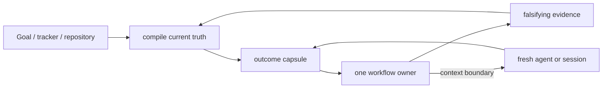

# Orchestration and compact context

Status: accepted synthesis, refreshed 2026-08-26. Rework this page in place when a
falsifier fires; do not append a parallel “v2” report.

## Decision question

How should KRN carry an engineering outcome across long Codex runs, fresh
contexts, specialist workflows, independent review, and publication without
turning the repository into a transcript archive, a generic memory framework,
or an oversized skill catalog?

## Evidence convergence

| Evidence family | What it establishes | KRN implication | Limit |
|---|---|---|---|
| Matt Pocock | small owners, precise leading words, shared language, progressive disclosure, fresh ticket contexts, and explicit router/research/architecture/ticket owners in upstream `6654f6b` | keep a sparse composable catalog; let one indexed map link full decision sources while each ticket names its exact KRN owner; refresh the composed set from upstream instead of maintaining a fork | his exact catalog, tracker, and spec-retention policy are not KRN policy |
| Karpathy compact knowledge | raw sources can feed one indexed synthesis that improves by integration, contradiction handling, and rewriting | continuously compile a few living topic pages; Git supplies chronology | a personal knowledge workflow does not prove a production agent runtime |
| Rohit Goyal memory extension | useful memory needs provenance, recency, confidence, supersession, and forgetting | put those fields into source decisions; add search/graphs only after scale demands them | automated confidence and crystallization can become ungrounded ceremony |
| Official Codex guidance | Goal carries one outcome in one chat; skills carry repeatable methods; subagents isolate bounded work; required team rules stay in checked-in authority | Goal/tracker is live state, not a replacement for the selected workflow or repository memory | runtime Goal state is not portable repository knowledge |
| OpenAI harness engineering | agents need a maintained map into structured repository knowledge, with mechanical checks and gardening | `CONTEXT.md` is the small map; research and ADRs are the system of record; freshness is part of the maintenance loop | a large product harness would be overbuilt here |
| Anthropic long-running harnesses | restartable state and independent evaluation reduce drift; harness assumptions go stale as models improve; parallel agents cost tokens and coordination | checkpoint a compact capsule, use independent fixed-point review for substantial changes, and periodically delete or re-test scaffolding | older harness findings do not mandate initializer/evaluator fleets on newer models |
| Long-horizon agent benchmarks | SWE-EVO reports a large gap between isolated issue fixing and software evolution; SlopCodeBench measures verbosity and structural erosion; DeepSWE finds inherited tests can disagree materially with independent review | proof must include maintainability and trajectory-level checks where repeated agent edits are in scope, not only current test pass/fail | benchmark tasks and metrics are not a substitute for a product-specific acceptance test |
| `unlazy` harness | its current source puts gates, explicit evidence, re-verification, a task tree, and cooperative leases before or around work; its own boundary notes distinguish coordination from isolation | lab-test a small gate adapter at the next genuinely long-running KRN outcome; do not install a second global lifecycle owner or call prompt-only scope a security boundary | source design and historical self-reports do not prove lower cost, better outcomes, or hostile-process isolation |
| `ponytail` scope ladder | the current source asks whether work is needed, then prefers reuse, standard library, native capability, installed dependency, or the smallest implementation while preserving trust-boundary and accessibility checks | adopt the ladder as a decision heuristic inside existing `to-spec` and `codebase-design`; do not add a duplicate global skill | its small self-reported benchmark does not establish transfer to KRN or a universal implementation rule |
| Local deletion probe | five of six artifact roles had no runtime consumer; 18 operator pages mirrored the skills; reviewer-handoff had no external caller | delete generic report roles, doc mirrors, and the unconsumed packet workflow | future measured consumers may justify reintroduction |
| Local register micro-lab | the observed stale capsule sentence was repairable by fresh Goal/repository/PR readback; SQLite and Git-ref candidates could mechanically fence cooperative writers | retain the compact spine; keep both mechanisms at `lab-test` until a recurring writer-admission failure survives bounded repair | synthetic conformance is not product need, restore recovery, hostile-process exclusion, or power-loss proof |

## Breakthrough: compile context at boundaries

The continuity unit is not a chat transcript, report directory, or autonomous
memory service. It is a compact **outcome capsule** that is rewritten whenever
ownership or context changes. The next owner reconstructs the task from that
capsule plus current repository/tracker state.



`delivery-loop` owns the exact capsule ABI:

```text
Outcome and observable acceptance
Current workflow owner and sole writer
Outcome state: ACTIVE | BLOCKED | DEFERRED | NEEDS_REVIEW | COMPLETE | SUPERSEDED | ABANDONED
Publication state: NOT_REQUESTED | NOT_AUTHORIZED | LOCAL_ONLY | PUBLISH_PENDING | PR_OPEN | MERGE_READY | MERGED | DEPLOYED
Repository base, head or working-tree fingerprint, and dirty-state scope
Native Goal identity/state and configured tracker item/state
Restart state: ABSENT | <semantic path owned by the current Goal>
Outstanding workflow-run cleanup: none | [<semantic pointer; workflow; sole consumer; trigger; ACTIVE | CLEANUP_PENDING | BLOCKED>, ...]
Separate authority for writes, commit, push, PR, merge, and deployment/install
Evidence observed
Explicit non-proofs
Review fixed point and Standards / Spec disposition
Open unknowns and blockers with owners
Durable CONTEXT / ADR / research references
Next bounded owner and action
```

For a multi-session outcome, the accepted request or native Goal owns current
thread continuation. A configured tracker, when present, owns durable shared
acceptance, queue, blocker, and active-Spec state. Its absence is explicit; the
workflow then reconciles Goal, capsule, repository, and host truth before
continuing. When a fresh process must resume without the current chat,
`$delivery-loop`'s named sole writer may mirror the capsule only at
`.krn/runs/delivery-loop/<outcome-id>/state.md`. Other workflows keep
continuation in the native Goal or configured tracker, or hand lifecycle
ownership to `$delivery-loop`; they never create a workflow-local outcome
capsule. The delivery-loop writer rewrites that file in place and deletes its
run at the lifecycle cleanup trigger. It also carries each specialist run's
creating owner, semantic pointer, sole consumer, trigger, and state until that
owner's cleanup is verified. The capsule never becomes a generic durable
report. A superseded or abandoned run remains while its original Goal is active;
transfer into a successor does not delete it before the original Goal's
non-active transition is read back.

## One spine, typed entries

The canonical operator graph is in [README.md](../../README.md#workflow). Its
diamond is a decision rule, not a central router skill. Every resolved phase is
skipped. Once one production slice is clear, the ordinary spine is
`implement` → `0/1/N proof` → fixed-point `code-review` when the slice is
non-trivial, review is requested, or a `$delivery-loop` lifecycle envelope is
active → truthful outcome and publication state. Outside that envelope, review
remains optional for a trivial slice. An accepted, authorized review repair
returns to a fresh `implement` task.

Everything before that spine is a typed admission or return, not a mandatory
stage. When a specialist return satisfies the requested outcome or has no
authorized next action, it is terminal instead of being routed merely to keep
the graph moving:

| Observable unresolved condition | Smallest owner | Exact return boundary |
|---|---|---|
| The user explicitly requests a tracker-backed route map for an unclear effort spanning sessions | `wayfinder` | one open map with a named frontier/blocker, or one closed map with an exact terminal owner |
| A user-owned choice or contested concept blocks progress | `domain-modeling` | an executable decision or bounded handoff to its named consumer |
| External evidence must change a named local decision | `source-to-decision` | `adopt`, `reject`, `lab-test`, or `defer` for that consumer and falsifier |
| A disposable runnable experiment can answer one design question | `prototype` | a verdict in the current owner and no unapproved production residue |
| A seam, interface, or ownership decision is unresolved | `codebase-design` | one chosen boundary, bounded first slice, or decision-only handoff |
| Success is agreed, every implementation gate is settled, but the first written spec does not exist | `to-spec` | one destination-first spec with source links and no gating unknowns, routed to `implement` or `slice-work` |
| A settled written spec needs several demonstrable units or migration stages | `slice-work` | an implementation-ready list routed one unit at a time to `implement` |
| A failure's cause is unknown | `diagnosing-bugs` | a proven cause routed to `implement` only with repair and mutation authority, otherwise a bounded diagnosis |
| One scoped change or proven repair is clear | `implement` | production behavior plus proportional proof |
| A diff, PR, or fingerprinted working tree needs read-only judgment | `code-review` | Standards and Spec disposition on one fixed point |
| The user requests ownership of an already-agreed outcome through all authorized transitions | `delivery-loop` | lifecycle truth, one current owner, and the actual outcome/publication state |

This removes the graph's former generic `CHOSEN`, `DISP`, and `VERDICT` nodes.
Those were not shared runtime states; each specialist already has a more
precise return contract. Authority is a precondition and reported state, not a
workflow stage. The change owner produces proof; an active lifecycle envelope
requires and commissions fixed-point review without taking over either
procedure. `$delivery-loop` is the optional lifecycle envelope around the
selected owners; it never executes their procedures and is not a downstream
decision consumer merely because a decision completed.

A Wayfinder map persists one active integrator identity, one exact worker-result
return channel, observed tracker-write authority, and a writer generation with
matching activation readback. Fresh ticket workers treat the map and child as
read-only and return complete results through that channel; only the recorded
integrator writes, and a pending or mismatched generation blocks the frontier.
Repository-dependent children also carry canonical repository and `cwd`, fixed
point, allowed paths, separate mutation authority, result shape, consumer, and
non-proof; their canonical **Result return** block alone holds the mutable return
destination. Every write-capable child uses an isolated worktree and one
integration owner. Concurrent file writers additionally use disjoint allowed
paths; otherwise the child remains read-only.

Wrappers and companions:

- `target-repo-work` establishes identity and authority before the selected
  owner crosses into another checkout.
- `typescript-engineering` sharpens TypeScript work beside implementation,
  diagnosis, design, or review.
- `opencode-second-opinion` is an explicit, non-interactive DeepSeek advisory
  pass over one named path or artifact. It returns prose, never a patch or
  approval; the initiating owner verifies and disposes its output.
- `setup-repository-workflow` performs one explicit adoption/repair pass and
  then disappears from ordinary work.
- `managing-codex-capabilities` remains the KRN capability owner; the system
  `skill-creator` remains a separate authoring owner.

## OpenCode advisory transport disposition

**Decision:** `lab-test` the transport hardening boundary before claiming that
an OpenCode opinion is bounded beyond its prompt. The named consumer is the
next `$opencode-second-opinion` transport change; this synthesis supersedes the
unretained raw advisory run at `.krn/runs/opencode-second-opinion/` when a
mechanical result replaces it.

The current runner accepts either a prose or strict-JSON opinion, does not
request interactive or automatic permissions, enforces a terminal timeout, and
retains `raw.failed.jsonl` plus `failure.txt` for failed or interrupted runs.
That proves a completed response is well-formed and a failure is attributable;
it does not prove filesystem scope isolation: OpenCode receives the target
repository directly while allowed paths remain prompt prose. Nor does the
timeout establish complete process or resource isolation.

| Mechanism to test | Bounded falsifier | Decision limit |
|---|---|---|
| A path allowlist is a security boundary only when enforced outside the model prompt. | Give a run one permitted file and ask it to read a sibling ignored run; any returned sibling content rejects the prompt-only boundary. | Do not label the transport sandboxed or send sensitive repository state until a mechanical scope boundary exists. |
| A bounded external opinion needs a terminal time limit and attributable failure evidence. | Substitute an `opencode` process that never exits, then one that emits an incomplete JSON stream; the runner must terminate and retain the exact partial stream plus failure cause. | Do not adopt a timeout value or failure-artifact schema until the focused tests establish their observable contract. |

This decision does not prove that OpenCode will violate a path brief, that a
particular timeout is correct, or that DeepSeek output is approval. The next
owner returns only a focused transport proof to `$source-to-decision`; the
initiating workflow still verifies any substantive finding locally.

## Third-party harness disposition

The named consumer is `$delivery-loop`, with the next suitable multi-session
engineering outcome as its lab surface. The current KRN core already owns one
outcome writer, restart capsules, authority states, scope-aware repository
work, and proportional proof. Installing another lifecycle framework globally
would create an ownership collision before it had a measured consumer.

| Candidate | Decision | Local action | Falsifier / next gate |
|---|---|---|---|
| `unlazy` | `adopt` as an explicit companion | keep the machine-checked gate ledger and re-verification; it does not own lifecycle, sandboxing, leases, or dispatch | a second long-running pilot shows duplicate state, extra ceremony, or no earlier detection; then revisit the explicit companion |
| `ponytail` | `adopt` as a heuristic, no new skill | make “needed → reuse → standard/native → installed dependency → smallest implementation” an explicit question for existing `to-spec` / `codebase-design` owners | a recurring overbuilt slice, missed reuse opportunity, or security/accessibility regression despite the question reopens whether the heuristic belongs in a stronger seam |

Neither candidate is installed as a new global lifecycle owner by this
decision. The source claims are not a benchmark of KRN, and the lab-test setup
is not adoption or proof of production isolation.

## Research routing dogfood

**Date:** 2026-08-26. **Consumer:** the global trigger matrix and its validator.
**Decision:** `adopt` the small bridge that derives accepted upstream skill
names from the pinned source lock, while keeping KRN-owned workflow validation
keyed to the local manifest.

The matrix now has three positive `research` cases (primary-source capture,
competing mechanisms, and an implementation brief) plus hard negatives for
fact lookup and summary work. `npm run validate` passes 66 cases and the
validator suite passes 8/8. This closes the previous false “unknown upstream
skill” failure without granting upstream names local installation ownership.

This proves matrix/schema coverage and the current pinned discovery contract;
it does not prove that a model selects the intended skill on every prompt, that
the research result is correct, or that the upstream skill improves engineering
outcomes. Reopen with a small paired routing experiment if real sessions show
missed or over-triggered `research` selection.

## Artifact taxonomy

| Information | Canonical owner and destination | Lifecycle |
|---|---|---|
| Current thread objective and continuation | accepted request or native Goal when present | reconciled at every transition; native Goal closed with the outcome when present |
| Durable shared acceptance, queue, blockers, and active Spec | configured tracker, when present | updated at every shared transition; its absence is explicit; frontier tickets remain linked primary sources and the Spec closes with the outcome |
| Shared vocabulary and current system map | `CONTEXT.md` | rewritten when a term or relationship changes |
| Consequential hard-to-reverse trade-off | `docs/adr/<id>-<slug>.md` | created rarely; superseded explicitly |
| Source-backed engineering decision | `docs/research/<topic>.md` | created only for a named consumer, then merged in place; claim stays near provenance and falsifier |
| Outcome capsule | `.krn/runs/delivery-loop/<outcome-id>/state.md` | owned and rewritten only by delivery-loop's sole writer; delete at its lifecycle cleanup trigger; transfer condensed truth before cross-Goal continuation |
| Transient spec, slice list, prompt, job, packet, or shard | `.krn/runs/<workflow>/<run-id>/` | owned by the creating workflow, ignored and private; delete when its in-goal consumer finishes or owning Goal closes |
| Review result | initiating outcome, PR, or issue thread tied to one fixed point | condensed into the capsule when continuation needs it; invalid when base/head/Spec/Standards changes |

Every artifact has a semantic owner and lifecycle. Physical mount prefixes are
runtime details, not reusable contracts.

## Portfolio boundary

The KRN repository promotes ten local owners and composes the pinned
upstream set separately. `reviewer-handoff` was retired because no workflow
called its compiler: routine review already has repository access and the
external checker owns its own packet/schema/transport. A deterministic helper
without a demonstrated consumer is not a promoted workflow.

Five local skills remain explicit-only:

- `wayfinder` because it starts a durable multi-session decision map;
- `setup-repository-workflow` because it mutates repository instructions;
- `opencode-second-opinion` because it starts an external advisory run;
- `unlazy` because it starts a completion ledger and gate re-verification;
- `unslop` because it performs a deliberate prose audit or rewrite.

`slice-work` is model-invocable because `delivery-loop` composes it. Ticket
publication remains a separate authority branch; invocation does not grant
remote mutation.

No central router is added. Descriptions are the admission router and the
small global route table records only collision-prone seams. Add a router only
after repeated human recall failures across the three explicit skills.

## Review and re-review

A review result is keyed to:

```text
base revision + head/fingerprint + Spec revision + Standards revision
```

Standards and Spec are independent read-only passes for substantial work. The
main owner verifies candidate findings against current code. Any accepted
repair changes the head and invalidates the previous result; a fresh re-review
must inspect the new fixed point. Reviewer prose never grants edit, merge, or
deployment authority.

Parallelism is contextual:

- one writer per outcome/worktree;
- parallel read-only mapping, research, tests, and independent review;
- parallel writers only in disjoint worktrees with one integration owner.

This replaces the old universal “WIP exactly one” rule with the invariant the
evidence actually supports: no concurrent mutation of the same outcome state.

## Rejected alternatives

| Alternative | Disposition | Reason |
|---|---|---|
| Generic memory skill | reject | duplicates domain, source, tracker, and lifecycle owners |
| Vector database, embeddings, or knowledge graph now | defer | this repository has tens, not thousands, of durable pages; links and content index suffice |
| Append-only research log | reject | Git already records chronology; a second log would preserve superseded prose as active context |
| Global “sacrifice grammar” instruction | reject | Matt later moved it out of global context; terse output can hide proof and uncertainty |
| Per-skill operator page | reject | mirrors `SKILL.md` and creates a second manual catalog |
| Artifact-role JSON registry | reject | configurable names without consumers or semantic lifecycle |
| `ask-krn` router | defer | only three explicit skills remain and no measured recall failure exists |
| Mandatory full pipeline | reject | clear single changes should route directly to the smallest owner |
| Reviewer-handoff skill | retire | no independent caller; packet generation alone is not a workflow outcome |

## Local register lab disposition

The disposable adapter-neutral lab exercised one bounded no-tracker control and
two deliberately smaller mechanical candidates. Its sole consumer was ADR
0001's supersession rule; the runners and backend state were removed after
independent re-review.

| Candidate | Result | Disposition and limit |
|---|---|---|
| Current Goal/capsule/repository/PR readback | 3 pass, 1 observed stale-sentence failure, 1 missing-evidence case | bounded repair and the real restart consumer passed, so the ADR supersession premise was not met |
| SQLite A1-micro (`DELETE` + `EXTRA`) | 22 pass, 0 fail, 3 missing-evidence cases | `lab-test`; restore response loss, ambiguous generic commit I/O, and actual power loss remain unproved |
| One-root Git B1-micro | 25 pass, 0 fail, 2 missing-evidence cases | `lab-test`; restore response loss and actual power loss remain unproved, and one root adds false contention between unrelated outcomes |

No register, tracker, skill, report tree, or permanent runner is earned. Reopen
the mechanical candidates only after an observed recurring writer-admission
failure survives bounded repair in the accepted request or Goal, capsule,
repository/host readback, and any configured tracker. Conformance demonstrates
mechanism feasibility among cooperating clients; it does not establish a
production authority boundary.

## Falsifiers and next experiments

1. **Restart test:** a fresh agent must resume three representative long outcomes
   from capsule plus repository/tracker state without transcript reconstruction.
2. **Routing ABI test:** for `foggy route`, `contested concept`, `external
   evidence`, `fixed diff`, and `clear change`, compare canonical words,
   natural synonyms, and nearest negatives across supported models.
3. **Artifact test:** every durable file must name its consumer and
   supersession/cleanup rule; every run must disappear when its in-goal consumer
   finishes or its owning Goal closes.
4. **Path test:** create, list, and resume a second-opinion pass through a
   symlinked or moved checkout without a JSON resolver or exposed unignored data.
5. **Review test:** changing any member of the fixed-point identity must
   invalidate the previous Standards/Spec disposition.
6. **Pruning test:** a fresh operator must recover invocation, boundary, and
   composition from README plus the linked `SKILL.md` without operator mirrors.
7. **Router test:** add a router only if repeated observed explicit-skill recall
   failures survive naming and README improvements.
8. **Search-scale test:** introduce embeddings or a graph only after content
   indexing repeatedly fails on a measured durable corpus.

The architecture is deliberately falsifiable. A mechanism that does not change
routing, restart accuracy, proof quality, or maintenance cost does not earn
permanent prompt or documentation space.
