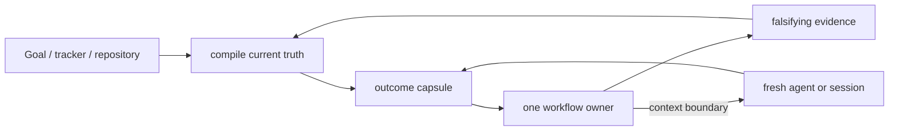
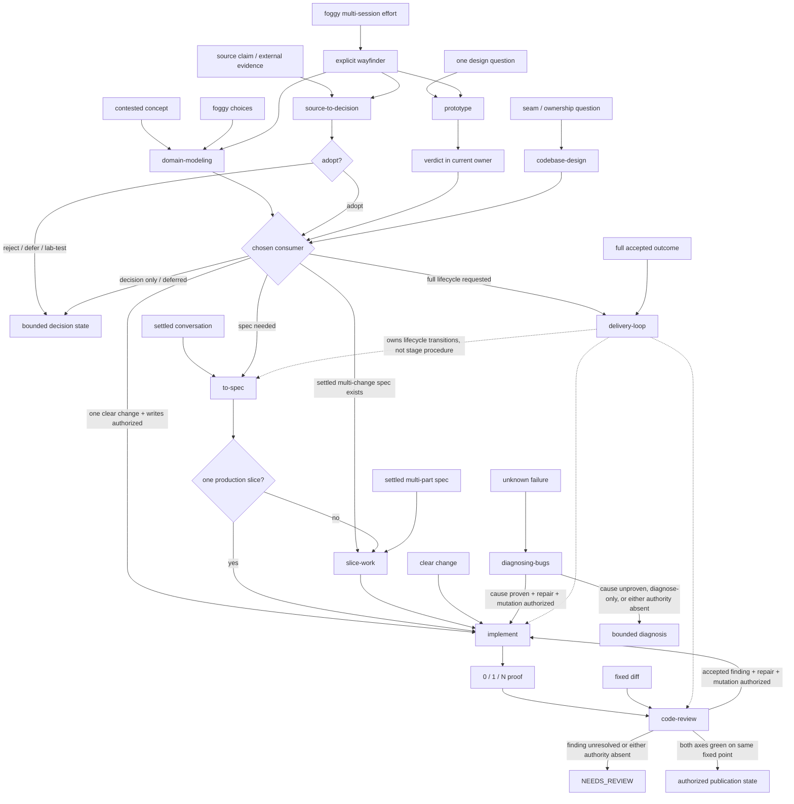

# Orchestration and compact context

Status: accepted synthesis, 2026-07-30. Rework this page in place when a
falsifier fires; do not append a parallel “v2” report.

## Decision question

How should KRN carry an engineering outcome across long Codex runs, fresh
contexts, specialist workflows, independent review, and publication without
turning the repository into a transcript archive, a generic memory framework,
or an oversized skill catalog?

## Evidence convergence

| Evidence family | What it establishes | KRN implication | Limit |
|---|---|---|---|
| Matt Pocock | small owners, precise leading words, shared language, progressive disclosure, context resets at workflow boundaries | keep a sparse composable catalog; treat vocabulary as a tested routing interface | his exact catalog and harness are not KRN policy |
| Karpathy compact knowledge | raw sources can feed one indexed synthesis that improves by integration, contradiction handling, and rewriting | continuously compile a few living topic pages; Git supplies chronology | a personal knowledge workflow does not prove a production agent runtime |
| Rohit Goyal memory extension | useful memory needs provenance, recency, confidence, supersession, and forgetting | put those fields into source decisions; add search/graphs only after scale demands them | automated confidence and crystallization can become ungrounded ceremony |
| Official Codex guidance | Goal carries one outcome in one chat; skills carry repeatable methods; subagents isolate bounded work; required team rules stay in checked-in authority | Goal/tracker is live state, not a replacement for the selected workflow or repository memory | runtime Goal state is not portable repository knowledge |
| OpenAI harness engineering | agents need a maintained map into structured repository knowledge, with mechanical checks and gardening | `CONTEXT.md` is the small map; research and ADRs are the system of record | a large product harness would be overbuilt here |
| Anthropic long-running harnesses | restartable state and independent evaluation reduce drift; parallel agents cost tokens and coordination | checkpoint a compact capsule and use independent fixed-point review for substantial changes | older harness findings do not mandate initializer/evaluator fleets on newer models |
| Local deletion probe | five of six artifact roles had no runtime consumer; 18 operator pages mirrored the skills; reviewer-handoff had no external caller | delete generic report roles, doc mirrors, and the unconsumed packet workflow | future measured consumers may justify reintroduction |

## Breakthrough: compile context at boundaries

The continuity unit is not a chat transcript, report directory, or autonomous
memory service. It is a compact **outcome capsule** that is rewritten whenever
ownership or context changes. The next owner reconstructs the task from that
capsule plus current repository/tracker state.



`delivery-loop` owns the exact capsule ABI:

```text
Outcome and observable acceptance
Current workflow owner and sole writer
Outcome state: ACTIVE | BLOCKED | DEFERRED | NEEDS_REVIEW | COMPLETE | SUPERSEDED | ABANDONED
Publication state: NOT_REQUESTED | NOT_AUTHORIZED | LOCAL_ONLY | PUBLISH_PENDING | PR_OPEN | MERGE_READY | MERGED | DEPLOYED
Repository base, head or working-tree fingerprint, and dirty-state scope
Native Goal identity/state and configured tracker item/state
Restart state identity/path and state: ABSENT or <semantic path> [ACTIVE | TRANSFER_PENDING | CLEANUP_PENDING]
Separate authority for writes, commit, push, PR, merge, and deployment/install
Evidence observed
Explicit non-proofs
Review fixed point and Standards / Spec disposition
Open unknowns and blockers with owners
Durable CONTEXT / ADR / research references
Next bounded owner and action
```

For a multi-session outcome, the native Goal owns current thread continuation;
the configured tracker owns durable shared acceptance, queue, and blocker
state. The workflow reconciles Goal from repository and tracker truth before
continuing. When a fresh process must resume without the current chat, the
initiating workflow may mirror the capsule at
`.krn/runs/<workflow>/<run-id>/state.md`. It rewrites that file in place and
deletes the run when the goal closes. The capsule never becomes a generic
durable report.

## Full workflow graph



Wrappers and companions:

- `target-repo-work` establishes identity and authority before the selected
  owner crosses into another checkout.
- `typescript-engineering` sharpens TypeScript work beside implementation,
  diagnosis, design, or review.
- `second-opinion-review` is an explicit advisory research/rewrite/check pass;
  local owners verify and dispose its output.
- `setup-repository-workflow` performs one explicit adoption/repair pass and
  then disappears from ordinary work.
- `managing-codex-capabilities` and `writing-great-skills` remain separate meta
  owners.

## Artifact taxonomy

| Information | Canonical owner and destination | Lifecycle |
|---|---|---|
| Current thread objective and continuation | native Goal | reconciled at every transition; closed with outcome |
| Durable acceptance, queue, blockers, and Spec | configured tracker | updated at every shared transition; closed with outcome |
| Shared vocabulary and current system map | `CONTEXT.md` | rewritten when a term or relationship changes |
| Consequential hard-to-reverse trade-off | `docs/adr/<id>-<slug>.md` | created rarely; superseded explicitly |
| Source-backed engineering decision | `docs/research/<topic>.md` | created only for a named consumer, then merged in place; claim stays near provenance and falsifier |
| Resumable prompt, job, packet, shard, or capsule | `.krn/runs/<workflow>/<run-id>/` | ignored and private; delete when its in-goal consumer finishes or owning Goal closes; cross-Goal continuation transfers condensed truth to a new run |
| Review result | initiating outcome, PR, or issue thread tied to one fixed point | condensed into the capsule when continuation needs it; invalid when base/head/Spec/Standards changes |

There is no `retained_reports`, `discovery`, or generic `capabilities` artifact
role. A semantic owner chooses the durable location. Physical mount prefixes
are runtime details, not reusable contracts.

## Portfolio boundary

The promoted catalog has 17 owners. `reviewer-handoff` was retired because no
workflow called its compiler: routine review already has repository access and
the external checker owns its own packet/schema/transport. A deterministic
helper without a demonstrated consumer is not a promoted workflow.

Three skills remain explicit-only:

- `wayfinder` because it starts a durable multi-session decision map;
- `setup-repository-workflow` because it mutates repository instructions;
- `second-opinion-review` because it starts paid external advisory work.

`slice-work` is model-invocable because `delivery-loop` composes it. Ticket
publication remains a separate authority branch; invocation does not grant
remote mutation.

No central router is added. Descriptions are the admission router and the
small global route table records only collision-prone seams. Add a router only
after repeated human recall failures across the three explicit skills.

## Review and re-review

A review result is keyed to:

```text
base revision + head/fingerprint + Spec revision + Standards revision
```

Standards and Spec are independent read-only passes for substantial work. The
main owner verifies candidate findings against current code. Any accepted
repair changes the head and invalidates the previous result; a fresh re-review
must inspect the new fixed point. Reviewer prose never grants edit, merge, or
deployment authority.

Parallelism is contextual:

- one writer per outcome/worktree;
- parallel read-only mapping, research, tests, and independent review;
- parallel writers only in disjoint worktrees with one integration owner.

This replaces the old universal “WIP exactly one” rule with the invariant the
evidence actually supports: no concurrent mutation of the same outcome state.

## Rejected alternatives

| Alternative | Disposition | Reason |
|---|---|---|
| Generic memory skill | reject | duplicates domain, source, tracker, and lifecycle owners |
| Vector database, embeddings, or knowledge graph now | defer | this repository has tens, not thousands, of durable pages; links and content index suffice |
| Append-only research log | reject | Git already records chronology; a second log would preserve superseded prose as active context |
| Global “sacrifice grammar” instruction | reject | Matt later moved it out of global context; terse output can hide proof and uncertainty |
| Per-skill operator page | reject | mirrors `SKILL.md` and creates a second manual catalog |
| Artifact-role JSON registry | reject | configurable names without consumers or semantic lifecycle |
| `ask-krn` router | defer | only three explicit skills remain and no measured recall failure exists |
| Mandatory full pipeline | reject | clear single changes should route directly to the smallest owner |
| Reviewer-handoff skill | retire | no independent caller; packet generation alone is not a workflow outcome |

## Falsifiers and next experiments

1. **Restart test:** a fresh agent must resume three representative long outcomes
   from capsule plus repository/tracker state without transcript reconstruction.
2. **Routing ABI test:** for `foggy route`, `contested concept`, `external
   evidence`, `fixed diff`, and `clear change`, compare canonical words,
   natural synonyms, and nearest negatives across supported models.
3. **Artifact test:** every durable file must name its consumer and
   supersession/cleanup rule; every run must disappear when its in-goal consumer
   finishes or its owning Goal closes.
4. **Path test:** create, list, and resume a second-opinion pass through a
   symlinked or moved checkout without a JSON resolver or exposed unignored data.
5. **Review test:** changing any member of the fixed-point identity must
   invalidate the previous Standards/Spec disposition.
6. **Pruning test:** a fresh operator must recover invocation, boundary, and
   composition from README plus the linked `SKILL.md` without operator mirrors.
7. **Router test:** add a router only if repeated observed explicit-skill recall
   failures survive naming and README improvements.
8. **Search-scale test:** introduce embeddings or a graph only after content
   indexing repeatedly fails on a measured durable corpus.

The architecture is deliberately falsifiable. A mechanism that does not change
routing, restart accuracy, proof quality, or maintenance cost does not earn
permanent prompt or documentation space.
