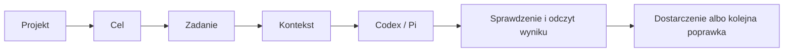

# KRN: jeden plan produktu

Status: `lab-test`. Consumer: operator i maintainer planujący produkt KRN.
Owner: maintainer. Verified: 2026-10-01.

To rekomendowany kierunek po badaniach i dwóch rundach pracy trzech agentów:
integracja natywna, pamięć i kontekst, jakość kodu i proces pracy.
Korekta operatora z 2026-10-01 ustala priorytet: najpierw mechanika tasków,
pamięci, sandboxu i odzyskiwania; panel/frontend jest odroczony do jej kwalifikacji.
Możemy zakwestionować obecne założenia. Działające domyślne ustawienia i wybór
C/Git-ref pozostają aktualną bazą, dopóki nie wybierzemy i nie zweryfikujemy
następcy. Ten dokument jest jednym planem produktu; kolejka posiada stan zadań,
a istniejący roadmap ich wykonanie. Badania nie wykazały jeszcze przewagi KRN.

## 1. Co budujemy i po co

**Spójny rdzeń pracy nad projektem w Codexie lub Pi.**
W natywnej sesji i CLI podłączasz repo, opisujesz wynik i widzisz, co obowiązuje,
czego brakuje, co sprawdzono oraz jakie jest następne legalne działanie.

Wartość ma być odczuwalna: mniej ponownego tłumaczenia projektu, błędnych zadań,
utraconych wymagań, ręcznego łączenia sesji z branchem i napraw po „gotowym” kodzie.
Agent zachowuje swobodę przywracalnej pracy; aktualne uprawnienia określają
właściciele rzeczywistych efektów.

Docelowe zastosowania: rozwijanie funkcji, diagnoza regresji, modernizacja,
bezpieczne porządkowanie kodu i wznowienie przerwanej pracy. Dobra realizacja
jednego projektu jest pierwszym sprawdzianem KRN jako produktu. Potem sprawdzamy
drugi, odmienny projekt i dopiero skalujemy zarządzanie wieloma projektami.

## 2. Wybrany kierunek i uczciwe alternatywy

Rekomenduję **rdzeń task–kontekst–sandbox–dowód–odzyskiwanie w natywnym Codexie/Pi**.
Najpierw jedna poprawna droga przez istniejące narzędzia, bez budowania panelu.
Gotowe narzędzia mogą dostarczać mechanizmy wykonania i izolacji; granice wymagają
kwalifikacji konkretnego profilu. KRN wnosi spójność projektu, aktualnych zobowiązań
i dowodów. Natywny host prowadzi
pętlę model–narzędzia, historię, logowanie i swoje uprawnienia.

| Wariant | Co zyskujemy | Co rozstrzyga wybór |
|---|---|---|
| Sam Codex/Pi i droga projektu, bez zadań/workflow KRN | Zero własnego silnika procesu: cel i sesja natywna, instrukcje, Git, kontrole i ewentualny tracker projektu. | Radykalna kontrola porównawcza. Jeśli zachowuje obowiązki i odzyskiwanie przy mniejszym koszcie, warstwa KRN ma być wycofana z migracją odbiorców, bez utraty pracy. |
| Natywne UI + mała integracja KRN | Najmniej własnego kodu; standardy, zadania i sprawdzanie przez aktualne narzędzia. | To kontrola porównawcza. Jeśli działa równie dobrze i taniej, dodatkowa warstwa musi uzasadnić swój koszt. |
| Mały panel obok Codexa/Pi | Późniejszy widok projektu, sesji, zadania i dowodów. | Odroczony do sprawdzenia rdzenia; UI nie może maskować niegotowej mechaniki ani wymagać kopii stanu. |
| Produkt zintegrowany, np. rozszerzenie T3 | Potencjalne późniejsze wykorzystanie istniejącego UI, sesji i silnika poleceń. | Odroczony. Wybór dopiero po kwalifikacji rdzenia i porównaniu kosztu migracji; jeden właściciel zastępuje starego. |

T3 ma rzeczywiste punkty rozszerzenia w źródle; gotowa wtyczka KRN/Pi nie została
ustalona. Fork, własny backend i inny magazyn zadań pozostają pełnoprawnymi
alternatywami do porównania, z migracją i listą rzeczy do wycofania.
[Kontrakty i porównanie źródeł](workbench-contracts.md#code-and-product-surfaces).

## 3. Jak to ma się spinać

| Pytanie | Jeden właściciel informacji |
|---|---|
| Czego chcemy i co wolno? | Aktualne żądanie operatora; Goal (cel zapisany w sesji), jeśli istnieje, oraz autoryzowane zmiany wymagań. |
| Co robić i kto ma turę? | Tracker, jeśli projekt go skonfigurował; w KRN Git-ref z claimem (wyłączną turą wykonawcy). Bez trackera pracę określa żądanie/Goal, bez udawanej kolejki. |
| Co wiadomo o projekcie? | Aktualny kod, instrukcje i kuratorowana wiedza repo. |
| Co dzieje się w sesji? | Natywny Codex/Pi; bieżący właściciel wykonania wiąże sesję z zadaniem i środowiskiem. |
| Czy wynik jest poprawny i dostarczony? | Wykonane kontrole dla konkretnego kandydata oraz odczyt rzeczywistego efektu. |

Natywna sesja i CLI korzystają z tych samych właścicieli; ewentualny panel będzie
ich późniejszym klientem. Widok, pamięć i odpowiedź
agenta nie nadają uprawnienia ani nie zamykają zadania. „Polecenie przyjęte”,
„sesja bezczynna”, „kandydat sprawdzony” i „zmiana dostarczona” są różnymi faktami.

Najpierw wiążemy projekt, osobny checkout (worktree), zadanie i właściwą sesję. Obserwatorów może
być wielu; konfliktujący zasób ma jednego piszącego i jawny handoff. Docelowo
niezależne projekty mogą działać równolegle; aktualny limit rozpoczętej pracy (WIP)
i uprawnienia pozostają
bez zmian do osobnej kwalifikacji. Token kontrolera UI nie zatrzyma obcego
edytora, TUI ani starego procesu.

Wznowienie historii, przyłączenie do żywego procesu, fork rozmowy, fork workspace,
checkpoint kodu i backup mają osobne znaczenie. Pokazujemy wspierane możliwości
konkretnego hosta, a brak jako brak. Po utracie połączenia lub odpowiedzi odczytujemy
stan przed kolejnym efektem. Stop sesji nie oznacza cofnięcia zmian ani oddania
claima. [Szczegóły kontroli](workbench-contracts.md#native-control-and-recovery-qualification).

## 4. Pamięć: odzyskiwać właściwą informację, nie gromadzić rozmowy

Rozdzielamy pięć pytań: czy informacja dotyczy tego działania, kto ją dostarczył,
czy nadal obowiązuje, czy mamy nazwane potrzebne dowody i czy działanie się udało.
Kompletny kontekst może zawierać błędną informację; trafny wynik wyszukiwania może
być nieaktualny. Pamięć nie zatwierdza zmiany celu.

| Poziom | Najmniejsza wersja | Kiedy zasługuje na własny mechanizm |
|---|---|---|
| Odtworzenie z bieżących źródeł | Natywna sesja, tracker, Git i wiedza repo. | Punkt odniesienia. Kapsuła pomaga tylko przy informacji, której nie da się taniej odtworzyć. |
| Kontekst dla następnego działania | Odtwarzalny widok aktualnych wymagań, źródeł, sprzeczności i braków. | Gdy rzeczywista próba ujawni powtarzalny błąd zdobycia lub zastosowania informacji. |
| Biblioteka doświadczeń | Mała kuratorowana wiedza: warunek, metoda, dowód oraz podobny przypadek, w którym metoda nie działa. | Gdy nawracający problem przetrwa poprawę kodu, reguły i nawigacji; koszt całego uczenia musi się opłacić. |

Najciekawsza hipoteza to **pamięć kontrastowa**: utrwalić różnicę między błędem
i sprawdzoną poprawką, z warunkiem zastosowania. Pierwsza wersja może być jednym
reviewowanym akapitem i dwoma odsyłaczami, bez grafowej bazy ani ekstraktora.

Nowy research doprecyzowuje pierwszy wariant: **kontekst przygotowany pod
następne działanie**. Obecny właściciel wybiera aktualne wymagania, właściwe
źródła, ostatnią istotną obserwację i brakujący dowód. Krótki widok wskazuje,
co pominięto przez budżet, czego nie odnaleziono i co wymaga ponownego odczytu.
Nieudana próba ma zakres i warunek powrotu; proponowana lekcja przechodzi
wąskie sprawdzenie w aktualnym repo. Handoff odpowiada potrzebom następcy.

Do porównania dodajemy wariant z mniejszą ilością przypominanych lekcji:
aktualny cel/task, potrzebne obserwacje, odsyłacze i istniejące kontrole.
Mierzymy zachowanie wymagań, poprawny rezultat i koszt przygotowania, czytania,
sprawdzania oraz poprawek. Korzyść pozostaje hipotezą; aktualny zakres dopuszcza
research, a istniejący właściciel eksperymentu rozstrzyga legalną realizację.
[Źródła, małe mechanizmy i kontrprzykłady](orchestration.md#task-conditioned-memory-deep-research-2026-10-01).

Wymagania, wartości projektu i uprawnienia zostają przy aktualnym źródle.
Między projektami przenosimy kwalifikowaną metodę, nie cudze ścieżki, nazewnictwo
czy prywatne dane. Treść przywołana z pamięci nie awansuje przez samo powtarzanie.

Widok może być cache’owany opisowo. Aktualny cel, kolejka/selector, wejścia kodu
i źródła muszą mieć właściwe wersje; uprawnienia sprawdza właściciel działania.
Ten sam Goal ID może mieć nowe wymagania, a lease wygasa bez zmiany Git OID.
Natywna pamięć pozostaje opcjonalna; jej wpływ pokazujemy jako nieznany, jeśli
host go nie ujawnia. Indeks dodajemy dopiero po rzeczywistym braku w obecnej
nawigacji. Retencja i fizyczne usunięcie danych mają swoich właścicieli.
[Źródła i próba pamięci](orchestration.md#action-applicability-and-scoped-memory-workbench-deepening-2026-09-30).

Warto sprawdzić kontekst przy konkretnym odczycie pliku: krótka wskazówka
z aktualnym źródłem i zakresem zamiast przypominania całej pamięci na każdej
turze. X-ray z pluginu pokazuje taki punkt podłączenia; jego analiza może być
nieaktualna, więc mechanizm wymaga własnej kwalifikacji.

## 5. Natywne Codex/Pi i codzienna praca

Obecnym interfejsem są natywne Codex/Pi i CLI. Odczytujemy właściwy root,
instrukcje, komendy, właściciela zmian i aktualne zadanie; brak legalnej pracy,
nieznany efekt i rozbieżność po wznowieniu mają czytelny powód.
Przywracalne kroki prowadzimy dalej. Pytamy, gdy brak zmienia zakres,
uprawnienie, wynik lub cel; znane koszty mają źródło, nieznane pozostają nieznane.

Nowe Pi ma natywne MCP, wyszukiwanie narzędzi i code mode do łączenia wywołań.
To pierwszy kandydat do reuse przy przyszłym profilu, zamiast własnego transportu
i katalogu narzędzi. Pi 1.0 z 1 października zastępuje poprzedni cel
dokumentacyjny 0.99.2; wersja, auth i uprawnienia w naszym środowisku wymagają
próby. [Zakres i ograniczenia](orchestration.md#native-pi-tool-discovery-and-composition-verified-2026-10-01).

Ogłoszone tego samego dnia **Pi Durable** jest osobnym eksperymentalnym SDK.
Może zastąpić planowane własne checkpointy, wznowienie wywołań i widoki wykonania.
Porównamy je przed budową takiej warstwy, zachowując natywne Pi jako kontrolę.
Nie zastępuje Git-ref, bieżącej zgody, sandboxu ani dowodu; profil konta,
przerwanie efektu i procesy potomne mają konkretne niewiadome.
[Kandydat do reuse i warunki kwalifikacji](workbench-contracts.md#pi-durable-runtime-reuse-2026-10-01).

**Panel jest odroczony do kwalifikacji rdzenia.** Przyszły zakres to wszystkie
sesje operatora, również istniejące, z osobno potwierdzoną historią, obserwacją
i kontrolą. Nieobsługiwane przyłączenie nie znika z obietnicy. Docelowy ekran
może łączyć projekt, sesję i dowody; jego źródłami zostają obecni właściciele.
[Przyszłe interfejsy i ograniczenia](workbench-contracts.md#code-and-product-surfaces).

Do porównania dochodzi mały widok MCP Apps w zgodnym hoście: operacje zwracają
dane, a osobne renderowanie pomaga obejrzeć task lub dowód. To może ograniczyć
własny panel i backend widoku. Rdzeń działa również bez komponentu; obsługa
iframe w Codexie/Pi oraz dostęp do prywatnego lokalnego repo wymagają osobnej
kwalifikacji. Wracamy do tej opcji po sprawdzeniu mechaniki.
[Wariant MCP Apps](workbench-contracts.md#optional-host-rendered-mcp-apps-view).

## 6. Kod, skills i „make it sexy”

Dla potrzebnych nowych interfejsów rdzenia rozważamy TypeScript; obecny JS
zostaje, a JSDoc/`checkJs` lub migracja jednej granicy muszą usuwać konkretną
niejasność. React/Vite należy do odroczonego panelu. Proponowane `snake_case`
dotyczy własnych identyfikatorów, PascalCase typów/komponentów; obce protokoły
zachowują nazwy. Standardy projektów pozostają lokalne.

Piękno kodu oznacza czytelny przepływ, lokalność zmian i niewiele obowiązków
wywołującego: głębokie moduły, jawne stany, walidacja wejścia raz.
Jeden skill prowadzi niepewność, companion tylko swój wycinek. Opis precyzuje
wejście/wynik, szczegóły są na żądanie. Polski jest kierunkiem ergonomii;
efekt tłumaczenia wymaga porównania, bez dwóch wersji prawdy lub kopii upstream.

Code-simplifier to jeden przegląd zmienionego kodu przed końcowym dowodem.
Zachowujemy zachowanie i upraszczamy odpowiedzialności; szersza refaktoryzacja
lub naprawa ma własny zakres. Świadomie doprecyzowujemy podany prompt:
preferujemy deklaracje funkcji i jawne publiczne typy, zachowując semantykę
arrow, wnioskowanie lokalne i potrzebną obsługę błędów. Każda zmiana unieważnia
poprzedni przegląd. `code-modernization` inspiruje poznanie reguł, odróżnienie
aktualizacji od zmiany stosu i pilot przed szeroką migracją; nie kopiujemy floty.
[Źródła i granice uproszczeń](orchestration.md#scoped-simplification-and-modernization-2026-09-30).

Naprawę zaczynamy od nazwanej gwarancji i rzeczywistego przepływu. Zniknięcie
lintu i zielone testy nie zastępują walidacji lub autoryzacji. Odróżniamy lokalną
naprawę, problem właścicielstwa i poprawny kod; abstrakcja wskazuje, co usuwa.
Kontrolę nawracającego błędu dodajemy w małym sprawdzonym zakresie, z powodem
odmowy. [Dostarczony artykuł](orchestration.md#contract-driven-cleanup-supplied-practitioner-source-2026-10-01).

Budżet `0/1/N`: zero nowych testów dla dokumentów/mechaniki, jeden dla kontraktu,
więcej dla różnych wymagań/awarii. Nowy falsyfikator najpierw przegrywa na
przed-stanie; zachowanie objęte dowodem chroni dotychczasowa kontrola.
Retirement rozlicza odbiorców i różne wymagania. Najpierw batch odczytów,
potem potrzebny osobny kontekst; równoległe pisanie wymaga izolacji/dopuszczenia.

Wzorce z Twojego RSS doprecyzowują ergonomię: swobodny opis zamiaru prowadzi do
małego sprawdzalnego kroku; pamięć jest jawna i poprawialna; przeciwną argumentację
zamieniamy w konkretny sprawdzian. Nowy element musi zmniejszać rzeczywisty ból
oraz mieć drogę wycofania. [Posty, napięcia i skutki dla KRN](orchestration.md#practitioner-patterns-selected-from-the-operators-rss).

Dots i Grok Bot doprecyzowują docelowy produkt: skill opisuje sposób pracy,
harmonogram określa kiedy, a aktualne uprawnienia wyznaczają dozwolony efekt.
Pamięć zespołu i prywatne notatki mają różny zakres; handoff ma jednego właściciela.
Najpierw kwalifikujemy ręczny przebieg, później pracę w tle z anulowaniem,
ochroną przed podwójnym efektem i czytelnym wynikiem. [Mechanizmy i granice źródeł](workbench-contracts.md#persistent-teammates-dots-and-grok-bot-2026-10-01).

Naprawy hooka są scalone w [#298](https://github.com/korneliuszburian/krn-codex-skills/pull/298)
i [#299](https://github.com/korneliuszburian/krn-codex-skills/pull/299), globalny release
to `ab403fdb…`. Checker z czystego main potwierdził instalację i seal; świeży
Codex odczytał cytowany tekst Pythona i otrzymał prawdziwą odmowę kasowania
nieistniejącego celu w potoku. To dowody tych przepływów, bez deklaracji pełnej
zgodności wszystkich komend lub wzrostu jakości pracy nad projektem.
Wracamy do mechaniki tasków/recovery, sandboxu i pamięci. Stara gałąź researchu
wymaga przeniesienia czterech dokumentów na aktualne main: jej dawny ledger
nie poświadcza nowego release'u. Naprawa launchera i spójność skillsów dostępu
mają osobne zakresy; wdrożenie hooka ich nie potwierdza.

Docelowy przepływ dostępu jest krótki: kompletny profil `.env` → `ftp-kr.json`
→ jedno doprecyzowanie nieudanego logowania → BW jako fallback. Po sukcesie
używamy połączenia oraz natywnego SSH/WP-CLI/FTP/SFTP; setup wraca przy braku
lub awarii dostępu. Przy kończeniu trzy automatyzacje FTP są wyłączone. Zasady
storage, hook i skill muszą mówić to samo; zwykła operacja nie tworzy nowego
runnera ani pełnej ceremonii projektu. [Naprawy, właściciele i granice](workbench-contracts.md#operational-friction-hook-and-site-access).

## 7. Kolejność budowy i warunki przejścia

| Pion | Wynik widoczny dla użytkownika | Co pozwala iść dalej |
|---|---|---|
| 1. Taski i aktualna intencja | Wybór legalnej pracy, claim, zależności i zmiana wymagań mają jeden sprawdzalny przebieg. | Wygaśnięta tura i stare wyniki nie przejmują pracy; odzyskiwanie zachowuje zobowiązania. |
| 2. Izolowane wykonanie | Codex/Pi pracuje na ograniczonym kandydacie w gotowym środowisku wykonania. | Sprawdzone granice plików/sekretów/sieci, zakończenie procesu i dzieci, wejścia oraz sprzątanie. |
| 3. Kontekst i pamięć | Wznowiona sesja stosuje aktualne wymagania i potrzebne źródła. | Zmiana intencji, nieaktualna pamięć i obcy projekt nie kierują efektem; pełny koszt uzasadnia dodatkową warstwę. |
| 4. Dowód, integracja i odzyskiwanie | Konkretny kandydat jest sprawdzony, a efekt odczytany także po przerwaniu. | Exit=0, snapshot i opis agenta nie zastępują dowodu; zgubiona odpowiedź nie powoduje ślepego ponowienia. |
| 5. Cały przepływ i odejmowanie | Jeden rzeczywisty przypadek przechodzi całą drogę w natywnej sesji/CLI. | Poprawność, fałszywe blokady i koszt są porównane z natywnym przebiegiem; dopiero wtedy wracamy do panelu. |

Pierwszy przypadek dotyczy `krn-codex-skills`: zadanie przechodzi przez claim,
izolowane wykonanie, aktualny dowód, integrację i zamknięcie, także po przerwaniu.
Istniejący właściciel tasków rozstrzyga recovery/CAS/selector; wybrany element
H3 wymaga legalnego dopuszczenia. `hardening-cli-integration` pozostaje późniejszą
poprawą interfejsu, nie zastępuje sprawdzenia tej mechaniki. Ten plan nie nadaje
ready, nie przejmuje claimów i nie uruchamia nowej implementacji.
Wcześniejszy kandydat frontendowy został wycofany po korekcie operatora.
Aktualny przypadek ma sprawdzić rdzeń KRN w tym repo; nie rozszerzamy zakresu
na WordPress/frontendy ani nie deklarujemy transferu jakości bez rzeczywistych prób.

Najbliższe rozstrzygnięcie dotyczy `hardening-task-recovery`: jak legalnie
wznowić importowane zadanie z wymaganym dowodem, zachowując historię,
zobowiązania i warunki zamknięcia. Najpierw trzeba odtworzyć odmowę przez
publiczny interfejs, następnie zaprojektować jedno przejście u obecnego
właściciela tasków. Powrót do pracy nie oznacza wykonania zadania ani przyjęcia
starego wyniku. To rekomendacja pierwszego zakresu po dopuszczeniu, nie nowy
status lub claim. Szerszy przebieg z przerwaniem workera kwalifikujemy później.

### Gotowe narzędzia zamiast własnej infrastruktury

Rozdzielamy bibliotekę prowadzenia agentów od granicy izolacji. Sandcastle może
uprościć lifecycle/workspace; nie staje się przez to samodzielną mikroVM.

| Kandydat | Rola i powód rozważenia | Co sprawdzamy przed użyciem |
|---|---|---|
| Obecny lokalny profil KRN | Kontrola porównawcza z istniejącym kodem. | To nie certyfikat bezpieczeństwa: auth trafia do workera, a sieć/procesy/Pi mają niezakończoną kwalifikację. |
| Docker Sandboxes, `sbx` | Lokalna mikroVM i udokumentowana obsługa Codexa; samodzielne narzędzie także na Ubuntu/KVM. | Nasz host, oczyszczone wejścia, proxy/OAuth, eksport i zakończenie pracy; clone nie usuwa sekretów ze źródła. |
| Sandcastle Matta | Biblioteka agent/workspace/provider, możliwa redukcja własnego glue. | Wąski adapter nad niezależnym klonem; bez domyślnego merge i ujawniania source Git; aktualny parser/identity Pi. |
| Cloudflare | Zarządzane wykonanie i snapshoty plików, gdy potrzebujemy chmury. | Nowe API/beta, account/auth, sieć, drzewo procesów, odtworzenie i pełny koszt. |
| E2B | Kandydat, gdy zachowanie RAM/procesu ma konkretną wartość. | Pauza i jej fallback, stara intencja po wznowieniu, retencja, auth i odbiór wyniku. |
| NVIDIA OpenShell | Nadzorowane wykonanie, polityki i proxy credentials; możliwe usunięcie własnego glue. | Właściwy driver izolacji oraz Pi/Codex OAuth, refresh, zakończenie pracy i pełny koszt. |

Najpierw kwalifikujemy jeden lokalny profil dla jednego natywnego hosta, jeżeli
warunki platformy pasują. Nie instalujemy wszystkich. Taski, intencja, niezależny
dowód i integracja zostają poza zapisywalnym workerem. Dalszy wybór zależy od
kontraktu i całego kosztu, nie rankingu startu sandboxów.
[Aktualne porównanie i ograniczenia](workbench-contracts.md#sandbox-comparison-and-first-profile-decision-2026-10-01).

### Czy można już zacząć?

**Informacji wystarcza do przygotowania małego hardeningu rdzenia.** Nie trzeba
najpierw zaprojektować idealnej docelowej platformy. H3/H4/H7 mają istniejących
właścicieli i konkretne kontrakty; nie zależą od wyboru końcowej chmury ani panelu.
Przed pierwszym piszącym workerem trzeba rozstrzygnąć poniższe punkty:

| Decyzja przed próbą | Najmniejsza rekomendacja / warunek |
|---|---|
| Host i auth | Pierwszy profil: wybrane Pi i oficjalne modele OpenAI Codex. Kwalifikujemy jedną wersję, model i rzeczywisty account/protocol; Codex CLI pozostaje osobnym porównaniem. Nie zastępujemy OAuth płatnym API bez decyzji. |
| Dopuszczenie pracy | Jedno legalne zadanie, jeden integrator; aktualny claim/lease/intent. Odzyskanie nie oznacza porzucenia zobowiązań. |
| Granica izolacji | Niezależny oczyszczony kandydat, dozwolone wejścia/sieć; źródło, sekrety i publikacja poza nim. Provider musi spełnić tę granicę. |
| Dowód | Akceptacja oraz źródło kontroli niezależne od workera; kandydat i wymagane dirty/ignored/generated wejścia powiązane z wykonaniem. |
| Przerwanie | Reguła dla utraconej odpowiedzi, dzieci procesu, starego claima i restore. Najpierw odczyt efektu; unknown nie zamienia się w done. |
| Pamięć i koszt | Obecne repo/Goal/task i wymagany bounded zapis wznowienia; bez nowej bazy. Liczymy utracone wymagania, poprawki, fałszywe blokady, wszystkie próby i koszt. |

Kwalifikacja konkretnego auth/hosta i wyniku nie da się zastąpić dalszą lekturą.
Przyjęte C/Git-ref pozostaje bazą. Finalny provider, bogata pamięć, wiele zespołów
i frontend mogą poczekać na pierwszy przebieg. Gotowość informacji nie omija
rzeczywistej eligibility ani uprawnień Git; plan nie zmienia kolejki i lease'ów.
[Granice gotowości i następny krok](workbench-contracts.md#core-hardening-readiness-2026-10-01).

### Nowe pomysły i konkurujące podejścia

Schemat z jednym leadem, dwoma zespołami i wspólnymi ustaleniami zachowujemy
jako opcję dla trudnej decyzji: różne izolowane kandydaty, jedna aktualna
akceptacja, jeden integrator i końcowy dowód po syntezie. To nie domyślna armia
na każdy ticket. Ustalenia są materiałem bieżącego zadania, nie nową bazą pamięci.

Limen daje inspirację do jednego wejścia koordynatora i odróżnienia końca joba
od wykonania zadania; jego worktree/proces nie jest sandboxem bezpieczeństwa.
Nie dokładamy drugiego silnika zadań. Każdy nowy link wiążemy z decyzją, którą
może zmienić, kodem do usunięcia i jedną próbą. Kończymy ogólne researchowanie,
gdy kontrakt następnego pionu jest jasny; resztę poznajemy przez realną pracę.
[Źródła, diagram i bramka pomysłów](orchestration.md#shared-findings-and-idea-admission-2026-10-01).

Mierzymy zaakceptowany wynik, zachowane wymagania, poprawki operatora,
fałszywe blokady, podłączenie/wznowienie oraz cały czas i koszt wykonania, czytania,
pisania pamięci, delegacji, kontroli i prób nieudanych. Natywny klient dostaje
te same wymagania i dostęp. Dobry pojedynczy przykład pokazuje wykonalność;
korzyść produktu wymaga porównania. Obecny indeks i ADR 0006 zachowują koszt
oraz niejednoznaczność wcześniejszych wyników.

## Materiały pomocnicze

- [Kontrakty wykonania i integracji](workbench-contracts.md): szczegóły wymagane
  przy konkretnym pionie; protokoły, źródła, awarie i ograniczenia.
- [Badania i decyzje](orchestration.md): mechanizmy, kontrargumenty i granice dowodów.
- [Istniejący roadmap](self-hardening-roadmap.md#current-target-delivery-graph):
  właściciel realizacji; live queue rozstrzyga eligibility i status.

Supersession: aktualizujemy ten jeden plan, gdy operator wybierze inny kierunek
lub rzeczywista próba obali założenie. Następca wskazuje migrację i wycofanie
starego właściciela. Szczegóły pozostają przy swoich źródłach; nie dodajemy
równoległego planu ani drugiej kopii statusu; opis propozycji nie jest jej wdrożeniem.
