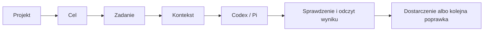

# KRN: jeden plan produktu

Status: `lab-test`. Consumer: operator i maintainer planujący produkt KRN.
Owner: maintainer. Verified: 2026-09-30.

To rekomendowany kierunek po badaniach i dwóch rundach pracy trzech agentów:
integracja natywna i panel, pamięć i kontekst, jakość kodu i proces pracy.
Możemy zakwestionować obecne założenia. Działające domyślne ustawienia i wybór
C/Git-ref pozostają aktualną bazą, dopóki nie wybierzemy i nie zweryfikujemy
następcy. Ten dokument jest jednym planem produktu; kolejka posiada stan zadań,
a istniejący roadmap ich wykonanie. Badania nie wykazały jeszcze przewagi KRN.

## 1. Co budujemy i po co

**Jedno miejsce pracy nad wynikiem projektu, z Codexem lub Pi pod spodem.**
Podłączasz repo, opisujesz wynik i widzisz, co agent robi, co obowiązuje,
czego brakuje, co sprawdzono oraz jakie jest następne legalne działanie.

Wartość ma być odczuwalna: mniej ponownego tłumaczenia projektu, błędnych zadań,
utraconych wymagań, ręcznego łączenia sesji z branchem i napraw po „gotowym” kodzie.
Agent zachowuje swobodę przywracalnej pracy; aktualne uprawnienia określają
właściciele rzeczywistych efektów.

Docelowe zastosowania: rozwijanie funkcji, diagnoza regresji, modernizacja,
bezpieczne porządkowanie kodu i wznowienie przerwanej pracy. Dobra realizacja
jednego projektu jest pierwszym sprawdzianem KRN jako produktu. Potem sprawdzamy
drugi, odmienny projekt i dopiero skalujemy zarządzanie wieloma projektami.

## 2. Wybrany kierunek i uczciwe alternatywy

Rekomenduję **mały lokalny panel obok natywnego wykonania**. Najpierw poprawna
droga przez istniejące narzędzia, potem widok pracy, następnie kwalifikowane
sterowanie sesją. KRN wnosi spójność projektu i dowodów; natywny host prowadzi
pętlę model–narzędzia, historię, logowanie i swoje uprawnienia.

| Wariant | Co zyskujemy | Co rozstrzyga wybór |
|---|---|---|
| Sam Codex/Pi i droga projektu, bez zadań/workflow KRN | Zero własnego silnika procesu: cel i sesja natywna, instrukcje, Git, kontrole i ewentualny tracker projektu. | Radykalna kontrola porównawcza. Jeśli zachowuje obowiązki i odzyskiwanie przy mniejszym koszcie, warstwa KRN ma być wycofana z migracją odbiorców, bez utraty pracy. |
| Natywne UI + mała integracja KRN | Najmniej własnego kodu; standardy, zadania i sprawdzanie przez aktualne narzędzia. | To kontrola porównawcza. Jeśli działa równie dobrze i taniej, dodatkowa warstwa musi uzasadnić swój koszt. |
| Mały panel obok Codexa/Pi | Jeden widok projektu, sesji, zadania i dowodów; można wrócić do CLI bez migracji całego projektu. | To pierwszy kandydat produktu. Wycofujemy go, jeśli wymaga konkurencyjnych kopii stanu i ręcznego uzgadniania. |
| Produkt zintegrowany, np. rozszerzenie T3 | Potencjalne wykorzystanie istniejącego UI, sesji i silnika poleceń. | Wybór tylko po próbie pokazującej niższy koszt zmian, aktualizacji i odzyskiwania. Jeden nowy właściciel zastępuje starego, zamiast tworzyć drugi tracker. |

T3 ma rzeczywiste punkty rozszerzenia w źródle; gotowa wtyczka KRN/Pi nie została
ustalona. Fork, własny backend i inny magazyn zadań pozostają pełnoprawnymi
alternatywami do porównania, z migracją i listą rzeczy do wycofania.
[Kontrakty i porównanie źródeł](workbench-contracts.md#code-and-product-surfaces).

## 3. Jak to ma się spinać

| Pytanie | Jeden właściciel informacji |
|---|---|
| Czego chcemy i co wolno? | Aktualne żądanie operatora; Goal (cel zapisany w sesji), jeśli istnieje, oraz autoryzowane zmiany wymagań. |
| Co robić i kto ma turę? | Tracker, jeśli projekt go skonfigurował; w KRN Git-ref z claimem (wyłączną turą wykonawcy). Bez trackera pracę określa żądanie/Goal, bez udawanej kolejki. |
| Co wiadomo o projekcie? | Aktualny kod, instrukcje i kuratorowana wiedza repo. |
| Co dzieje się w sesji? | Natywny Codex/Pi; panel przechowuje tylko potrzebne powiązanie i stan połączenia. |
| Czy wynik jest poprawny i dostarczony? | Wykonane kontrole dla konkretnego kandydata oraz odczyt rzeczywistego efektu. |

Panel i CLI korzystają z tych samych właścicieli. Widok, pamięć i odpowiedź
agenta nie nadają uprawnienia ani nie zamykają zadania. „Polecenie przyjęte”,
„sesja bezczynna”, „kandydat sprawdzony” i „zmiana dostarczona” są różnymi faktami.

Najpierw wiążemy projekt, osobny checkout (worktree), zadanie i właściwą sesję. Obserwatorów może
być wielu; konfliktujący zasób ma jednego piszącego i jawny handoff. Docelowo
niezależne projekty mogą działać równolegle; aktualny limit rozpoczętej pracy (WIP)
i uprawnienia pozostają
bez zmian do osobnej kwalifikacji. Token kontrolera UI nie zatrzyma obcego
edytora, TUI ani starego procesu.

Wznowienie historii, przyłączenie do żywego procesu, fork rozmowy, fork workspace,
checkpoint kodu i backup mają osobne znaczenie. Pokazujemy wspierane możliwości
konkretnego hosta, a brak jako brak. Po utracie połączenia lub odpowiedzi odczytujemy
stan przed kolejnym efektem. Stop sesji nie oznacza cofnięcia zmian ani oddania
claima. [Szczegóły kontroli](workbench-contracts.md#native-control-and-recovery-qualification).

## 4. Pamięć: odzyskiwać właściwą informację, nie gromadzić rozmowy

Rozdzielamy pięć pytań: czy informacja dotyczy tego działania, kto ją dostarczył,
czy nadal obowiązuje, czy mamy nazwane potrzebne dowody i czy działanie się udało.
Kompletny kontekst może zawierać błędną informację; trafny wynik wyszukiwania może
być nieaktualny. Pamięć nie zatwierdza zmiany celu.

| Poziom | Najmniejsza wersja | Kiedy zasługuje na własny mechanizm |
|---|---|---|
| Odtworzenie z bieżących źródeł | Natywna sesja, tracker, Git i wiedza repo. | Punkt odniesienia. Kapsuła pomaga tylko przy informacji, której nie da się taniej odtworzyć. |
| Kontekst dla następnego działania | Odtwarzalny widok aktualnych wymagań, źródeł, sprzeczności i braków. | Gdy rzeczywista próba ujawni powtarzalny błąd zdobycia lub zastosowania informacji. |
| Biblioteka doświadczeń | Mała kuratorowana wiedza: warunek, metoda, dowód oraz podobny przypadek, w którym metoda nie działa. | Gdy nawracający problem przetrwa poprawę kodu, reguły i nawigacji; koszt całego uczenia musi się opłacić. |

Najciekawsza hipoteza to **pamięć kontrastowa**: utrwalić różnicę między błędem
i sprawdzoną poprawką, z warunkiem zastosowania. Pierwsza wersja może być jednym
reviewowanym akapitem i dwoma odsyłaczami, bez grafowej bazy ani ekstraktora.

Wymagania, wartości projektu i uprawnienia zostają przy aktualnym źródle.
Między projektami przenosimy kwalifikowaną metodę, nie cudze ścieżki, nazewnictwo
czy prywatne dane. Treść przywołana z pamięci nie awansuje przez samo powtarzanie.

Widok może być cache’owany opisowo. Aktualny cel, kolejka/selector, wejścia kodu
i źródła muszą mieć właściwe wersje; uprawnienia sprawdza właściciel działania.
Ten sam Goal ID może mieć nowe wymagania, a lease wygasa bez zmiany Git OID.
Natywna pamięć pozostaje opcjonalna; jej wpływ pokazujemy jako nieznany, jeśli
host go nie ujawnia. Indeks dodajemy dopiero po rzeczywistym braku w obecnej
nawigacji. Retencja i fizyczne usunięcie danych mają swoich właścicieli.
[Źródła i próba pamięci](orchestration.md#action-applicability-and-scoped-memory-workbench-deepening-2026-09-30).

Warto sprawdzić kontekst przy konkretnym odczycie pliku: krótka wskazówka
z aktualnym źródłem i zakresem zamiast przypominania całej pamięci na każdej
turze. X-ray z pluginu pokazuje taki punkt podłączenia; jego analiza może być
nieaktualna, więc mechanizm wymaga własnej kwalifikacji.

## 5. Panel i codzienna praca

Jeden ekran: **wybór projektu i wyniku → obszar sesji → szuflada kontekstu i dowodów**.
Lista dopuszczonych zadań, pamięć, koszty i orkiestracja nie potrzebują osobnych dashboardów.

Docelowo panel obejmuje wszystkie sesje operatora w Codex/Pi i jego projektach,
również wcześniej istniejące. Każda ma osobno wskazany dostęp do historii,
obserwacji na żywo i sterowania. Oficjalne API oraz wersja hosta muszą ten zakres
potwierdzić; nieobsługiwane przyłączenie do żywego procesu pozostaje jawną luką,
a nie ukrytym wyłączeniem z obietnicy „wszystkich sesji”.

Po podłączeniu widzisz wykryty root, obowiązujące instrukcje, komendy projektu,
własność wcześniejszych zmian i dokładny plan brakującej konfiguracji.
Następnego dnia system ponownie sprawdza źródła i pokazuje rozbieżność.
Nie nadpisuje dobrego kontraktu projektu szablonem.

Pierwszy panel tylko czyta zadanie/blokadę, sesję, zmianę kodu, źródła i wynik kontroli.
Następny pion dodaje otwieranie/wznowienie jednej zarządzanej sesji, a potem
zmianę polecenia w trakcie pracy, przerwanie, pytania i zatwierdzenie. Zasoby i dane pozostają lokalne;
oficjalne protokoły nie oznaczają automatycznie zgodności z zainstalowaną wersją.

Ważne stany produktu to pusty projekt, brak legalnego zadania, błąd, nieaktualny
widok, ponowne połączenie i nieznany efekt. Ograniczamy zbędne pytania: przywracalne kroki
prowadzimy dalej; pytamy, gdy brak zmienia zakres, uprawnienie, wynik lub cel.
Znane użycie i limity pokazujemy ze źródłem; brak danych nie staje się zerowym
kosztem. Backup i powrót do wcześniejszej wersji trzeba sprawdzić także po nowych
zapisach, bez utraty pracy i uprawnień.

## 6. Kod, skills i „make it sexy”

Dla nowych interfejsów bridge/UI wybieram TypeScript i lokalny React/Vite.
Obecne moduły JS zachowujemy; JSDoc/`checkJs` lub migracja jednego interfejsu
są alternatywami, gdy usuwają konkretną niejasność. Standardy projektów pozostają
lokalne. W nowych własnych identyfikatorach proponuję `snake_case`, z PascalCase
dla typów i komponentów; nazwy obcych protokołów zachowujemy.

Piękno kodu mierzymy czytelnym przepływem, lokalnością zmian i małą liczbą
obowiązków wywołującego. Preferujemy głębokie moduły, jawne stany i walidację
wejścia raz. Własny framework, powielony schemat lub wrapper potrzebują odbiorcy.

Jeden skill prowadzi aktualną niepewność; companion pomaga tylko w swoim wycinku.
Opis precyzuje sytuację wejściową i wynik, procedura i referencje są na żądanie.
Polski jest kierunkiem interfejsu/operatora; wpływ tłumaczenia na zachowanie
agenta wymaga porównania. Nie utrzymujemy dwóch wersji prawdy ani kopii upstream.

Pomysł code-simplifier włączam jako **jeden przegląd zmienionego kodu przed końcowym
dowodem**, pod obecnym właścicielem jakości. Zachowujemy zachowanie, upraszczamy
nazwy, zagnieżdżenia i nadmiarowe abstrakcje. Arrow, typ wyniku i `catch` dobieramy
do realnych kontraktów; przejrzystość wygrywa z gęstym skracaniem. Szersza
refaktoryzacja lub naprawa dostaje własny zakres. Nowy stan unieważnia stary przegląd.
To świadome doprecyzowanie podanego promptu: deklaracje funkcji i jawne typy
publicznych kontraktów są preferencją, ale zachowujemy semantykę arrow oraz
użyteczne wnioskowanie lokalne zamiast automatycznie przepisywać każdą funkcję.

Z `code-modernization` bierzemy rozróżnienie aktualizacji wersji i zmiany stosu,
poznanie reguł przed migracją oraz pilot przed rozszerzeniem pracy na kolejne
moduły. Jego raporty równoważności mają granice dowodu; nie kopiujemy całej
procedury ani automatycznej armii agentów.
[Analiza pluginu i uproszczeń](orchestration.md#scoped-simplification-and-modernization-2026-09-30).

Budżet nowych falsyfikatorów zostaje `0/1/N`: zero dla dokumentów/mechaniki,
jeden dla zmienionego kontraktu, więcej dla różnych wymagań i awarii.
Nowy falsyfikator najpierw przegrywa na przed-stanie. Zachowanie już objęte
dowodem chronimy dotychczasową kontrolą. Testy retirowane mają rozliczonego
odbiorcę i zachowane różne wymagania. Najpierw batch niezależnych odczytów, potem
potrzebny osobny kontekst; równoległe pisanie wymaga izolacji i legalnego dopuszczenia.

## 7. Kolejność budowy i warunki przejścia

| Pion | Wynik widoczny dla użytkownika | Co pozwala iść dalej |
|---|---|---|
| 1. Rzeczywista droga pracy | Aktualne narzędzia prowadzą zadanie od celu do sprawdzonego efektu i wznowienia. | Właściwy projekt, wymagania i właściciel; obsłużony brak legalnej pracy i zmiana celu. |
| 2. Jeden ekran tylko do odczytu | Projekt, zadanie, sesja i dowody w jednym czytelnym widoku. | Ponowne połączenie odbudowuje widok; nieznany stan jest uczciwy, a użytkownik ma mniej ręcznego składania informacji. |
| 3. Sterowanie natywne | Jedna zarządzana sesja: otwarcie/wznowienie, następnie pytania i przerwanie. | Osobno sprawdzone szybkie zakończenie, praca oczekująca, zgubiona odpowiedź, stare zatwierdzenie i zły projekt. |
| 4. Celowane memory/learning | Naprawiony rzeczywisty brak informacji albo powtarzalny błąd transferu. | Porównanie z odczytem natywnym zachowuje wymagania i uzasadnia pełny koszt. |
| 5. Skalowanie i odejmowanie | Kolejne projekty, potrzebna współbieżność, mniej zbędnych powierzchni. | Drugi odmienny projekt, kwalifikowane aktualizacje/odzyskiwanie; zbędny kod ma przeniesionych odbiorców. |

Pierwszy konkretny kandydat dogfoodingu: `krn-codex-skills` i istniejący
`hardening-cli-integration`, po jego legalnym dopuszczeniu i rozstrzygnięciu
poprzednika. Użytkownik/integrator ma uzyskać potrzebny stan zadania bez
przeszukiwania pełnej historii i bez mylenia widoku z uprawnieniem.
Drugi kandydat: `bloom-barista-www`, projekt WordPress/PHP/CSS bez skonfigurowanego
trackera. Planowana próba dotyczy kontekstu sekcji kursów/karty i wznowienia
z zachowaniem wcześniejszych zmian, po uzgodnieniu ich właściciela i zakresu.
Odczyt metadanych potwierdził lokalne reguły i istniejącą rozpoczętą pracę;
projekt nie został zmieniony ani uruchomiony. To sprawdzian, czy KRN respektuje
odmienny stos i brak kolejki, zamiast narzucać standardy własnego repo.
Nie ogłaszamy transferu jakości przed rzeczywistymi próbami.

Mierzymy zaakceptowany wynik, zachowane wymagania, poprawki operatora,
fałszywe blokady, podłączenie/wznowienie oraz cały czas i koszt wykonania, czytania,
pisania pamięci, delegacji, kontroli i prób nieudanych. Natywny klient dostaje
te same wymagania i dostęp. Dobry pojedynczy przykład pokazuje wykonalność;
korzyść produktu wymaga porównania. Obecny indeks i ADR 0006 zachowują koszt
oraz niejednoznaczność wcześniejszych wyników.

## Materiały pomocnicze

- [Kontrakty wykonania i integracji](workbench-contracts.md): szczegóły wymagane
  przy konkretnym pionie; protokoły, źródła, awarie i ograniczenia.
- [Badania i decyzje](orchestration.md): mechanizmy, kontrargumenty i granice dowodów.
- [Istniejący roadmap](self-hardening-roadmap.md#current-target-delivery-graph):
  właściciel realizacji; live queue rozstrzyga eligibility i status.

Supersession: aktualizujemy ten jeden plan, gdy operator wybierze inny kierunek
lub rzeczywista próba obali założenie. Następca wskazuje migrację i wycofanie
starego właściciela. Szczegóły pozostają przy swoich źródłach; nie dodajemy
równoległego planu ani drugiej kopii statusu; opis propozycji nie jest jej wdrożeniem.
