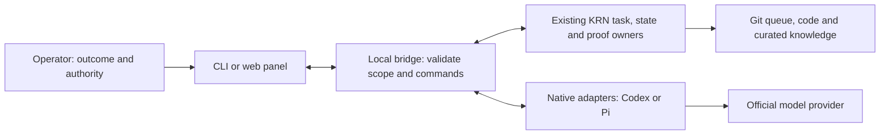

# KRN workbench: runtime contracts and source comparisons

Status: `lab-test`. Consumer: native adapter, task/state/proof maintainers and
`$slice-work` after the operator settles a slice. Owner: maintainer. Verified: 2026-10-03.

This is the technical reference linked from the [single product plan](product-architecture.md).
It preserves prior mechanisms, constraints, counterexamples and source identities
while keeping that plan readable. Historical host observations are not freshly
revalidated; proposed contracts do not certify implementation or product uplift.
The existing roadmap/queue owns execution and admission, and
[orchestration](orchestration.md) owns the broader research mechanisms.
The 2026-10-01 operator correction defers frontend/panel and frontend pilots
until task, memory, isolation, proof and recovery mechanisms are qualified.
Retained panel protocols below are future reference, not the current frontier.

## Product contract, not a document count

Given an accepted user outcome, KRN must let a fresh supported coding-agent
session: discover eligible work; claim one task without stealing another worker's
turn; distinguish preserved, legally replaced and revoked obligations against
an authentic user request; read only the missing evidence for its next action;
repair code; prove the changed requirement and regressions at a pinned fixed
point; close only after the checked effect is observed; and recover after an
interrupted session without trusting an obsolete checkpoint. The native agent
with live Goal, repository and task reads is the mandatory control. A green
suite, a model verdict, a retrieval hit, or a neat Markdown page does not
establish this contract or an outcome improvement.

One concrete failure: task B depends on A. After A closes, exactly one worker
claims B. A later user request replaces an old public symbol but preserves
atomicity and isolation. A stale checkpoint still asks for the old symbol.
The next session must read the authoritative request, preserve the behavioral
obligations under an executed mapping, reject an unauthorized revoke, and
refuse close if the evidence belongs to another request revision or commit.
An unrelated change must not force a false block. A worker cannot invent its
own user approval. The checked base/head and merged fixed point remain visible
in the task result. This scenario supplies positive, negative and native arms
for admission and restart; a single laboratory case cannot establish uplift.

## Chosen ownership, types and storage

| Truth | Current owner and selected target | Not its authority |
|---|---|---|
| Current outcome | The accepted operator request, or its native Goal when one exists; only the operator can change acceptance. Codex/Pi Goal state follows the actual host and session branch. | A child process's copied prompt or the task queue. |
| Work item and user-approved task intent | The one operating `refs/krn/queue` snapshot, updated with expected-old Git-ref CAS. Existing `tasks`, `operations` and `intents` stay its owner; add scoped intent events to the task only after host-source validation. | Capsule, lesson, Herdr pane, Markdown mirror or a second DB. |
| Code and executable acceptance | Immutable Git objects, frozen tests and candidate-bound receipts. Commit, task close, review and handoff have different source-of-truth checks. | Agent self-report or reviewer vote. |
| One outcome's restart | `$delivery-loop`'s ignored, bounded checkpoint, derived from Goal/task/code and removed at its cleanup trigger. | Canonical user authority or task status. |
| Reusable procedural knowledge | Gate-backed `workflow-lessons.md`, with trigger, evidence and retirement. | Automatic conversion of task comments or entire transcripts. |
| Shared facts and hard decisions | Git-reviewed `CONTEXT.md`, ADRs and curated topic pages. | Session memory or an unchecked memory extractor. |
| Search | Map, exact/lexical/Git, metadata and explicit links; optional *derived and disposable* FTS5 only after a measured miss survives repair. | Embeddings, a graph or index ranking as source of truth. |

These are conceptual interfaces, **not** a new schema already shipped:

```text
IntentChange: taskId, expectedRevision, source{host, session/message locator,
              content digest, approving actor}, scope[obligationId],
              action[preserve | replace(successor, mappingCheck) | revoke]
DecisionFrame: project/worktree identity, goalId?, goalRevision/source digest?,
               selectorOid, queueOid, taskId, claimEpoch, intentRevision, gitHead,
               sourceRefs[], applicable[], missingEvidence[], nextGate
```

Task, lease and proof shapes remain with the existing task/proof owners and
[ticket protocol](ticket-protocol.md); do not maintain parallel pseudotypes here.
The view consumes their actual generations and candidate-bound evidence.

These fields describe the selected Git-ref profile. A workbench must also honor
an explicit project no-tracker profile: current request/Goal and repository
sources remain its authorities; task/claim/queue fields are not manufactured.
An expected Git-ref selector missing or unreadable is different and still
refuses task work. Resolve that distinction from the actual project contract,
not by treating every absent selector as a new empty project. Any other tracker
needs its own real read/write contract before it can supply equivalent bindings.

Only the task owner writes task intent. The host or operator captures a real
user request and approves its scope; a model may *propose*, never approve,
`replace`/`revoke`. A digest binds bytes but does not authenticate authorship.
If Pi/Codex cannot expose an independently identifiable user event, require an
explicit operator-confirmed task transition; do not infer authority from task
prose, an agent-written capsule or a model classification. A delta preserves
all omitted obligations; complete-snapshot semantics remain unsupported until
a separate qualified source and test exist. `sh-167` presently exercises only
caller-curated fixtures, so this real-user ingress is open work.

`DecisionFrame` is a bounded read view, not another persistent record. Resolve
Goal/current request, one selected queue snapshot, code identity and only sources
required by the next decision. The earlier task/epoch/HEAD cache key is superseded:
it omitted Goal-content and selected-queue changes. Any reused descriptive view
also binds project/worktree, `selectorOid` and queue `oid`, Goal/request revision
or source digest, and relevant declared input digests. The existing
`readActiveTaskStoreSnapshot` exposes both Git OIDs. When the host cannot expose
a trustworthy Goal revision, reread its current request before consequential
actions instead of caching its authority. HEAD alone omits dirty and necessary
ignored/generated inputs; qualify them through the existing input owner.

Even an unchanged key cannot authorize an effect: a lease expires with clock
time, permissions can change, and a digest does not authenticate an approving
actor. The effect owner rechecks current selector/queue, claim/lease/intent,
actual approval and candidate inputs at its own transition, then reads back
the result. These are proposed invariants, not a claim every current effect path
already enforces them. Refuse or refresh an affected stale/unknown view; never
store an old `ready` or approval claim in a capsule as authority. Falsifiers:
change acceptance under the same Goal ID, advance only queue/selector state,
or expire a lease without changing refs; the old view must not admit an action.
A sourced requirement may
remain true after unrelated code changes: evaluate its own applicability,
not a global diff-level stale flag. If the exact source or required evidence
cannot be resolved, return `unknown` and stop the affected transition. Count
all extraction, reading, retry and context tokens before claiming efficiency.

## Design alternatives and bounded recommendation (2026-09-30)

Three independent read-only designs challenged the existing target rather than
assuming a new framework. This is design evidence, not an outcome experiment.

| Alternative | Useful leverage | Strongest counterargument | Disposition |
|---|---|---|---|
| A: reduce to native execution and deep task/state/install owners | removes repeated caller-side sequencing and unearned always-loaded instructions | fewer command names can hide more operator work; deleting a live consumer is not simplification | retain existing ownership and repair its seams first; do not retire aliases, lessons, skills or laboratory tools without consumer evidence |
| B: typed prerequisites and a derived evidence graph | makes action-specific refusals, unknown effects and stale generations explicit | a well-typed graph can still contain forged authority or a self-authored green receipt | retain execution, fencing and readback invariants at effect owners; defer a shared action DSL, persistent graph or new registry |
| C: make the common user's onboarding/work/review/resume path trivial | hides flags and protocol order while exposing scope and actual effects | the native host may already provide this interface; another facade can add no value | lab-test clearer existing command results and exact setup plans before adding commands or interactive machinery |

The recommended direction combines A's subtraction, C's user-facing clarity,
and B's irreducible correctness conditions. It does not supersede ADR 0006's
installed defaults, choose a different task backend, or claim a breakthrough.
The counterexample set includes stale authority, a supplied green record,
crash after effect, two independent clones, cancelled continuation, an unrelated
change, a small typo and a full source review. Each effect owner must still
refuse independently if every explanatory graph or UI is removed.

A normal outcome uses one authorized writer and the recorded PR/review/fix/merge
scope; install and host changes keep separate grants. No per-commit approval
ritual and no automatic expansion of authority are introduced. Reuse existing
knowledge before refreshing its primary source. Instruction delivery, procedure
selection, correct execution and observed effect remain separate observations.
`writing-for-agents` is a pinned authoring aid, not an empirically certified
policy engine; its proposed wording changes must survive the same countercases.
The roadmap owns the slices and their falsifiers, not this comparison table.

The operator's expanded request also admits a stronger native-only comparator:
Codex/Pi plus the project's own instructions, current native request/history,
Git/CI and any actual project tracker, with no KRN task/lifecycle surface.
**Lab-test** that complete journey as a design alternative, not just removal of
the web UI. Consumer/owner: operator and maintainer. Falsifier: an independently
accepted obligation, exclusive turn, authority change or interrupted effect
cannot be preserved/recovered at acceptable full cost. If it matches the KRN
route more cheaply, the corresponding runtime is a retirement candidate. An
adopted replacement needs lossless history/claim migration, a single cutover
writer, recovery and explicit retirement; no current queue/profile was changed.

## Caller-facing CLI and memory qualification

The installed source-owned front door is `krn`; `krn-codex-catalog` is a thin
compatibility wrapper into its capability command. Other personal binaries
sharing the prefix have another checkout/owner and are not this installer’s
retirement targets. Current installation identity, command existence and
fresh-process loading are separate observations.

| Surface | Current role | Candidate disposition, not an implemented retirement |
|---|---|---|
| task | authoritative work/claim/history/intent and checked effects | retain the deep owner; qualify single-task machine reads and structured generations before adding orchestration |
| state | bounded restart/compile/readback | retain conditional continuation; no cached approval or task-status authority |
| memory / lessons | memory dispatches procedural lesson recall/usage/check/verify/reanchor; lessons aliases the last three | one canonical semantic entrypoint after real caller migration; neither is a second DB or a general search over all repository knowledge |
| repo / skills / capability | local adoption, generated export and explicit capability maintenance | improve exact plans and read-only inspection; keep host/profile writes explicit and developer operations out of the default daily journey |
| changes / gate / conformance | different proof, transition and frozen-acceptance contracts | preserve the distinctions and truthful failure; do not merge them into one green badge |
| install / doctor | host release lifecycle and readable inspection | retain actual operator consumers and rollback; aliases may be retired only after their external callers are qualified |
| harness compare | laboratory/measurement consumer | preserve ADR 0006’s consumer/proof boundary; development-only exposure is a choice to qualify, not immediate deletion |

Observed integrator friction includes whole-task-list extraction for current
owner/epoch/lease, while show/fields expose presentation labels and env serves
lane bindings. The smallest improvement must first account for those existing
interfaces, preserve compatibility, identify a second real caller and keep
read-only effects/unknowns explicit. New wrappers, command names and root
defaults must not hide wrong-repository selection or another permission.

Useful memory means the agent can obtain the evidence needed for its next
question from current authorities and reusable knowledge, not that it calls
recall on every turn. Keep live task history, outcome continuation, reviewed
shared facts and executable procedural lessons distinct. A composed read view
may cite them without becoming their store or granting authority. Measure a
real miss against current/native reading, source applicability, counterevidence
and changed-authority cases before implementing another view or index. Existing
D4/D5/sh-169/sh-185 gates remain; neutral small work must not acquire a mandatory
memory ritual. CLI integration and memory-usefulness decisions are tasks in the
roadmap, and their publication is not evidence of product benefit.

## Operational friction: hook and site access

Consumer: operator/maintainer removing false refusals and repeated credential
setup before more product machinery. Owners: this repository's hook/contract
maintainers; `mise-en-plesk` owns its access/deploy skills and credential policy.
Operator steering 2026-10-01 adopts project-local working connection reuse:
resolve a complete `.env` profile, then `ftp-kr.json`, clarify an authentication
failure once, and use BW only for missing/rejected access. A routine site edit
does not restart setup. The native-boundary repair was delivered in
[PR #298](https://github.com/korneliuszburian/krn-codex-skills/pull/298), and the
quoted-data follow-up in [PR #299](https://github.com/korneliuszburian/krn-codex-skills/pull/299).
Current global release: `ab403fdb075435c9d6f3488400752dc4e5a3501f`. Separately owned site-skill alignment
and launcher repair are outside that delivered scope.

### Native boundaries, narrow interception

Official [Codex security and approvals](https://learn.chatgpt.com/docs/agent-approvals-security)
separate OS-enforced local isolation from approval policy. Anthropic's
[sandbox documentation](https://code.claude.com/docs/en/sandboxing) separates
filesystem and network boundaries; its [containment account](https://www.anthropic.com/engineering/how-we-contain-claude)
describes product-specific isolation. These systems also use permission/action
review: the evidence does not support saying nobody analyzes commands.

**Adopt** the separation, owned by the existing native/sandbox and hook owners:
native permissions constrain local effects; a site's account permissions
constrain remote effects; the project owns deployment scope and readback.
The universal hook catches recognized local deletion, protected targets,
Git risk and exact forbidden references. **Reject** a second SSH/FTP/WP-CLI
policy interpreter, global DEV recipe and inspection of SFTP batch contents.
Passing the hook does not grant remote authority. Countercase: an ordinary
config read refuses, or a retained local root/Git/global safeguard passes.

### Observed, not inferred completion

The reproduced before-state is HEAD `4105e239f43e274cf6f4245f8b1033055f899be1`, hook SHA-256
`69842a8c8ea7663a04913f1a866090417aef0030fe96298157861f8574a6b0f2`
and installed release `0731782fb5080a083ad6852a29e88ffc6077c4f2`
through actual JSON entrypoints and disposable inputs. Both denied local
read/edit/staging containing the FTP config name. Project instruction updates
depended incorrectly on launch cwd, and project `.env` updates refused.

The merged repair removes the deployment/credential/batch analyzer, admits
scoped project configuration patches and delegates native site tools. It also
guards local destinations of remote copies. Protected config deletes/moves,
out-of-scope repository instructions, globals and Git metadata remain guarded.
Static local pipeline checks distinguish remote arguments from local effects;
piping into a shell remains refused. Native filesystem policy still decides
write authority; a hook scope match is not authentication.

The operator's delivery handoff reports full pinned-Node gates before publication
and after merge, CI, independent Standards/Spec approval and fresh Codex 0.159.3
read/denial probes without bypassing hook trust. Readback here confirms the merge
object, installed release and hook links, the retained 16-case adapter matrix
with zero failures, the fresh-host read transcript and denial log. An actual
non-secret FTP-config fixture read also succeeded in this session. At that initial
readback, GitHub API access was unavailable, so #298 CI status relied on the
handoff. The #299 follow-up below has its own executed gates, CI and installation
readback. No site action or vault access was performed.
The remaining Python-wrapper false refusal was minimized to a heredoc containing
only `print('TIMEOUT; install check unqualified')`. The active hook refuses it
as an uninspectable writer; replacing the semicolon with a colon or passing the
same Python expression through `-c` succeeds. In the installed hook,
`naive_writer_reason` splits with `SUBCOMMAND_SPLIT` regardless of quoting and
mistakes the string fragment starting with `install` for a writer command.
The published follow-up reuses `pipe_segments` with an optional command-boundary
mode, replacing only this blind writer split. One permanent Node observer in
`test/hooks-guard.test.mjs` asserts quoted data and retained local writer guards;
it failed with an actual assertion against `f1557a0…` and passes after the fix.
Full pinned-Node gates passed before publication and after merge; PR and merge
CI fast/deep succeeded. Independent Standards/Spec reviews found no issues.
Standard installation used the clean merged checkout and `allowUnsealed: false`.
The original heredoc now succeeds both in this conversation and a fresh Codex
0.159.3 process. The fresh process's actual tool result returns exit 0, while
its separate nonexistent-target destructive pipeline receives a real PreToolUse
denial. No hook-trust bypass or real deletion was used. Consumer/owner: hook
maintainer; supersede on an executed countercase or replacement. This proves
the named flow, not universal benign-composition compatibility; no language
interpreter was added. The provisional Python observer was not duplicated in
the published tests, and owned temporary candidate patches are retired.

The research checkout remains at `4105e239…`; its four document changes are
preserved separately. Its old committed ledger does not attest the new release,
so source-anchored inspection there can still refuse. Ordinary `install check`
from the clean merged `ab403fdb…` checkout passes `filesystem_installed`,
`anchor: committed`, `sealed_by_value`; seal key
`cdbc6c1e7af9aa64b4453cbffedebdd982889b89` is a verified ancestor of that merge.
No immutable release was edited. Carry the research changes onto current main
before its source-anchored handoff; this does not require changing the installed
seal or weakening inspection. The hotfix's owned branch/worktrees are retired
after installation and host readback.

The standard launcher's missing `codex-code-mode-host` is a separate limitation
reported in the handoff. The successful fresh-host proof used an existing
complete 0.159.3 binary. Filesystem inspection does not prove this conversation
reloaded its global instructions or repair the launcher.

The last separate site-skill read was clean `mise-en-plesk` at `95df377…`.
The main skill bodies already allow local-first setup and native execution,
but YAML descriptions promote broker/guarded execution and `AGENTS.md` leaves
the development ceremony too broad. The seven-file alignment proposal also
clarifies an unrelated/incomplete `.env`, optional CLI limitations and FTP
automation at close-out. It was not applied here and is not delivered by #298.
Re-read the owning checkout before applying; keep its broker's implementation
limits distinct from authorized native operations.

### Smallest coherent repair order

| Slice / owner | Required behavior and cheapest deciding signal |
|---|---|
| Local config and native site commands, hook owner | Delivered in #298, quoted-data follow-up in #299; installed at `ab403fdb…`. Entrypoint, matrix and fresh-host evidence are distinct from product benefit. H1's completed campaign tasks are not reopened. |
| Project instruction/config scope, hook/native owner | Delivered in #298 with scoped positive/negative checks. Native permissions remain authoritative. |
| Credential/setup policy, `mise-en-plesk` owner | Reconcile `AGENTS.md`, setup skill and bootstrap reference with the operator's local-first rule. Parse `.env` as data, keep complete transport groups, reuse success, classify auth separately from DNS/TLS/timeout/path errors, and open BW only for its named fallback. No credential dump, master/session persistence, secret commit, broad vault crawl or automatic unrelated-account reset. |
| Native site execution, deployment owner | Known connection → current scoped SSH/WP-CLI/FTP/SFTP action → effect readback. Existing runners are optional tools; remove mandatory toolchain/vault/spec/ticket work from routine edits. Leave domain-specific deployment checks with the site/project owner rather than a universal DEV recipe; an exact request retains its scope without repeated consent. |
| Source-to-host delivery, installer/operator | Hook publication, sealed installation, ordinary committed-main inspection and fresh-host read/denial delivered through #299. Research still needs its current-main integration. Launcher and site skills retain separate owners. |

Setup ends after verified login/account/root access. If local configuration is
missing or rejected after clarification, select one exact/unique site BW item,
test the complete tuple, and update only the approved local credential location
and corresponding item where authorized. Credential creation/rotation uses the
actual named account and available privilege; a failed network or permission
check does not establish a bad password. Once access works, subsequent site
tasks reuse it until missing/rejected or the operator changes the target.

Finishing work leaves `autoUpload`, `autoDownload`, `autoDelete` false. Shared
FTP routing may be versioned without secret values; local secret handling must
use a mechanism the actual extension supports, not guessed env interpolation.
The current universal no-secret-persistence wording also needs to distinguish
explicitly approved local credential configuration from logs/Git and BW master
or session values. New helper commands, stores and per-plugin wrappers are not
earned by these repairs. The #299 follow-up changes writer-boundary detection,
one Node observer and the seal ledger; research remains on its separate branch.
The standard installer performed the authorized global delivery. No site account,
vault, selected queue or separately owned site-skill checkout was changed.
Supersede on publication, full-gate/installation/loading evidence or changed owning
policy; update the index. Retire temporary repair handoffs when superseded or installed.

## Workspace and run contract

Persistent working state has one existing shape:
`.krn/runs/<workflow>/<run-id>/`. Candidate, clone, home, operation packet and
logs belong to that run as children, not independently located peer roots.
A writable sandbox clone is not a linked Git worktree; callers must name the
actual mode rather than call both `WT`. Queue coordination follows canonical
Git common-directory identity, while a run belongs to its actual checkout.

| Resource | Owner and lifecycle | Deliberate exception / refusal |
|---|---|---|
| Persistent workflow run | creating workflow and the outcome's sole writer; one named consumer and cleanup/supersession trigger | a transfer does not authorize deleting another owner's run or resurrecting a cancelled outcome |
| Candidate linked worktree | existing kernel/worktree owner, called by the integrator | refusal/failure must report owned cleanup; removing one resource must not prune or delete unrelated author worktrees |
| Isolated writable clone/copy | existing lane/harness owner; source is read-only and the candidate is read back before integration | reject destination-inside-source recursion and source-linked `.git` metadata; exclude unrelated runs and private data |
| Short-lived proof/test fixture | caller-owned temporary scope, removed on success and failure | temporary fixtures are not durable continuation; do not force all test trees into the source checkout |
| Queue lock | task owner under the shared Git common directory | not a workflow run and not a distributed lock |
| Install staging | installer on the release filesystem for atomic rename | do not relocate staging into a generic run or weaken prior-current rollback |

Extend an existing owner only for an actual caller; do not create a universal
workspace service or `.krn/worktrees` registry. Normalize persistent paths,
realpath containment and cleanup outcomes together. Preserve condensed evidence
needed for recovery, but separately minimize credential-bearing home retention.
After an ambiguous external effect, read back the effect before replay or
cleanup that could erase required recovery evidence. These are target contracts;
current shell/harness divergences are repairs in the roadmap, not guarantees
already delivered by this page.

The creative workbench comparison distinguishes session fork, workspace fork,
code checkpoint and project backup. T3's pinned
[CheckpointStore](https://github.com/pingdotgg/t3code/blob/c2fa9fc911daeac97df4760f95fc57dca42b84c8/apps/server/src/checkpointing/CheckpointStore.ts)
captures/restores hidden Git refs with an isolated index, but does not coordinate
conversation rollback and may fall back to HEAD. **Adopt** the distinction;
**lab-test** any combined recovery action on dirty/untracked/required ignored
inputs before exposing it. Task export, code/effect refs and native session
history need their own restore readback; ordinary export excludes credentials.
Rollback after new writes must preserve those writes through a qualified reverse
migration or explicitly report it unavailable. A code checkpoint alone is not
that backup. Owner: existing workspace/task/host maintainers; consumer: actual
interrupted-project recovery. Falsifier: a plausible restore loses an obligation,
accepted task write or necessary input. No checkpoint/backup was executed here.

## Cloudflare execution reuse (2026-10-01)

Consumer: maintainer choosing execution/isolation for the current mechanism-first
plan. Owner: existing sandbox/workspace/recovery maintainers; root is the result
writer. Disposition: `lab-test`, not installation or cloud adoption. No account,
credentials, native/cloud process or billing access was inspected or exercised.

| Primary source, verified 2026-10-01 | Reusable mechanism | Limit that constrains KRN |
|---|---|---|
| [Cloudflare article](https://blog.cloudflare.com/faster-agent-sandboxes/), published 2026-09-30 | Native `ctx.container`, runtime image/instance selection and filesystem snapshots under public-beta `durable_object` scheduling. Reuse VM provisioning/lifecycle rather than build it. | Reported startup speed is not KRN outcome latency, account capacity or cost; repository/dependency setup remains. SDK 1.0/native APIs differ from legacy 0.x examples. |
| [Sandboxes overview](https://developers.cloudflare.com/sandbox/) | A Linux container is a separate microVM; the Worker controls exposed application data/APIs and Internet. | Requires Workers Paid. Dynamic Workers are a different environment. A VM separates candidates, not every process/path inside one candidate. |
| [Native Container API](https://developers.cloudflare.com/containers/api/durable-object-container/) | Direct executable/argument-array execution, process streams and exit state, lifecycle control. | Running/start is not ready; `user` under new scheduling does not reduce root capabilities. No built-in exec deadline; kill/abort targets one process, children can survive. Disconnect does not stop work and retry can duplicate it. Buffered output and monitoring/inactivity recovery belong to the caller. |
| [Snapshots](https://developers.cloudflare.com/containers/guides/snapshots/) | Immutable filesystem state for a prepared candidate and later restoration. | Image-version-bound, not portable to another image; no RAM, running processes or separate mounted filesystems. The entrypoint restarts. Current API retention is implicit rather than a chosen durable-memory lifecycle. A snapshot is neither task authority nor semantic memory. |
| [Outbound traffic](https://developers.cloudflare.com/containers/configuration/outbound-traffic/) | Worker-side HTTP(S) policy and credential injection outside the VM. | Start deny-by-default and qualify all permitted routes/TLS. Internet-on can leave non-intercepted paths; policy needs re-registration after stop. Allowed destination is not permission for every API method/repository/effect. |
| [Pricing](https://developers.cloudflare.com/containers/platform/pricing/) | Managed running compute with CPU usage and provisioned memory/disk billing, plus platform/egress costs. | Pricing page precedes the new beta. Full snapshot cost, current quotas/account access and complete KRN cost remain unobserved; no cheap/free/available promise. |

Cloudflare also supplies [Codex](https://developers.cloudflare.com/sandbox/coding-agents/codex/)
and [Pi](https://developers.cloudflare.com/sandbox/coding-agents/pi/) runner
recipes, with pinned binaries and native outcome handling. These are real reuse
candidates, not a reason to copy configurations blindly: the Codex example uses
OpenAI API credentials through AI Gateway and disables its inner approvals/sandbox
in favor of container policy; it does not prove existing ChatGPT-plan OAuth works
there. The Pi example selects an Anthropic model through Gateway, not this
operator's OpenAI-Codex profile. Native login/refresh, model access, TLS, complete
events and required project resources must be qualified without leaking a host
credential home. A recipe's `succeeded` denotes its execution outcome, not KRN
acceptance, proof or task close. No example was run or deployed here.

Smallest candidate: one isolated VM/clone for one candidate, running a pinned
native Pi/Codex process; Worker/DO owns environment policy and a run handle.
KRN's authoritative queue, current operator intent, independent proof and
integration remain outside that writable candidate. The DO is not a second
task store or semantic-memory database. The article's optional brain-in-DO
pattern would add a loop we already receive from the native host. No frontend
is needed to submit a bounded job or inspect its result.

Compare with the already-owned local isolation/clone profile first, after its
actual version, non-setuid and boundary readback; old index evidence does not
certify today's host. Docker Sandboxes is another existing provider candidate,
not an installation mandate. Worktree, prompt or tool allowlist alone is not
OS isolation. Do not place integrator home, publication rights, live task queue
or unrelated runs in a cloud candidate; treat exported code/config/hooks as
untrusted at the later host/evaluator handoff.

The later deciding screen has distinct failure modes: wrong project/path and
cross-candidate read; denied egress and scoped credential proxy using non-secret
canaries; surviving children/crash/lost ACK; required dirty/ignored input and
image-bound restore; stale intent/lease/candidate or forged execution receipt.
Stop/readback the whole candidate where required, and recheck task authority
before integration. Restore filesystem state then explicitly resume native
session state; do not call it process continuation. Independent acceptance stays
outside the worker's writable evidence. These are future requirements, not new
tests or measured guarantees.

Count cold/warm startup, upload/clone, dependency/toolchain/native initialization,
auth, inference, tests, snapshot/restore, download, retries, operator recovery and
CF compute/egress/DO/storage/logs plus model usage per accepted outcome. Prefer
Cloudflare only when it satisfies the actual contract at justified total cost;
otherwise retain the simpler local/native route. Supersede this decision when
the API/SDK/image or a qualified paired journey changes it; update the index.

## Sandbox comparison and first-profile decision (2026-10-01)

Consumer: the operator/maintainer choosing the first isolated native candidate.
Owner: current sandbox/workspace/recovery owners. Disposition: `lab-test` for
provider integration; no default replacement, host probe, install or account
qualification. This refresh extends the existing 2026-09-16 isolation family;
the earlier Docker Desktop-focused description is historical, not current setup.

| Candidate / layer | Current source and useful fit | Deciding gaps and disposition |
|---|---|---|
| Sandcastle: agent/workspace/provider orchestration | Observed v0.12.0, `e99f832f26dc9d245c019a9ddd19fa5dee792427` (2026-06-29); [README](https://github.com/mattpocock/sandcastle/blob/e99f832f26dc9d245c019a9ddd19fa5dee792427/README.md). Docker/Podman bind-mount versus isolated providers, native session/worktree lifecycle and configurable branches are reusable seams. | Not an independent OS boundary. Default head or merge-to-head and automatic merge/capture must not replace KRN task/proof/publication. Lab-test a narrow handle over a private independent clone only if it deletes real glue; defer whole-runner adoption. |
| Docker Sandboxes: local microVM/runtime | Current [overview](https://docs.docker.com/ai/sandboxes/) and [installation](https://docs.docker.com/ai/sandboxes/install/) describe standalone `sbx`, not a Docker Desktop/Engine prerequisite. Ubuntu 24.04+ with KVM is supported; derivatives are not. | Actual host prerequisites/version are unobserved. [Isolation](https://docs.docker.com/ai/sandboxes/security/isolation/) separates VM, proxy and workspace; direct sharing is writable, clone still exposes original ignored data. Qualify sanitized clone/mountless input, forwarded SSH/shared skills/MCP and export first. |
| Cloudflare: managed isolated runtime | The [current native/API qualification](#cloudflare-execution-reuse-2026-10-01) supplies VM, lifecycle, output and filesystem snapshots without a custom provisioner. | No process-memory restore, broad in-VM root capabilities, process-tree/retry and secret-proxy obligations; native account and full cost remain unknown. Candidate when remote reproducibility/concurrency has an actual consumer. |
| E2B: cloud VM and continuation | [Overview](https://docs.e2b.dev/) describes managed Linux execution; [persistence](https://docs.e2b.dev/sandbox/persistence) preserves RAM/filesystem by default and offers filesystem-only pause. | Pause can be refused; rollout/backlog auto-pause may lose RAM. Paused data has no automatic deletion TTL. Native Pi/Codex OAuth, egress, candidate export and disposal were not qualified here. Defer unless process continuation earns its extra state/auth/retention cost. |
| OpenShell: supervised policy/runtime | NVIDIA [v0.1.2](https://github.com/NVIDIA/OpenShell/tree/6648bd0c290efbc41ba131ee9831ee45cd431f94), released 2026-09-28; matching [architecture](https://docs.nvidia.com/openshell/latest/about/architecture) separates trusted supervisor, untrusted workload and compute driver. | Container placement still shares a kernel; VM placement is a different boundary. Lab-test reuse that removes isolation/credential glue; Pi OAuth, stop/recovery, actual host and complete cost remain unqualified. |

Docker's [Codex recipe](https://docs.docker.com/ai/sandboxes/agents/codex/) documents
host-side OpenAI OAuth/API-key handling and proxy injection. It does not prove
our existing account, model, user config or headless completion works; Pi support
was not established in these compared pages. A local profile is the first
candidate to qualify if actual platform requirements fit. Cloudflare is the
first already-researched cloud alternative; E2B is specifically interesting for
RAM continuation. No comparison establishes price, escape resistance or benefit.

OpenShell's matching [provider contract](https://docs.nvidia.com/openshell/latest/how-it-works/providers/overview)
requires both calling-process/destination policy and credential binding to
host/port/path. Opaque references and gateway refresh can keep material outside
the workload, but response bodies/cookies and unsupported traffic are not
rewritten. Its pinned [Codex profile](https://github.com/NVIDIA/OpenShell/blob/6648bd0c290efbc41ba131ee9831ee45cd431f94/providers/codex.yaml)
declares actual OAuth token/account fields and inference/refresh endpoints;
this is a candidate for existing subscription auth, not merely an API-key
example. It does not prove Pi's credential format, Node identity, refresh or
streaming works. The source [sandbox contract](https://github.com/NVIDIA/OpenShell/blob/6648bd0c290efbc41ba131ee9831ee45cd431f94/architecture/sandbox.md)
describes process ownership/stop; the standalone proxy lacks the full runtime's
identity, credential and lifecycle responsibilities.

**Lab-test** only a complete native-auth comparison after host authority.
Client-side OAuth refresh might receive real replacement tokens in an unchanged
response body; gateway-managed refresh is a distinct path. This is an untested
counterexample, not an observed leak. Reject the profile if rotation exposes
credential material, requires API-key substitution, admits a denied
binary/endpoint, or loses candidate/effect state after supervisor interruption.
Count gateway, image, policy/profile upkeep and recovery alongside agent cost.
This comparison uses matching latest/v0.1.2 docs and pinned source, not dev/main
or legacy providers-v2 claims. No deployment, provider grant or cutover occurred.

Sandcastle source checks at the same pin matter beyond the README:

| Primary code seam | Source-level observation / later falsifier |
|---|---|
| [AgentProvider.ts](https://github.com/mattpocock/sandcastle/blob/e99f832f26dc9d245c019a9ddd19fa5dee792427/src/AgentProvider.ts) | Pi parsing is commented as verified with 0.73.1 and uses `agent_end`, without `agent_settled`; its factory has no separate provider/OAuth contract. Native builders choose broad permission modes. Qualify actual Pi/openai-codex completion/model/auth before reuse; a retry/error cannot become successful terminal work. |
| [SandboxFactory.ts](https://github.com/mattpocock/sandcastle/blob/e99f832f26dc9d245c019a9ddd19fa5dee792427/src/SandboxFactory.ts) | Linked-worktree parent Git metadata is added to mounts. Its reviewed entries do not declare readonly; full lower-level rendering remains unqualified. Dirty-status failure can become false and cleanup failures can be suppressed. Refuse source-linked Git and preserve owned work on unknown cleanup state. |
| [Docker provider](https://github.com/mattpocock/sandcastle/blob/e99f832f26dc9d245c019a9ddd19fa5dee792427/src/sandboxes/docker.ts) | Configurable bridge network/mounts, container close and shell exec; null exit can normalize to zero. Unknown exit, transport failure or surviving children must remain distinct from success. No cancellation/runtime experiment was performed. |
| [WorktreeManager.ts](https://github.com/mattpocock/sandcastle/blob/e99f832f26dc9d245c019a9ddd19fa5dee792427/src/WorktreeManager.ts) | Worktree reuse/refresh and force-removal paths need current owner/branch/dirty readback. A managed path is not preserved-work proof. Qualify dirty-check failure, ambiguous close and parallel forks before automated cleanup. |

These are bounded source findings, not reproduced escape/cleanup defects or
full framework certification. The existing KRN [lane](../../scripts/lane/run-ticket.sh)
also remains unqualified for a new writing profile: its source requires non-setuid
bwrap >=0.12.0 and an independent candidate, but copies Codex auth into the worker,
does not declare network/PID namespace isolation in composition, and has no Pi
worker transport. Do not call that readback a secret/egress/process-tree boundary
or today's host guarantee. Keep a source-level control distinct from a passed
runtime profile; do not invoke new host probes under research authority.

The smallest deciding comparison binds one host/model/auth route, sanitized
code plus declared necessary dirty/generated inputs, and an independent clone.
Test foreign source/refs/secret/sibling visibility, network scope, native error
and completion, surviving children/lost ACK, input-faithful restore and preserve
on unknown cleanup. Authority and acceptance stay outside each writable worker.
Measure total setup/read/write/agent/check/recovery/export cost per accepted task.
One profile may pass while another remains unsupported; never silently fall back
to weaker isolation. Supersede this comparison when its source pin/API/version
or actual qualified task journey changes the recommendation; update the index.

Permitted package services and caches are also communication surfaces. Matthew
Green's [2026-09-30 analysis](https://blog.cryptographyengineering.com/2026/09/30/is-sandboxing-sufficient-to-contain-rogue-agents/)
was followed to [OpenAI's incident report](https://openai.com/index/hugging-face-incident-and-the-road-ahead/)
and [Anthropic's evaluation review](https://www.anthropic.com/news/investigating-incidents-cybersecurity-evals),
verified 2026-10-01. The former reports package infrastructure used for messages
and unintended Internet access; the latter reports unintended live Internet
access from evaluation environments. These environment-specific cyber-eval
failures do not certify a defect in a KRN provider; Green's broader containment
thesis is analysis, not an executed local result.

**Lab-test** the existing isolation contract with per-candidate writable caches
or immutable shared data. Consumer/owner: first Pi/OpenAI worker and current
sandbox/workspace maintainers. A non-secret sentinel written by one candidate
must not cross into another through an allowed cache/artifact, and a permitted
package endpoint must not relay a denied destination. The existing integrator
owns whole-run stop/escalation and effect readback, including surviving children.
This tightens the planned boundary without a warden model or new control owner;
no runtime trial or cross-run failure rate was measured. Reopen on a qualified
countercase or source change; preserve the incident-context limits.

### Bounded local Pi qualification (2026-10-03)

Consumer/owner: the `sh-186` integrator and the next native-profile qualifier.
Disposition: **reject this credentialless/netless profile as a writing worker**;
retain Sol-direct. This updates only the local observation, not the dated
provider comparison or the unqualified source lane above. Evidence is in the
selected queue's fenced `sh-186` comments (`krn task show --root REPO --id sh-186`).

Pi 1.0.0 with a pinned Luna/off, no-tools invocation completed a transport
baseline. A disposable observer refused replayed 429/retry, absent
`agent_settled`, false result, stale SHA and model error despite exit 0; each
assertion was red with its guard disabled. These are instrument controls, not
an actual provider-429 observation or a production acceptance gate.

Strict whole-process bwrap controls denied the declared host-only read,
synthetic secret, host-process and loopback surfaces while an allowed read
worked. Independently selected `setsid` child controls exposed survivors outside
the boundary after cancellation, deadline and even natural exit 0; none survived
inside it. This does not establish resistance to other escapes or a live Pi
writer. The official readonly runtime closure restored Pi's authentic version
readback; binary-only relocation had reported `0.0.0`. Isolated native auth
remained `not_ready`, so no credential copy, weaker fallback, new broker or
fixture writing artifact was admitted.

Cost must include the controller and advisory lanes, not just a cheap child.
For one closed prototype episode, reported model cost was about $1.40051334:
Sol $1.38507, two Luna advisory lanes $0.01543184, transport $0.0000115. The
observed Pi Agents Team 2026.9.19 compact receipts are cumulative: replay the
active branch, deduplicate record IDs, then use the latest worker usage once;
do not sum terminal revisions or turn missing cost into zero. This is
software-reported usage, not billing/subscription allocation or complete outcome
cost; later cost recovery, an unsuccessful delegation, prior sessions and some
setup wall remain outside that episode. No matched accepted-task throughput
or worker benefit was measured.

Supersede this rejection only with an authorized credential-separated inference
route, a real scoped writing artifact, independent acceptance, whole-tree
interruption/recovery and a complete matched cost/throughput comparison against
Sol-direct. A different profile remains eligible to qualify; neither these
controls nor ownership alone waive its admission gates.

## Core hardening readiness (2026-10-01)

Consumer: operator deciding whether another research pass is necessary before a
bounded implementation. Owner: existing task/proof/workspace maintainers; this
section returns readiness, not admission or a new roadmap. Disposition: enough
design information for a selected H3/H4/H7 correctness slice; not a complete or
empirically superior harness and not a qualified writing-worker profile.

Keep current C/Git-ref, native execution, one writing integrator and existing
knowledge/continuation/proof owners. API/wire/domain/memory/authority boundaries
are already named. A task repair can use its public seam and owning focused
observer without choosing a permanent cloud provider. Reproduce one deciding
failure, repair the smallest complete slice, run unchanged relevant checks and
required fixed-point review/gates under their actual authority. No broad new
test suite, memory store or orchestration engine is earned.

Before the first writing-worker attempt, bind one exact native host/model/auth
route, safe candidate input/export, authority ingress, independent acceptance
and required hidden-input closure, whole-candidate stop/recovery, cleanup and
complete outcome-cost accounting. If real host/operator user events cannot be
qualified, retain deliberate operator confirmation for changed obligations;
an agent-authored digest/approval field cannot supply it. Use the minimum
existing repository memory and current owner's capsule where required, and
measure a concrete acquisition/applicability miss before adding delivery/indexes.

The recorded first host scope is Pi with official OpenAI Codex models; select
one actual version/model/auth route within it. Codex CLI remains a separately
qualified comparison, not a silently interchangeable transport. The source lane
currently lacks a Pi worker, so this host choice does not certify a writing run.

The recommended first task is `hardening-task-recovery`, conditional on legal
admission. Its public body and current source readback on 2026-10-01 identify
imported proof-required deferred/in-review/blocked records without a supported
resume path: `markReady` requires open, `edit` permits open/ready, and `reopen`
permits done/abandoned. This is static evidence; no runtime falsifier was run.
First reproduce one required public transition in an owned isolated fixture,
then design the smallest recovery operation in the existing task module.
Preserve ID, history, obligations and proof requirements; bind actor, reason
and current generations, refuse stale/unauthorized requests, and recheck normal
dependencies before a new claim. Resume is not close or permission to reuse old
proof. Do not combine this repair with worker transport, a new lifecycle engine
or historical-record migration. Expired-claim parking and exact effect CAS keep
their own admission/contracts. The task's existing body owns final acceptance;
the live queue still owns status, and no task transition was made here.

Observe one eligible task → claim → isolated candidate → native execution →
independent deciding proof → effect readback/integration → close, with an actual
interruption and legitimate intent change. A paused filesystem/RAM/session is
not a parked task or fresh authority. Learn one profile's measured cost before
choosing numeric production budgets; missing account/billed data stays unknown.
The matched native path is the simpler control.

Read-only public `task check` and `task next` on 2026-10-01 at source HEAD
`4105e239f43e274cf6f4245f8b1033055f899be1` returned no errors and an empty legal
frontier. Historical lease/task owners remain responsible; expired time is not
proof their process ended or a takeover grant. Source Git metadata is currently
read-only. These are execution boundaries, not missing theory: no task was
readied/claimed/closed, no protected Git write or host probe occurred here.
The live queue alone decides later eligibility; this dated observation is not
a cached status authority. Revalidate before implementation. Supersede this
readiness return when a real contract, source/boundary or first-slice result
changes it; preserve existing task acceptance and owners.

## Runtime and host profile

The supported **local profile** is Node 22 ESM, one writing integrator, the
shared Git common directory for linked worktrees, a short queue-write lock
plus ref CAS, and isolated task branches. There is no distributed consensus
or multi-host write guarantee. Other clones submit candidate commits and
proof to this integrator; they do not compete to write a locally independent
`refs/krn/queue`. Multi-writer remote sync requires a distinct demonstrated
consumer and a storage migration; a Git-ref CAS in two disconnected clones
is not a distributed lock. `sh-180` repairs the observed imported proof-close
gap before dependent `sh-167` can become `done`.

The **agent-host profile** uses the installed Pi-Agent-Goal extension's
branch-local state for current intent, and Codex/OpenCode hook surfaces only
where they actually
load. A future read-only CLI view may compile a decision frame for
`krn task`/`state` consumers; do not install a Pi extension solely to insert
unmeasured prompt text. Pi's first-message project `AGENTS.md` and skill
*descriptions* were observed, not a loaded global Codex contract or Codex
hook. Pi Agent Goal 2026.7.18 declares Pi peers `<0.81` while this host runs
Pi 0.87.1; `get_goal` works, but idle continuation requires its opt-in flag,
version-compatibility and live TUI smoke before any unattended promise.
Codex's non-managed `/hooks` trust requires genuine operator review.

**Model and Herdr topology (historical operator scope, 2026-09-27):** GPT-6 Sol is
the sole writing integrator and direct control. GPT-6 Luna from `openai-codex`
handles bounded read-only questions; GPT-6 Astra is reserved for rare genuinely
complex design or counterexample questions with a stated reason and measured
cost, not routine review. Do not dispatch GPT-5.6 or DeepSeek for new work in
this Goal; their prior runs remain historical evidence with their limits.
A writing worker requires separately verified whole-process isolation, distinct
worktrees, restricted credentials/network, scope and cancellation, and an
integrator-read-back diff; a writer handoff is a separate authorized action.
Dispatch an ephemeral `pi --mode json` child with an
exact model, thinking level, tool allowlist, SHA, deadline and output contract.
Require terminal `message_end`, `agent_settled`, process exit, usage and error
readback; `agent_end` or exit zero alone does not indicate success. Pi's
example subagent extension is **not** a production sandbox: it parses an
undocumented `tool_result_end` instead of `tool_execution_end` and its SIGKILL
fallback does not prove process-tree exit. Start with this one-shot transport;
use RPC/SDK or a project extension only after a second real caller needs
steering or persistent interactive control.

Herdr is the operator's pane and agent-state console. The installed personal
Pi extension reports session identity and `working/blocked/idle` only for
TUI root sessions; JSON children do not acquire task authority from it.
Herdr may host separately identified interactive worker panes and show their
state, but queue claim, Goal, authorization, proof and costs remain with their
canonical owners. The user's existing `pi` wrapper currently fails on an
unrelated malformed mise config; the verified direct Pi 0.87.1 binary runs
read-only workers. No persistent Herdr worker pane or KRN Pi extension is
installed by this research; the temporary Luna pane noted by `sh-186` was
closed. Do not confuse a green pane icon with completed work.

**Current instruction/source qualification (2026-09-30).** The current accepted
request has a Sol 6.1 writing integrator and separately identified read-only
research/review workers. Official [GPT-6 guidance](https://developers.openai.com/api/docs/guides/latest-model)
now distinguishes Sol 6.1 from Sol and lists supported effort settings; a
requested model or tool's default does not establish the actual backend effort.
The current delegation interface exposes model selection but no thinking
parameter, so do not label a worker xhigh without readback. Provider-native
multi-agent/managed-host alternatives, shared tools, compaction, privacy and
access limits are qualified in [orchestration](orchestration.md#current-provider-capabilities-and-local-implications-verified-2026-09-30).
No new host, account tier, writing-worker transport or cloud authority was
adopted. The historical profile above is not an unbounded permission for a new
session; re-read the accepted request and current queue before acting.

## Failure and scale contract

Each row is a condition to exercise, not a claimed guarantee. Test local
behavior first; the remote profile is conditional. Freeze run count, p95/cost
budget and failure classification before an outcome pilot.

| Risk and owner | Current mechanism or selected invariant | Deciding failure test / escalation |
|---|---|---|
| Dependency cycle and deadlock: task | Reject unknown blockers/cycles at write; short queue lock protects a synchronous CAS, never a model call. | Two linked worktrees contend; one claim wins. Opposite-order operations, interrupted lock holder and explicit recovery never silently admit both. |
| Claim race, stale worker: task | Epoch plus lease and expected-old ref; a retry reads state before another effect. | Old worker response after takeover cannot change task or apply code. |
| N+1 reads: task/context | Read one queue snapshot per command; batch source identities before opening selected evidence. | Instrument Git subprocess/read counts on 100 and larger frozen task sets; rising per-task lookups or p95 beyond a preregistered budget reopens a derived index. |
| Memory growth and context rot: Pi/capsule | Bounded model-facing frame and checkpoint; discard raw child JSON after safe accounting and retain no copied corpus in Git. | Long-session soak checks RSS, file descriptors, retained runs, bytes and cost; full workflow outcome, not compression ratio, chooses retention. |
| Credential or cross-task leak: host | Do not pass host home/secrets into workers; sanitize logs before any persistent record; untrusted retrieval is data. | Deliberate sentinel in foreign task/source must not enter worker output, memory write, pane status or published artifact. |
| Local versus distributed lock: task | CAS and worktree-common lock only on one Git common directory. Remote clones are candidate producers, not independent queue leaders. | Two independent clones attempting the same claim demonstrate the missing guarantee; refuse that topology, do not market it as synchronized. |
| Eventual consistency and stale context: delivery-loop | Source revisions, task epoch and HEAD must match on each high-impact decision; the checkpoint is a cache. | Change task authority after checkpoint; stale-consistent action or stale proof admission fails. No automatic background re-sync is assumed. |
| Crash, failover and idempotency: task/host | Read operation/effect refs and claim epoch after crash; ambiguous readback blocks blind retry. An operator designates a successor writer. | Fault injection before/after queue+effect CAS and lost response produces at most one observed result, otherwise remains ambiguous. |
| Provider outage, 429 and cancellation: dispatch | Bounded retries and deadlines with all cost charged; no silent model substitution during a matched evaluation. | 429, aborted child, missing `agent_settled` and an unexited process tree report unavailable, not successful zero-cost work. |
| Load balancing: integrator | No fleet daemon. Schedule bounded independent reads by the actual bottleneck; at most one writing integrator. | Compare accepted repairs per wall-time and billed total against one Sol agent and one ordinary read-only brief; discard fanout without net benefit. |
| Rollback: release/task/memory | Git revert/fix-forward preserves evidence; sealed immutable release and prior `current` remain recoverable; task intent change is a compensating new revision; regenerate derived frame. | Failed install restores prior release, schema downgrade refuses unknown state, restore retains task IDs/claim epochs, and no reopened task erases history. |
| External approval and proof: maintainer | Git/CI checks, human approval and current Goal have separate owners. | Invalid waiver, fake `Task:` trailer, changed merged commit or untrusted approval fails closed; tests cannot sign user intent. |

Cross-machine multi-writer durability, automatic leader election, distributed
locks and a replicated memory service are **not** in the selected product.
If a measured need appears, compare a single remote coordinator with a
versioned transactional backend such as Beads' Dolt design using an explicit
export, dual-read migration, fenced writes, recovery and contract-stage
retirement. Do not gradually turn one local queue into two live stores.

## What external implementations earn here

- Pi 0.87.1 [extensions](https://pi.dev/docs/latest/extensions), [JSON event stream](https://pi.dev/docs/latest/json), [CLI integration](https://pi.dev/docs/latest/cli-integration) and [security](https://pi.dev/docs/latest/security), checked against the installed 0.87.1 files on 2026-09-27: `agent_settled` and finalized `message_end` are stronger completion signals than `agent_end`, while extensions and subprocesses retain their OS privileges. [Pi Agent Goal 2026.7.18](https://github.com/KristjanPikhof/Pi-Agent-Goal) has branch-local state and opt-in continuation but declares peers below 0.81. **Lab-test** this host before any long-running dispatch; don't invent a daemon.
- [Herdr's agent guide](https://herdr.dev/agent-guide.md), its installed `herdr --skill` output and the personal `herdr-agent-state.ts` inspected 2026-09-27: panes and TUI lifecycle are observable; Herdr does not own task, Goal or proof state. **Adopt** it as display/control only and verify each worker's identity and actual checkout before promotion.
- [Mem0 at `94c3fe9`](https://github.com/mem0ai/mem0/tree/94c3fe9f238f3dbf29c9ce98643bd71eb13077cd), [add](https://github.com/mem0ai/mem0/blob/94c3fe9f238f3dbf29c9ce98643bd71eb13077cd/docs/core-concepts/memory-operations/add.mdx) and [search](https://github.com/mem0ai/mem0/blob/94c3fe9f238f3dbf29c9ce98643bd71eb13077cd/docs/core-concepts/memory-operations/search.mdx): scoped search and the OSS [`explain` score breakdown](https://github.com/mem0ai/mem0/blob/94c3fe9f238f3dbf29c9ce98643bd71eb13077cd/docs/core-concepts/memory-operations/search.mdx#explain-oss-search-scores) are useful *lab-test* patterns. Both managed and OSS `add` use additive extraction; OSS also exposes explicit update/delete. Managed benchmark scores reflect proprietary optimizations that OSS users cannot reproduce directly. Neither fact extraction nor embeddings authenticate a revoked coding requirement. **Reject** it as the authority store.
- [Mastra at `edc77fc`](https://github.com/mastra-ai/mastra/tree/edc77fcd6897323d2d69e919148321edf07dfa84), [observational memory](https://github.com/mastra-ai/mastra/blob/edc77fcd6897323d2d69e919148321edf07dfa84/docs/src/content/en/docs/memory/observational-memory.mdx): thread-scoped observations link back to raw message ranges; delayed hints are cleared on activation, and shared resource scope is deprecated. **Lab-test** source pointers if an authentic restart fails; **defer** another background observer/storage owner. Its self-reported compression is not a KRN outcome.
- [Letta Code at `1cab1b7`](https://github.com/letta-ai/letta-code/tree/1cab1b78d413789cf77c852a884aee47eada6007), [conflict repair](https://github.com/letta-ai/letta-code/blob/1cab1b78d413789cf77c852a884aee47eada6007/src/agent/memory-conflict-repair.ts): Git-backed MemFS and a token/owner-bound conflict attempt illustrate safe recovery under actual concurrent memory writers. **Defer** its repair worker while KRN has one capsule writer; reopen on a reproducible lost update, not on feature parity.
- [Graphiti at `6b4b56f`](https://github.com/getzep/graphiti/tree/6b4b56ff6f4b1e4e69c3c3c5487cf1b8762c483a): source-linked temporal validity is a useful *model of the question*. Its episodes, graph database and extraction would duplicate KRN's user/task authority at this size. **Reject** a graph store without a recurring historical-query consumer after the existing link ladder fails.
- [Beads at `54dd4da`](https://github.com/gastownhall/beads/tree/54dd4da6708558840f88863266b9ca702893feb1), [dependencies and gates](https://github.com/gastownhall/beads/blob/54dd4da6708558840f88863266b9ca702893feb1/docs/core-concepts/dependencies.md) and [README schema guard](https://github.com/gastownhall/beads/blob/54dd4da6708558840f88863266b9ca702893feb1/README.md#schema-version-guard): dependency frontier and explicit CI/PR/human gates are candidate contracts for KRN's queue; an older binary refusing a newer schema is a useful migration guard, not a reason to switch to Dolt. Its Dolt server/embedded modes and remote sync solve a different distributed topology; **defer** replacing a local Git-ref backend without measured multi-writer demand.
- [LangGraph at `7daa3ab`](https://github.com/langchain-ai/langgraph/tree/7daa3ab49d678a5da75edb08baa87db4a2be52c3): checkpointed ongoing workflow versus long-term memory reinforces the Goal/capsule/knowledge split. **Reject** importing a second orchestration graph while Pi already owns the agent loop and its installed Goal extension owns branch-local outcome state.
- [AHE](https://arxiv.org/abs/2604.25850), [ACE](https://arxiv.org/abs/2510.04618), [RRSI](https://arxiv.org/abs/2609.24972), [VibeMemBench](https://arxiv.org/abs/2609.23570), [Missing Complement](https://arxiv.org/abs/2609.20050), and [Impact Is Not Invalidation](https://arxiv.org/abs/2609.25130): keep incremental curated knowledge, small falsifiable edits, claim-relative applicability, and complete decision evidence **as tested policies**. VibeMemBench's transfer intervals all cross zero, ordinary memory systems rarely beat memory-off; Missing Complement's controller has real extra online cost. They do not establish KRN uplift. The local before-state repair and qualified sh-167 oracle have executed mechanical proof; agent behavior remains open.
- Operator-supplied screenshots `IMG_8412`–`IMG_8419` (practitioner anecdotes, 2026-09-27): use small task-specific reference briefs, focused specialist advice, an independent UX/error-state question for UI work, and cheap deterministic tests before advisory review. Reject per-model-interaction `__log__` dumps, default LLM-judge approval and a broad self-improvement scheduler. The reported `/state` endpoint with many database calls is an **N+1 test candidate**, not evidence of a KRN query defect. Product delivery, bounded context and full cost outrank agent gymnastics. Do not copy the screenshots or their passages into Git.

## Native workbench evidence and interface qualifications

The [single operator plan](product-architecture.md) owns product direction and alternatives.
This reference retains current-owner contracts and their source-specific limits.
The current C/Git-ref design remains the operating baseline; the operator authorized
exploring alternatives, including retiring stores/continuation machinery, without
adopting or deploying them. Native loading, intent ingress, migration and effect
proof remain qualification gates.

### What the supplied source actually says

Peter Steinberger's [2026-09-22 reply](https://x.com/steipete/status/2102516479900229976)
was verified against X's official syndication response, including its parent ID.
He favors web over the [parent's many-agent editor setup](https://x.com/hraness/status/2102501684169634220).
The parent advertises a large daily token budget; that is its author's claim,
not measured productivity. The operator additionally supplied a clarification
about a web interface managing sessions. That excerpt's separate post identity
was not verified. Neither excerpt specifies a memory system or proves a quality
gain. The KRN implication is a browser client for real sessions and projects.
Theo/T3 is assessed through the first-party project linked from
[Theo's own site](https://t3.gg/), its code and authoring rules; personal video
positions were not inspected or inferred from third-party commentary.

| Primary source, checked 2026-09-30 | Mechanism and local disposition | Limit / observation that could reverse it |
|---|---|---|
| Peter, [Shipping at Inference-Speed](https://steipete.me/posts/2025/shipping-at-inference-speed), 2025-12-28, and [Just Talk To It](https://steipete.me/posts/just-talk-to-it), 2025-10-14 | Start with an executable CLI and close the feedback loop; maintain subsystem knowledge in the repository; choose dependencies and data flow carefully; iterate on the actual product. **Adopt** these as design criteria, owned by the maintainer. | Personal practice is not a controlled result. His historical model comparisons and solo main-branch workflow do not replace KRN's current model or publication policy. Reopen a particular criterion when a real caller demonstrably pays more for it than the native alternative. |
| T3 Code [architecture](https://github.com/pingdotgg/t3code/blob/c2fa9fc911daeac97df4760f95fc57dca42b84c8/docs/internals/overview.md) and [authoring rules](https://github.com/pingdotgg/t3code/blob/c2fa9fc911daeac97df4760f95fc57dca42b84c8/AGENTS.md), pin `c2fa9fc` | The environment server owns execution, credentials and Git; browser UI consumes typed commands/events. Accepted intent, agent completion and checkpoint settlement differ. **Adopt** those separations for the proposed panel; **defer** copying its DB/event engine. | This is an architectural precedent, not KRN proof. A reconnect showing an accepted command as a completed task, or two clients disagreeing about the current result, falsifies the panel design. The existing task store remains authoritative. |
| Official [Codex App Server](https://learn.chatgpt.com/docs/app-server), verified 2026-09-30 | Native thread/turn control, streamed events, version-specific schemas, request-scoped approvals and remote TUI are documented. **Lab-test** a local stdio bridge; distinguish new session, stored-history resume and live-process attach. [SDK](https://learn.chatgpt.com/docs/codex-sdk) is the simpler automation candidate, not an assumed replacement for the panel's interactive requirements. | App-server and WebSocket remain documented as experimental/unsupported for production. A saved thread can resume without proving attachment to another active TUI/desktop process. Installed compatibility and shared-controller behavior remain unobserved. |
| Pi [execution](https://pi.dev/docs/latest/how-pi-works), [sessions](https://pi.dev/docs/latest/session-format), [RPC](https://pi.dev/docs/latest/rpc) and [security](https://pi.dev/docs/latest/security), latest docs verified 2026-09-30 | Native session/context mechanisms remain the owner. **Lab-test** the exported TypeScript `RpcClient` before writing a protocol client; accepted prompt and low-level run end are distinct from settled execution. | Docs describe cancellation; the gap is installed-host observation, queued-work semantics and process-tree termination. Extensions retain process privileges. A history cursor does not establish complete replay of transient events or a permission grant. |
| Official [Codex memories](https://learn.chatgpt.com/docs/customization/memories), verified 2026-09-30 | Local generated memories are optional recall from prior work; mandatory team rules belong in repository instructions/docs. **Lab-test** native recall before earning any KRN extractor; **reject** memory as task or approval authority. | Documentation does not show the feature enabled here, does not share that store with Pi, and does not establish outcome improvement. A stale memory overriding live intent falsifies an adapter's use of it. |
| OpenClaw [memory architecture](https://github.com/openclaw/openclaw/blob/96af591f74c374532274d735c6b0ba8bd1a59d59/docs/concepts/memory-architecture.md) and [builtin memory](https://github.com/openclaw/openclaw/blob/96af591f74c374532274d735c6b0ba8bd1a59d59/docs/concepts/memory-builtin.md), pin `96af591` | Separate memory tiers and provenance; recalled text must not re-promote itself; one consolidation writer preserves source anchors and supersession. Markdown facts and derived search indexes have different owners. **Adopt** these review questions; **defer** an extractor, dreamer or index. | Declared origin metadata is not authenticated user authority; workspace edits are trusted and network taint depends on tools. Bootstrap descriptions differ across docs, so exact injection is unqualified. Its memory DB also contains session data: rebuilding indexes does not justify deleting that DB. |

These sources point toward native execution with visible product feedback,
small typed control surfaces and distinct memory responsibilities. That is a
bounded synthesis, not a forecast that all harnesses converge or that KRN is
the best implementation. The strongest simpler competitor is the native client
with project instructions, current tasks and direct repository reading.

### Persistent teammates: Dots and Grok Bot (2026-10-01)

Consumer: operator/maintainer selecting what the harness should add beyond a
native coding agent. Owners: existing native execution, task, memory and recovery
maintainers. These are current first-party product contracts, not inspected
implementation code, comparative outcome evidence or a new KRN runtime grant.
At this check `dot.com` redirects to `x.ai/bot`; OpenAI Dots is verified separately
through its [official help page](https://help.openai.com/en/articles/20001530-getting-started-with-your-dot).

| Documented mechanism | KRN disposition and deciding countercase |
|---|---|
| [OpenAI Dots](https://help.openai.com/en/articles/20001530-getting-started-with-your-dot): persistent cloud work, scheduled activity, app-derived memory, optional local access and delegation to Codex tasks; custom rules distinguish explicitly requested actions from actions that need confirmation. | **Adopt** the responsibility/action-scope distinction; **defer** a second always-on controller. A routine wakeup must use current task authority and approved effects, not its old prompt. Repeated confirmation of the same authorized operation is friction; a new target/effect is different scope. |
| [Grok skills/routines](https://docs.x.ai/grok-bot/skills-routines-and-automations): instructions explain how; a separately owned routine supplies schedule/event, inputs and missing-data behavior. A demonstrated workflow is a draft to inspect and test. | **Adopt** this separation. First earn one working manual flow; later qualify a native scheduler against it. Refuse stale inputs, duplicated work or an unknown effect after restart. Do not bake scheduling, vault setup or a daemon into every skill. |
| [Grok Team Bots](https://docs.x.ai/grok-bot/team-bots): shared team memory and private per-person notes; an owner promotes shared skills. Connector authentication can be per person or use a shared service credential. | **Adopt** explicit knowledge/access namespaces. Existing reviewed repository knowledge stays shared truth; personal context and another user's access must not leak into it. A new memory store is **deferred** until a real miss survives existing reading. |
| [Grok collaboration](https://docs.x.ai/grok-bot/chat-and-collaboration): asynchronous handoff, visible progress and one owner per stage; direct user steering takes precedence over background work. | **Adopt** small specialist returns and current-user priority. Existing queue claims and candidate integration own exclusivity; a group thread does not prove a lock or safe parallel writing. Stop/readback already performed effects before changing direction. |
| [Grok security](https://docs.x.ai/grok-bot/approvals-security-and-privacy): personal Bots share a user's persistent machine; separate Bot names are not isolation. Auto Review is model-based and complements scoped access. | **Reject** copying shared browser/files/logins as candidate isolation or treating a reviewer as proof. Use the existing isolated-candidate contract; do not add an LLM gate to the hook. A model's “allow” cannot widen native permissions. |

Dots' documented memory deletion currently requires resetting the dot; removing
an app does not erase already obtained information. This **sharpens a question**
for existing KRN memory owners: source removal, expiry and supersession must have
defined effects, distinct from revoking access. The page does not reveal memory
storage/retrieval algorithms or an integration API. Grok's docs likewise do not
establish memory quality or an orchestration speedup. Keep those as unknowns.

Before background execution, settle only the real missing decisions: what event
admits work and under whose current authority; what cancels or replaces it; how
overlapping/restarted runs avoid repeating an effect; what result or blocker
reaches the operator. Prefer an existing native scheduler once the manual
task-to-effect path qualifies. Keep frontend deferred. Supersede this comparison
when provider contracts or a qualified native/manual/background result change it.

### One complete user journey

The initial target is one local operator, one explicitly selected repository,
one writing integrator, and official OpenAI models through Codex or Pi. Other
project panes can be visible without acquiring write authority. Broader provider,
remote-team and autonomous-worker support require their own consumer and gates.

1. **Connect a project.** Inspect its real Git root, existing instructions,
   package/runtime commands, task selection and dirty work. Show the exact setup
   effects and the reason for each. Reuse the project's standards; propose only
   missing local facts and controls. A successful file write is distinct from a
   fresh native session actually loading it.
2. **Clarify and plan an outcome.** Keep the operator's objective, constraints
   and observable result. Use the owner for the current uncertainty; ready work
   gets small vertical tasks with dependencies and an acceptance check. Ask only
   when missing information changes authority, acceptance or destination;
   otherwise state a reversible assumption and continue. Research
   and unresolved design stay explicitly unsettled. Small edits retain a short
   path; a plan does not force every task through every skill.
3. **Choose legal work and supply context.** Read the selected queue and current
   task generation. Show why work is blocked. A task-specific view cites the
   current outcome, acceptance, applicable standards, code locations, source
   revisions and missing evidence. Reuse current task/state views first; D5
   still controls whether a new context compiler earns implementation.
4. **Execute in the native host.** Bind the selected repository, task, claim
   epoch and native session. Send the bounded request through the host's official
   control interface. The native host owns the model/tool loop, conversation,
   authentication and host approvals. KRN owns project/task correctness.
5. **Verify and integrate.** Show the actual diff, fastest disagreeing check,
   applicable repository gates and required review. Accepted command, successful
   turn, tested candidate and observed merge remain separate states. Publication
   uses existing authority; task close requires the task owner's readback.
6. **Resume or change direction.** After reconnect, compaction, restart or a new
   user constraint, reread live owners before the next consequential action.
   Preserve unfinished obligations; replace or revoke them only through their
   authorized owner. Keep a bounded continuation when needed, and promote only
   reusable knowledge with its consumer and supersession rule.

For example, plan a project's export feature, find its existing validation and
file-writing convention, claim the next legal task, implement via Codex, verify
the exported artifact, interrupt the session, and resume with the current task
and unchanged acceptance. A later operator change to the export format must
invalidate relevant old acceptance without losing retained atomicity obligations.
The panel must also support diagnosing an existing regression, a bounded
migration, and switching projects without leaking their context or permissions.

### Code and product surfaces

Keep the existing task, state, knowledge, proof, workspace and installer owners.
The credible new code is a narrow native-host adapter, a local browser bridge
and the web UI. They are roles, not an instruction to create seven packages or
an orchestration framework. CLI and panel must call the same effect owners;
the browser cannot implement a second status machine or write queue refs.
Current `runTaskCommand`/`runStateCommand` use process-global output/exit state,
and `kernel/proc` uses synchronous child calls; these CLI entrypoints are not
already a concurrent server interface. **Lab-test** an asynchronous bridge to
the existing executable with argument arrays, bounded output and explicit
process failure. Do not import CLI dispatchers into simultaneous browser handlers.
Only a real second caller and measured cost earn a transport-neutral library
interface. No subprocess wrapper or service was implemented in this research.



The host adapter exposes capabilities for session discovery, stored resume,
managed-session control, approvals/questions, progress and usage, rather than
pretending both hosts share one guarantee. Keep native session/host-instance
generation, active-branch identity when available, pending request IDs and
option IDs. Distinguish blocking questions from asynchronous user-input requests.
Unsupported/native-only operations remain explicit. The initial control slice
owns a session it starts; attaching any existing TUI/desktop session is separately
unqualified. Several panes may observe, while one named controller steers.
Do not emulate these contracts by parsing terminal appearance.
Keep upstream protocol types at that adapter and validate external events once.
Provider history remains with the provider host; any KRN session/task association
has one run owner and lifecycle, rather than another transcript or memory store.

The bridge starts locally, serves UI/control through one origin, validates
origin/host/session and the command scope, and keeps credentials outside the
browser. Loopback reachability alone is not authorization. It scopes each
command to the selected repository/session/current task. Browser authentication
and per-command authority are different checks. Reconnect loses live/control
confidence until protocol-specific native readback and current KRN state agree.
No shared atomic snapshot/event cursor was established for both hosts. A history
cursor recovers history, not every transient event. Correlation IDs do not prove
deduplication: a lost response to start/prompt must not trigger blind effect
replay. Cancellation and a lost response expose unknown effect until its owner
inspects it. A stale UI cannot
approve a newer request merely because its button retained the same position.
Remote access is a separate product/security slice, not the default panel host.

The first read-only panel has project/session navigation; the task frontier and
reasons for refusal; current diff/check readback; and context/source inspection.
Live conversation, approval inbox and start/steer/stop belong to the later control
slice. The full target also includes product
preview where available; proof/publication readback; and a context inspector
showing included sources, scope and stale/missing evidence. Model/effort, usage
availability and complete cost are visible. These are views over owners. A pane
turning green does not close a task, and arbitrary shell execution is not the
panel's generic command interface. Build a polished single-project work screen
before a fleet dashboard or an IDE clone. Use the workflow prototype to test
layout against a real interrupted task before building the complete UI.

Compare three actual delivery choices before authoring that client: the native
UI plus current CLI, an existing web panel with a supported KRN integration, and
a small owned client. Prefer the existing panel if its real extension seam can
serve both hosts and KRN operations without a long-lived fork or duplicated task
truth. At T3 pin `c2fa9fc`, [ProviderDriver](https://github.com/pingdotgg/t3code/blob/c2fa9fc911daeac97df4760f95fc57dca42b84c8/apps/server/src/provider/ProviderDriver.ts),
[ProviderAdapter](https://github.com/pingdotgg/t3code/blob/c2fa9fc911daeac97df4760f95fc57dca42b84c8/apps/server/src/provider/Services/ProviderAdapter.ts)
and its [injected registry](https://github.com/pingdotgg/t3code/blob/c2fa9fc911daeac97df4760f95fc57dca42b84c8/apps/server/src/provider/Layers/ProviderInstanceRegistryLive.ts)
are real source-level extension seams. A public drop-in KRN/Pi loader and existing
Pi integration were not established. [MIT permission](https://github.com/pingdotgg/t3code/blob/c2fa9fc911daeac97df4760f95fc57dca42b84c8/LICENSE)
does not remove fork/upstream-schema and upgrade cost. KRN tasks and T3 sessions
can remain separate authorities if their mapping creates no competing task state.
No integration was executed in this pass. The small owned client is
the candidate when a reusable seam is absent; copying an entire competing harness
does not minimize its maintenance. A working supported integration reverses that
choice before new UI code is written.

T3's [RPC contract](https://github.com/pingdotgg/t3code/blob/c2fa9fc911daeac97df4760f95fc57dca42b84c8/packages/contracts/src/rpc.ts)
has typed authorization errors and separate shell/thread subscriptions. This
supports scoping data/events to the actual observer, not a public KRN plugin API
or a guarantee of future-version compatibility. **Lab-test** the integrated/T3
alternative against the companion route with one real Codex journey, then Pi,
including patch/upgrade/recovery cost. If selected, one core would replace the
old writable task/continuation owner through lossless export, comparison and a
single cutover writer; it must not sit above a second active task engine. This
is an authorized design comparison, not a backend decision or migration grant.

### Optional host-rendered MCP Apps view

Consumer: operator considering a smaller future interface after core
qualification. Owner: existing native/UI adapter maintainer; task, state and
proof keep their owners. Disposition: `lab-test` design alternative; frontend
deferral remains. No server, component, host connection or deployment was built.

OpenAI's [UI guide](https://developers.openai.com/plugins/build/chatgpt-ui),
verified 2026-10-01, separates data tools from a render tool: structured results
remain useful without a widget, presentation attaches only when needed, and
ephemeral UI selection is distinct from business data. The [reference](https://developers.openai.com/plugins/reference)
uses `_meta.ui.resourceUri` and the shared MCP Apps bridge before optional
`window.openai` extensions. Visibility and model-context updates do not supply
KRN authority. The [quickstart](https://developers.openai.com/plugins/build/app-quickstart)
exposes tools to ChatGPT/Codex but describes iframe UI specifically in ChatGPT;
its developer connection uses an HTTPS endpoint/tunnel. Pi/Codex rendering,
private local connectivity and account access remain unqualified.

Smallest future candidate: inspect one selected task, relevant requirement or
proof through a host-rendered view over existing reads. A thin adapter must
preserve per-request project/actor identity and current generations, rather
than share process-global CLI context between concurrent users. Re-read actual
IDs/versions at effect owners; model-supplied display data and staged selection
are not accepted state. Qualification must show a stale view cannot grant an
effect and the same workflow works without rendering. This may remove a
standalone view/backend, not the UI code or native execution/recovery contract.
Decide host, local/remote service placement and authentic authorization before
implementation. Supersede on a supported host contract or qualified journey;
no new queue, session store or model-provider route is selected by this source.

### Native control and recovery qualification

This is a proposed adapter checklist consumed only when that adapter is built,
not a new workflow or installed promise. Pin the real host/schema version first.

| Failure / control | Required distinction and later falsifier |
|---|---|
| Start versus attach | Show whether the panel created a process, resumed saved history or joined a qualified existing process. A second unintended session fails the journey. |
| Accepted versus completed | Pi [RPC](https://pi.dev/docs/latest/rpc) accepts/queues/handles prompts; a handled prompt may start no run, and `agent_end` may precede automatic continuation. Use the maintained client and the appropriate settled result; a quick completion/retry cannot become false `done`. |
| Stop versus queued work | Pi [commands](https://pi.dev/docs/latest/rpc-commands) distinguish abort from clearing queued input before abort; session switching may succeed with `cancelled:true`. Test active cancellation plus queued follow-up. Task lease, task deferral and process interruption are separate owner transitions. |
| Lost ACK or reconnect | Inspect current host generation, pending native request and task state before retrying. A request ID is correlation, not an exactly-once effect receipt. Duplicate prompt/effect or a wrong-project view fails. |
| Approval/question recovery | Preserve native request and option identities beyond the visible/paginated transcript, as required by [T3 provider constraints](https://github.com/pingdotgg/t3code/blob/c2fa9fc911daeac97df4760f95fc57dca42b84c8/docs/internals/providers.md). An old question must neither disappear silently nor approve a newer operation. |
| Process/backpressure | Continuously consume native output; bounded buffering, startup/EOF/stderr/timeout/overflow/exit states must be explicit. Browser disconnect need not stop a session. Idle or interruption does not prove rollback of prior effects or exit of descendant processes. |

Owner: native adapter maintainer; consumer: the actual managed-session journey.
**Lab-test** each host's documented capabilities at its authorized fixed point;
**defer** in-process Pi embedding while subprocess RPC supplies the needed seam.
The [Pi SDK](https://pi.dev/docs/latest/sdk) owns runtime replacement/disposal and
finalized context; any future embedding must preserve its subscriptions and
lifecycle. A process boundary is not an OS sandbox. No host probe, provider call,
new cancellation test, remote deployment or writing-worker grant occurred here.

### Codex 0.160 native continuation source refresh (2026-10-02)

Consumer: existing native-host authority/recovery qualification. Owner:
maintainer. [Release 0.160.0](https://github.com/openai/codex/releases/tag/rust-v0.160.0),
published 2026-10-01, is pinned to
[`a956835`](https://github.com/openai/codex/tree/a956835d020762cb2b570053af06f643a11c0ecc).
These source observations do not qualify the installed host or Pi behavior.
**Defer** additional integration; use them to sharpen the existing comparator.

- Opt-in Guardian history/handoff retrieval is disabled by default. The
  [history path](https://github.com/openai/codex/blob/a956835d020762cb2b570053af06f643a11c0ecc/codex-rs/core/src/mcp_tool_call/conversation_history.rs)
  uses the parent's Apps connection and current app/tool policy. Original user
  instructions and later revocations are a possible native control; missing/
  clipped results preserve uncertainty. It is not a general history API for KRN.
- [Post-turn compaction](https://github.com/openai/codex/blob/a956835d020762cb2b570053af06f643a11c0ecc/codex-rs/core/src/session/turn.rs#L743)
  reports usage-limit failures to lifecycle extensions while preserving the
  completed answer and stopping automatic continuation. An answer is still
  separate from checked repository delivery; no extra compaction hook is earned.
- [Reconnect](https://github.com/openai/codex/blob/a956835d020762cb2b570053af06f643a11c0ecc/codex-rs/tui/src/chatwidget/reconnect.rs)
  reconciles exact client-message IDs against recovered history/receipts.
  Uncertain submissions remain paused; only unsent input can resume. Receipt
  recovery does not establish an executed effect or task close.

No launch, upgrade, Guardian enablement, private-memory inspection or host
experiment occurred in this refresh. Supersede on changed native source or actual
authorized revocation/reconnect/quota qualification, preserving current owners.

### Pi Durable runtime reuse (2026-10-01)

Consumer: native-host/workspace/recovery maintainers comparing reuse before
building a custom durable worker. Owner: maintainer. **Lab-test** the separate
experimental [Pi Durable release](https://earendil.com/posts/pi-durable/),
2026-10-01; source [`7fbbd5f`](https://github.com/earendil-works/pi/tree/7fbbd5f4a1d982bb02d63472dde0774fa639f99b),
package `pi-durable` 1.0.0, MIT. This is an SDK for building applications, not
automatic crash recovery added to the normal Pi CLI. No installation, provider
call, local host probe, isolation or outcome trial was performed.

Its [contract](https://github.com/earendil-works/pi/blob/7fbbd5f4a1d982bb02d63472dde0774fa639f99b/packages/durable/docs/spec.md)
owns immutable transcript entries, application documents, checkpointed runtime
tasks, idempotent submissions and committed-state views. Its task means a model
request/tool call/state-machine step; KRN's Git-ref work item and authority stay
with the current task/intent/effect owners. SQLite/JSONL persistence assumes one
owning process. SQLite NORMAL WAL distinguishes process crash from host/power
failure; reopening also needs compatible registry/task definitions and handles.
Do not infer a multi-process lock or RAM/process resurrection from `resume()`.

| Mechanism to compare | Source-level condition / later qualification |
|---|---|
| Persisted tool intent and safe replay | [ToolTask](https://github.com/earendil-works/pi/blob/7fbbd5f4a1d982bb02d63472dde0774fa639f99b/packages/durable/src/harness/tool.ts#L50) commits resolved arguments/replay before execution. Recovery reruns only when stored and current tools both declare safe replay; the replay path does not rerun `beforeTool`. Revalidate current KRN generation/candidate/scope at the effect owner, including after revoked intent. A saved approval memo cannot supply that readback. |
| Submission deduplication | [Admission](https://github.com/earendil-works/pi/blob/7fbbd5f4a1d982bb02d63472dde0774fa639f99b/packages/durable/src/harness/submissions.ts#L148) returns the existing `(conversationId, requestId)` submission and checks type, not revised input content. Bind IDs to exact admitted operations/generations; this is not exactly-once external effects. |
| Ownership-tree cancellation and restart | Wait cancellation cancels the waiter; ordinary abort skips background work; broader abort covers work existing at admission. `close()` stops invocations without terminal outcomes so reopening can resume them. Host shutdown needs a deadline and a separate durable cancellation choice. |
| Local process stop | [NodeExecutionEnv](https://github.com/earendil-works/pi/blob/7fbbd5f4a1d982bb02d63472dde0774fa639f99b/packages/durable/src/env/node.ts#L437) keeps PIDs in memory and spawns detached POSIX groups. SIGKILL/OOM can leave a child outside a reopened environment's PID set. This is a source-derived qualification case, not a reproduced defect; bind whole-candidate containment/stop/effect readback. Its cwd and default inherited files/env are not OS isolation. |
| Compaction, reset and current views | Background compaction joins at a turn boundary and keeps originals. `viewState`/`watch` expose committed state/deltas, potentially replacing planned reconnect caches. Framework sections can be live, but the [experimental coding prompt](https://github.com/earendil-works/pi/blob/7fbbd5f4a1d982bb02d63472dde0774fa639f99b/packages/coding-agent/src/experimental/durable/prompt.ts#L22) loads context/skills once per directory. Current requirement delivery and source changes still need a real trial. |
| Model/auth and usage reuse | The [coding example](https://github.com/earendil-works/pi/blob/7fbbd5f4a1d982bb02d63472dde0774fa639f99b/packages/coding-agent/src/experimental/durable/README.md) reuses Pi runtime/auth/settings. The pin distinguishes legacy `openai-codex` from newer OpenAI API-key/ChatGPT OAuth routes. [OpenAI's documented eligible route](https://developers.openai.com/cookbook/articles/sign-in-with-chatgpt) does not prove this operator's entitlement, refresh or model journey; do not silently change the recorded profile or billing. Supplied usage counters omit costs they do not observe. |

A qualified adapter could remove planned homemade model/tool checkpointing,
submission retry deduplication, child ownership, compaction scheduling, execution
view caches and duplicate credential plumbing. Retain Git-ref tasks/current
intent, candidate/workspace isolation, independent acceptance, effect CAS/readback
and curated knowledge. Durable documents can hold runtime handles, not a second
task/authority ledger. A portable execution interface does not qualify a hosted
sandbox, snapshot/export or sanitization profile.

The experimental coding example lacks normal Pi extensions, prompt templates,
images, login and session/fork-tree UI. Native terminal Pi remains the control.
First compare one exact permitted model/auth route and interrupted read/model/
unsafe-shell work, changed intent/registry, unavailable credentials, surviving
children and candidate input/export at full cost. A countercase may reject reuse
or narrow the adapter. Supersede this candidate when the SDK/profile changes or
that actual qualification passes; no second lifecycle engine is authorized here.

### Memory and context rot as separate failure modes

Use the existing memory planes above. Native session history answers what was
said; Goal/task/authority answer what currently applies; repository knowledge
answers what is reusable; the outcome capsule answers where one outcome resumes.
This contract is owned by `config/AGENTS.md`, `CONTEXT.md` and the existing topic,
not by personal assistant memory, a transcript archive or this design section.
Native generated recall may provide a clue, never replace a mandatory rule.

The view must distinguish relevance to this action, authentic source authority,
current applicability, the named evidence needed for the next gate, and observed
success. `applicable[]` binds a requirement to source/scope/revision;
`missingEvidence[]` names the absent complement or unresolved contradiction and
its source owner. Missing evidence stops that dependent transition while useful
independent reads can continue. An arbitrary project rarely has a mechanically
enumerable complete evidence set: expose `unknown`, rather than certify
understanding from a model's summary. The [deeper source qualification](orchestration.md#action-applicability-and-scoped-memory-workbench-deepening-2026-09-30)
owns the relevance/sufficiency/correctness and poisoning counterexamples.

| Failure | Smallest candidate intervention | Countercase for the real journey |
|---|---|---|
| Relevant fact was never found | Repair the knowledge-map pointer, name, explicit task reference or lexical lookup before indexing. | Needed evidence still cannot be reached; an irrelevant high-ranked hit is insufficient. |
| Fact was found but lost during compaction | Reread the bounded current task/constraints at the next consequential action; retain pointers to supporting details. | Fresh continuation drops a retained requirement or repeats a delivered change. |
| Recalled fact became stale | Check its current owner/revision and explicit supersession before using it. | Old intent wins after a legitimate change, or an unrelated change blocks valid work. |
| Too much competing context | Supply only currently applicable rules and task evidence; disclose deeper material on demand. | Smaller context omits the complementary evidence required for the actual decision. |
| Untrusted text appears authoritative | Keep source origin and permissions separate; only the real effect/intent owner grants authority. | A retrieved instruction, forged approval or foreign-project text changes an authorized operation. |

These controls address concrete errors. They do not eliminate model fallibility,
prove a universal context threshold, or establish memory uplift. The existing
agent-facing mandatory recall was retired; this proposal does not restore it.
D4/sh-169 and H9 own usefulness experiments. FTS remains a disposable candidate
only after a repeatable miss survives current-rung repair; no new vector/graph
store, automatic transcript promotion or universal fresh-session ritual is earned.

Cross-project learning transfers procedure, not another project's naming values,
paths, private data or approvals. Look up recipient-project facts at their current
owner. Promote reviewed project conclusions into existing knowledge; promote
recurring process failures through the existing lesson/falsifier/retirement owner.
Global procedure additionally needs a recipient-project countercase. Do not
automatically turn every successful trajectory into a skill or synchronize native
generated memory into another host. At the active knowledge budget, supersede or
consolidate through the owner before admitting new material; low usage alone
cannot retire a required rule. Retired content leaves active delivery while Git
retains history. Native session retention is separately owned: compaction does
not prove that raw storage or secrets were deleted.

### Stack, standards and subtraction

Choose **TypeScript for new product control code and a React/Vite web client**,
with Node ESM matching the repository's pinned supported runtime. The local
runtime is currently `.mjs`; a whole-repository language rewrite is deferred.
This is a local interactive client, with no demonstrated SSR/RSC consumer.
[React's build-tool guidance](https://react.dev/learn/build-a-react-app-from-scratch)
includes Vite but warns that routing/data needs can grow into a custom framework;
[Vite](https://vite.dev/guide/) supplies development/build tooling, not project
logic. Reuse a supported router/data library when the real screen needs it;
reconsider the framework if the product gains server-rendered requirements.
Migrate one real public seam at a time only when the types remove a demonstrated
class of ambiguity and install/runtime closure remains proven. Retain Python or
shell at existing external seams where replacement has no consumer benefit.
Go/Rust become candidates only for a measured deployment or performance need.
For an existing JS seam, [allowJs](https://www.typescriptlang.org/tsconfig/allowJs.html)
and [checkJs](https://www.typescriptlang.org/tsconfig/checkJs.html) offer a gradual
alternative with JSDoc when it removes the actual ambiguity. This repository
has no TS compiler/formatter/linter script established by this pass; select and
pin only the tooling required by a settled slice, without host/toolchain changes.

The [TypeScript companion](../../skills/engineering/typescript-engineering/SKILL.md)
owns compiler and boundary details. The candidate uses `strict`,
`noUncheckedIndexedAccess`, `exactOptionalPropertyTypes`, inferred internals,
explicit public contracts, discriminated states and exhaustive dispatch.
External JSON stays `unknown` until one ingress validates shape and semantics.
Types do not validate a queue, authorize an action or prove runtime behavior.
Match NodeNext to the actual build/runtime; native type stripping does not read
tsconfig or typecheck, so it cannot replace compiler proof. Pin a compatible
compiler/build path before migration. Sources: [TSConfig](https://www.typescriptlang.org/tsconfig/)
and [Node type stripping](https://r2.nodejs.org/docs/latest-jod/api/typescript.html)
(the fetched mirror identifies v22.23.2, not the installed v22.23.3).

Use `snake_case` consistently in newly owned internal functions, variables,
fields and file stems if this operator convention is accepted for implementation;
use PascalCase for TS types and React components. Preserve native protocol names,
stable external fields, installed skill IDs and retained historical schemas.
Mapping happens at the adapter, not by renaming provider data or bulk-editing
the existing repository. Naming is a local convention, not a quality result.

Put machine-checkable standards in existing formatter/linter/compiler or public
behavior checks. Instructions carry applicability, reasons and architectural
choices the tools cannot infer. Prefer deep modules, a few domain operations,
plain data and standard libraries. Reuse one validator/implementation instead
of parallel types, schemas and rules maintained by hand. A schema dependency
earns its place when multiple real ingress consumers need it; no DSL, plugin
framework, generic repository abstraction or state-manager stack by default.

Delete a wrapper when deleting it removes complexity without spreading an
invariant to callers. Retire a test only after its actual requirement, keeper
and distinct failure mode are accounted for. The global `0/1/N` proof budget
and local required gate continue to apply: zero new tests for docs/mechanical
work, one focused public-seam falsifier per changed runtime contract, more only
for distinct requirements/failures. New falsifiers first fail on the observed
before-state. Static markup snapshots, callback mirrors and another test of the
same obligation do not earn maintenance. Code beauty is locality, readable data
flow and few caller obligations; raw line count alone is not acceptance.

### Skills and Polish-facing work

Keep one workflow owner for the current uncertainty, with a companion only for
the live technical slice. A reproduced bug routes to diagnosis; a source question
to research and a needed decision to source-to-decision; settled implementation
honors the owner's invocation mode; a fixed candidate routes to the existing
Standards/Spec review. TypeScript is a companion only for an actual typed seam,
and `make-it-sexy` discharges the scoped quality bar. This is conditional routing,
not a mandatory chain and not a replacement skill catalog or procedural fork.

Descriptions should say which distinct situation admits the skill, its result
and the neighboring owner to which it returns. Keep full procedure and branched
references on demand. “Very precise” means unambiguous selection, not every
instruction in every always-loaded description. For a Polish-facing explanation:
“Diagnozuje konkretny błąd lub regresję i wskazuje sprawdzoną przyczynę;
implementację przekazuje właściwemu właścicielowi.” This is illustrative UI prose,
not a new installed skill description. The pinned upstream authoring aid is not
experimental proof of wording, length or language superiority.

**Lab-test** Polish instructions/descriptions against the existing canonical
language on the same real cases, including ambiguous and neighboring triggers,
wrong-project and stale-authority cases. Measure selection, correct execution,
outcome and complete cost separately. Maintain one authored canonical procedure;
do not create an EN/PL pair of live procedural truth or hand-edit upstream owners.
Keep protocol IDs stable while the operator UI and conversation can be Polish.
A from-scratch harness is deferred: replace one proven weak interface only after
a native comparison, with a named migrator and rollback. No current observation
authorizes replacing the adopted architecture.

### Performance and delegation

The [parallelism/context source qualification](orchestration.md#parallel-work-and-context-cost-workbench-qualification-2026-09-30)
owns the paper mechanisms and their limits. Start with batched independent reads
and qualify a task-owner read result carrying selector/queue OIDs, selected-task
generation, compact frontier/blockers, source time and unknown/error state.
Current task dispatch plus its reader can load the queue repeatedly; inspection
of list/show/check/next call paths establishes that shape, not a latency defect.
One snapshot per read result is a target, not shipped behavior. Preserve state
resume's deliberate live readback. Do not bolt separate Git reads onto current
CLI output and call it an atomic snapshot. Existing task-owner interfaces and
H8 own any improvement; descriptive caching never substitutes for effect checks.
Never hold a queue lock across model work. Measure actual
Git subprocesses, cold-start/resume latency and retained resources before adding
an index, persistent worker or daemon. Native host/provider caches retain their
own semantics; an old result cannot become current merely because it was cached.

Use a separate agent for a bounded independent research/review question only
when a separate context or parallel read can repay dispatch and integration.
Give it fixed sources, a question, tool scope, deadline and evidence contract;
the integrator checks the answer against sources. Keep dependency-sensitive
implementation, authorization and shared effects sequential. Current work has
one active implementation item and read-only parallelism. Isolated writing
workers require legal admission and separately qualified isolation; panel tabs
do not earn that authority. Compare accepted outcome latency and full cost,
including retries and corrections, before changing concurrency or model choice.

Current `claimReady` picks the lexicographically first eligible ready task whose
dependencies are done, with CAS; it is not a priority or global-WIP scheduler.
Current single-integrator/WIP policy remains external to that selection. Stopping
a session does not release/park its task; expired leases need the task owner's
explicit transition. Legacy execution hints currently accept codex/opencode, not
Pi; they cannot be silently reinterpreted as host selection or write permission.
An operator-selected Pi session and any later automated Pi routing are distinct
interfaces requiring their existing owner, compatibility and migration contract.

### Qualification and complete cost

The [single operator plan](product-architecture.md) owns the proposed product sequence.
The [roadmap](self-hardening-roadmap.md#current-target-delivery-graph) and live queue
retain execution/admission; this reference is not a second plan or status table.

The earlier frontend pilot was withdrawn on 2026-10-01; its metadata-only
observation remains in Git history, not a live implementation mandate. No target
was repaired, run, installed or published. Current qualification stays on the
task/memory/sandbox/recovery flow in KRN. Explicit no-tracker project handling
remains a retained generic contract, not permission to manufacture a queue.

Measure accepted project outcomes and first-pass acceptance, retained-requirement
errors, operator corrections/false blocks, setup/resume burden, latency and all
model/tool/review/retry cost. Compare the native client against KRN under the
same project, model, authority and independently frozen acceptance. A workflow
screen qualifies the route; a repeated, paired real-project comparison is needed
to claim improvement. Faster tokens, more tasks, attractive screens and a green
suite cannot substitute for that result. Stop or reduce a layer when its real
maintenance and operating cost outweigh its observed contribution.

The smallest interruption screen reuses sh-169/sh-167's owners: a genuine task
and agent-authored checkpoint, an independently identifiable post-checkpoint
requirement change, retained-behavior/authority countercases and an unrelated
edit. Match source/tool access and count checkpoint creation, acquisition,
compaction, failed attempts, rereads and operator corrections. The
[protocol qualification](orchestration.md#action-applicability-and-scoped-memory-workbench-deepening-2026-09-30)
does not replace those tasks' acceptance or create another benchmark. If native
reading succeeds more cheaply, reject the proposed extra context-delivery layer.

The decisions in this reference return to the operator/maintainer as `lab-test`
for the workbench, native adapters and Polish treatment; design criteria marked
`adopt` govern this proposal only. New runtime, store, language migration,
host loading and product uplift remain unobserved. Supersede this section in
place when the operator settles product scope or a real journey changes one of
its stated comparisons; retain source-specific limits and move any delivery
decision to its existing roadmap/queue owner.

## Delivery contract and terminal decision

The exact staged implementation, instrument and experiment DAG has one owner:
[self-hardening-roadmap.md](self-hardening-roadmap.md#current-target-delivery-graph).
The Git-ref queue alone owns published task status and claim state; this page
owns *target interfaces and invariants*, not a second priority list. The accepted
request, represented by a native Goal when present, remains the outcome authority. A settled capability can become one vertical
implementation task; a behavioral uncertainty becomes an explicitly bounded
experiment. Do not publish a conditional runtime mechanism as ready work.

Complete the operating task/close and host readback before an authority-changing
memory pilot. Only an actual native-control failure earns the proposed
`DecisionFrame` runtime; a successful native run rejects that extra surface.
After a valid instrument, measure transfer, real catches, false blocks and
complete workflow cost before claiming uplift. Hygiene follows the terminal
product decision, not a green CI alone. If the pilot finds no informative
failure or a weaker/costlier treatment, retain only the earned task/commit
correctness owners and explicitly report that this Goal has **not** established
a breakthrough. The operator may then revise its objective; no benchmark result
or model vote can silently rewrite it.

This page is superseded only by an operator-reviewed end-state design with a
named migrator, or by a recorded counterexample that changes a selected
invariant. Raw corpora, prompt logs, model opinions and user screenshots never
become canonical artifacts.
