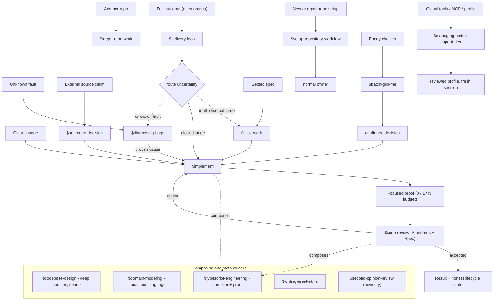

# KRN Skills Work Pipeline

Navigation aid for how work flows through the KRN skill catalog. The procedure
authority is each skill's `SKILL.md`; the contract authority is `config/AGENTS.md`
and the repository `AGENTS.md`. If this diagram and an authority surface
disagree, the authority surface wins.

## The pipeline

## Reading it

- **Entry routing.** A prompt's shape selects one owner: a clear change to
  `implement`, a full autonomous outcome to `delivery-loop`, an unknown fault to
  `diagnosing-bugs`, a source claim to `source-to-decision`, another repo to
  `target-repo-work`, a settled spec to `slice-work`, foggy choices to
  `batch-grill-me`, and global tooling to `managing-codex-capabilities`.
- **Delivery routing.** `delivery-loop` does not implement; it routes the current
  uncertainty — a multi-slice outcome through `slice-work`, a clear change to
  `implement`, an unknown fault to `diagnosing-bugs` — then claims one item at a
  time under a work-in-progress limit of one.
- **The implement spine.** `slice-work` and `source-to-decision` hand bounded
  input to `implement`; `implement` builds one vertical slice with a proportional
  `0/1/N` proof budget, then `code-review` checks Standards and Spec on the fixed
  point. Findings return as a bounded `implement` repair; acceptance reaches an
  honest lifecycle state.
- **Composing owners.** `codebase-design`, `domain-modeling`,
  `typescript-engineering`, `writing-great-skills`, and the advisory
  `second-opinion-review` compose beside the spine without owning its sequence.

## Non-goals

This graph routes; it does not execute, approve, or publish. Explicit-only skills
(`setup-repository-workflow`, `second-opinion-review`, `batch-grill-me`,
`slice-work`) require an explicit `$skill` selection and never route implicitly.
